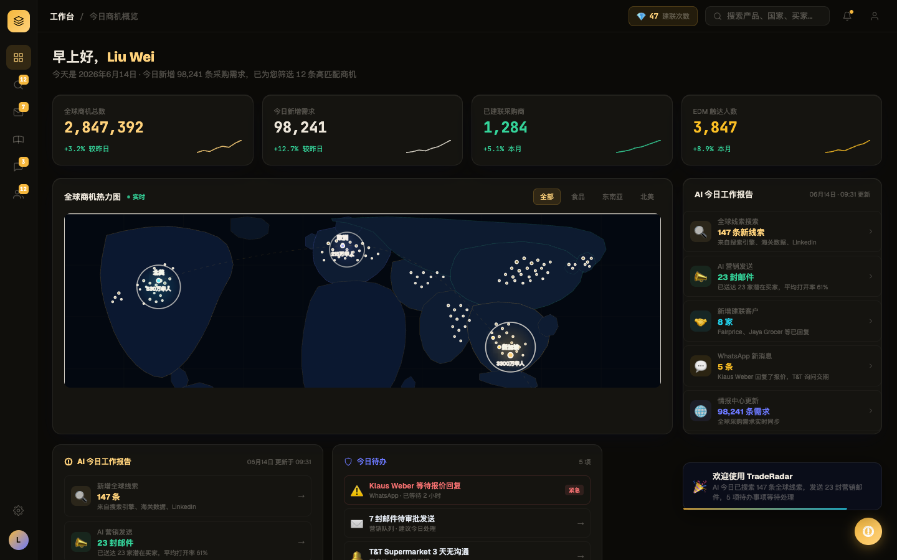

# Round 001 · 🟦 Standard · Phosphor 全局换色 (B1/B2)

- **时间**:2026-06-16 上午 · backlog 来源:B1 + B2(基建,高影响低风险,排序最高)
- **做了什么**:把整个 Vue 项目从 Signal Room cyan 切到 **Phosphor**:品牌 cyan→amber(`#2dd6c6→#f5b73d`、`45,214,198→245,183,61` 等),底色冷黑→暖近黑(`#060911→#0b0a07` 等),按钮 ink 与文字/边框暖白化。另把工作台一处遗留 cyan KPI(98,241)调成 `--hot` 橙,消除竞争色。
- **验收(四段全过)**:
  - build ✓
  - 机检:login & dashboard `pass:true`,无新增运行时错误
  - critic 3/3 **KEEP**,grade **A / A / A−**,slop **A/A/A**(critic 1 像素审计确认全站无残留 cyan 品牌色)
- **截图**:
  - 登录 
  - 工作台(指挥台雏形 + Phosphor)
- **commit**:见 `feat?`→ 实为 Standard 自动落库 commit(本轮)。
- **backlog 变化**:
  - ✅ 完成 B1 + B2(Phosphor 品牌+底色)。
  - ➕ 新增候选(critic/自查发现,留后续轮):
    - 次级数据色仍是旧值(`--cyan #22d3ee` / `--green #34d399` / `--amber #fbbf24` / 第 4 KPI sparkline 偏 teal)→ 收编进 Phosphor 语义(up/hot/iris)。
    - 夜地图 ocean 填充仍是冷蓝 `#0b1830`/`#0e1c32` → 调暖。
    - critic 提:每个 KPI 都挂 ▲%(轻微)· AI 报告面板看似重复(布局,非本轮)。
