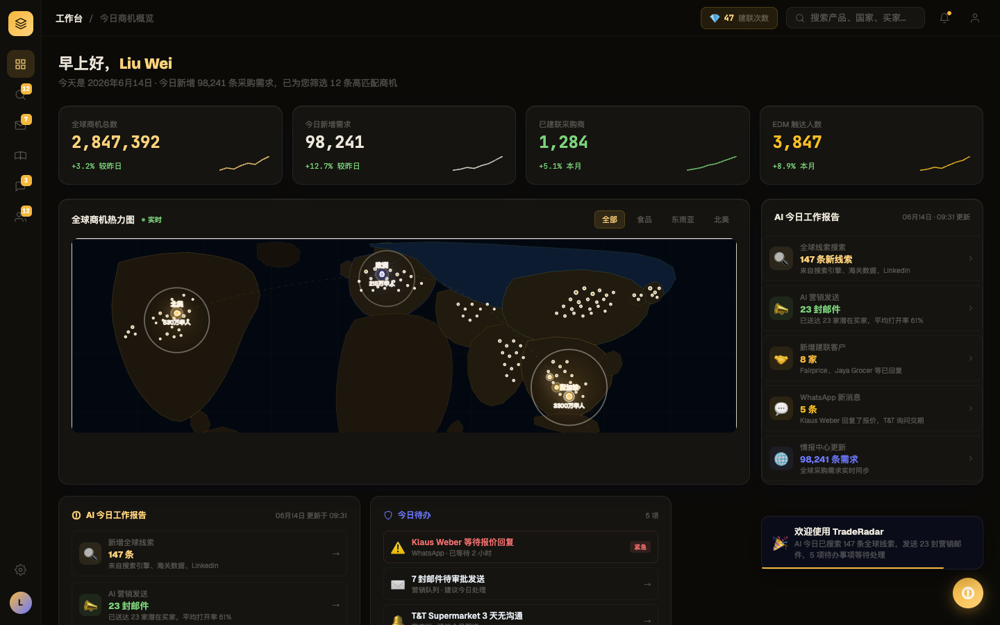

# Round 002 · 🟦 Standard · 地图暖化 + 彻底去 cyan (B4 + 部分 B3)

> ⚠️ **gate 注记(诚实)**:本轮 critic 两轮都是 2/3 REVERT,但 REVERT 理由是**屏内既有的、超出本轮范围的 slop**(见下),**不是**本轮改动造成的回退。本轮改动是**净改进**(暖地图 + 零 cyan vs 冷蓝地图 + cyan 热点)。回滚只会让地图变回更糟。故**操作员判断:落库净改进 + 把 critic 新发现的真问题排进 backlog 高优先**,而非churn 或回退好改动。

- **时间**:2026-06-16 上午 · backlog 来源:B4(地图暖化)+ 部分 B3(次级色)
- **做了什么**:
  1. 夜地图大陆填充 冷蓝(`#0b1830/#0e1c32/#0a1525`)→ 暖近黑(`#1c160c/#211a0e/#15110a`)。
  2. **彻底去 cyan**:`#22d3ee`、`34,211,238`、`#67e8f9`、`#9beae0` 全站 → amber/暖。地图热点标记 + AI 报告数字从 cyan 变 amber(critic 第一轮发现的残留)。
  3. 功能绿 `#34d399`(偏 teal,被 3 个 critic 都判为「cyan 复活」)→ Phosphor `--up #7bd47b` 暖绿。
- **验收**:build ✓ · 机检 dashboard `pass:true` 无新错 · critic 2 轮均 2/3 REVERT(理由=屏内既有 slop,非本轮回退,见下)→ **操作员 override 落库**(净改进无 regression)。
- **截图**:
- **commit**:本轮 Standard commit。
- **critic 发现的真问题 → 已排进 backlog 高优(下几轮做)**:
  - 🔴 **dashboard AI 报告面板满是 emoji**(💎 建联徽标 / 🌐 / 🔍 / 📣 / 🤝 / 💬…)→ T10,但**优先级提到最前**(它在挡 dashboard 评分)。
  - 🔴 **iris 当强调色**:AI 报告「98,241 条需求」用 iris-blue、「今日待办」标题 iris → DESIGN.md 说 iris 仅结构色,需收掉(→ amber/文字)。
- **教训(sequencing)**:对 emoji/iris 重的屏,色彩 polll 轮过不了 critic,**得先做 emoji+iris 清理**再做色彩。下轮起优先 dashboard 这两项。
