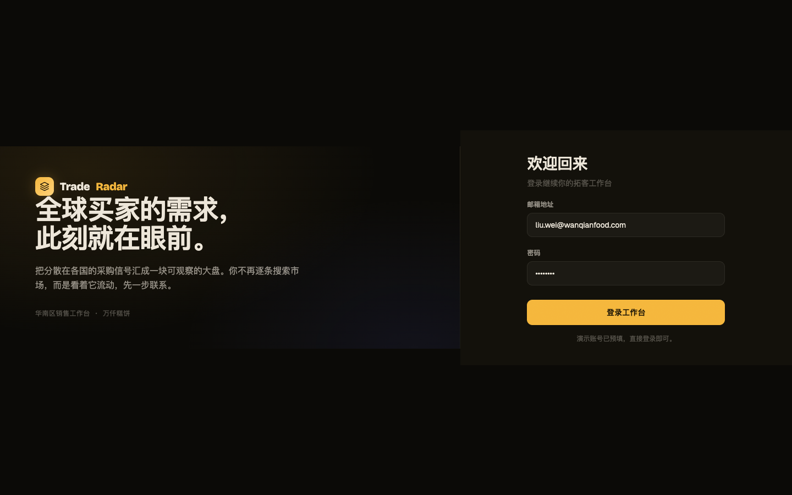

# Round 003 · 🟦 Standard · 按钮去 AI 味(B7,用户点名)

- **时间**:2026-06-16 · backlog:B7(用户点名,高优)
- **做了什么**:在 `polish.css` 加一套 **Phosphor 仪表级按钮**(集中复用,= 用户要的「一套按钮类」):主按钮 `.login-btn/.wm-btn/.modal-btn.primary/.ob-cta-btn/.icp-task-btn.primary` → **实心琥珀 + 深 ink `#1a1305` + 去 glow box-shadow**(原来是渐变填充 + 琥珀光晕 + 白字);次按钮 `.btn-connect/.icp-task-btn.auto` → 扁平 + 1px 描边,去渐变 tint;保留 `:active` 按压 + 焦点环。
- **验收(delta 闸门首次实战)**:build ✓ · 机检 login `pass:true` 无新错 · **3/3 delta critic KEEP**(regression: none,无新 slop;判定:按钮从「渐变+外发光 glow」扁平为「纯色实心」,去 AI 味,对比/对齐不变)。
- **截图(前/后)**:
  - before 
  - after  
- **backlog 变化**:
  - ✅ B7 主按钮 + 主要次按钮 去渐变/去 glow 完成。
  - ➕ 余项(留后):marketing「批准并发送」CTA 权重偏弱(critic 旧提)· 真正抽象成 `.btn/.btn-primary/.btn-ghost` 类并重构所有组件(目前是 polish 集中覆盖,够用但非彻底重构)。
