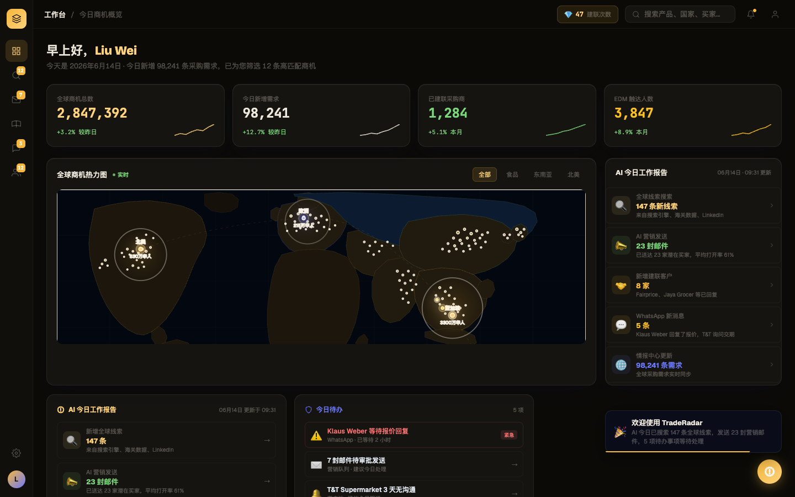
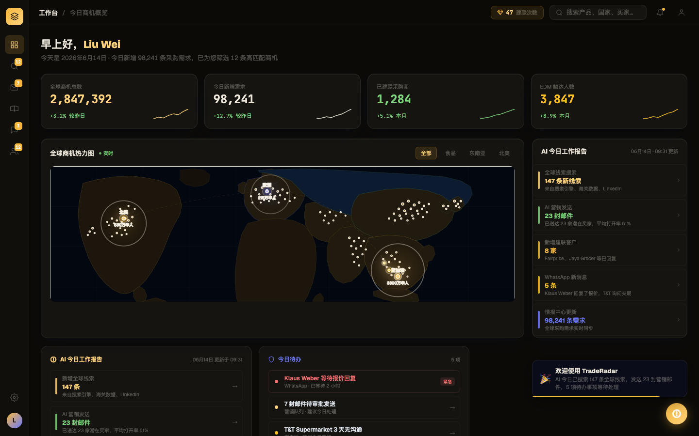

# Round 004 · 🟦 Standard · dashboard 去 emoji (B5)

- **时间**:2026-06-16 · backlog:B5(R002 critic 揪出,高优,挡 dashboard 评分)
- **做了什么**:dashboard 的 AI 报告行 / 今日待办行 / 顶栏积分的 emoji(💎🔍📣🤝💬⚠️✉️🔔📋🌐…)全去掉:
  - AI 报告 / 每日报告行:emoji 彩色圆 chip → **左侧细彩色 accent bar**(保留逐行配色语义)
  - 今日待办行:emoji → **彩色圆点**
  - 顶栏积分 💎 → **小琥珀描边 SVG 钻石**
- **验收(delta)**:build ✓ · 机检 dashboard `pass:true` 无新错 · **额外机检:渲染后 #page-dashboard + 积分区 emoji = clean** · **3/3 delta critic KEEP**(regression none,无新 slop;判定:emoji 贴纸 → 克制 accent bar,更专业、更 Phosphor)。
- **截图(前/后)**:
  - before 
  - after  
- **backlog**:✅ B5 完成。余:B6 iris 收掉(AI 报告「98,241 条需求」仍 iris-blue)· 其它屏 emoji 归 T10。
