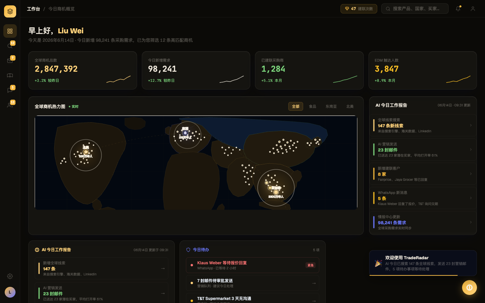
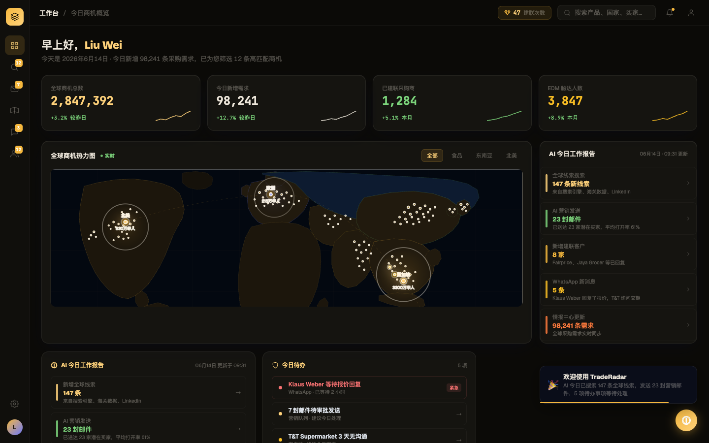

# Round 005 · 🟦 Standard · iris 强调色收掉 (B6)

- **时间**:2026-06-16 · backlog:B6(R002 critic 发现,iris 当数据/标题强调色,违 DESIGN.md「iris 仅结构色」)
- **做了什么**:dashboard 4 处 iris-blue(#6b78ff)→ 暖色:
  - 「今日待办」标题 iris → 浅琥珀 `#ffd27a`(与「AI 今日工作报告」标题一致)
  - AI 报告「98,241 条需求」数字+色条 iris → hot 橙 `#ff7a3d`
  - 今日待办 Asian Grocery 行 iris → 浅琥珀
  - 欧洲地图热点 iris → 琥珀 `#f5b73d`(per spec:hotspots = accent)
- **验收(delta)**:build ✓ · 机检 `pass:true` 无新错 · **3/3 delta critic KEEP**(regression none;判定:残留竞争品牌蓝统一到暖色 Phosphor,调色板更一致,可读性不降)。
- **截图(前/后)**: 
- **里程碑**:**dashboard 至此全清** —— 无 cyan / 无 emoji / 无 iris 强调 / 实心按钮 / 暖地图。Phosphor 在 dashboard 上落地完整。
- **backlog**:✅ B6。next 大头:多窗格 AppShell 布局 · T10 其它屏 emoji · 3 个 Hero。
