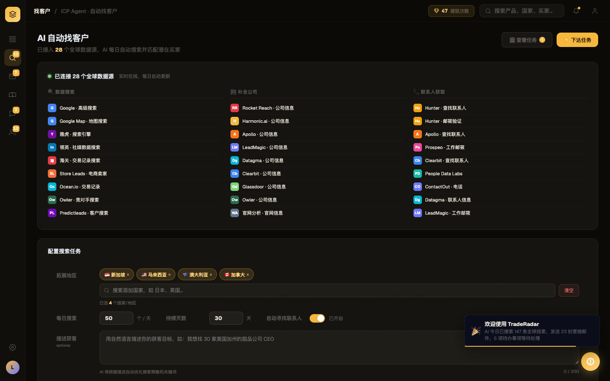
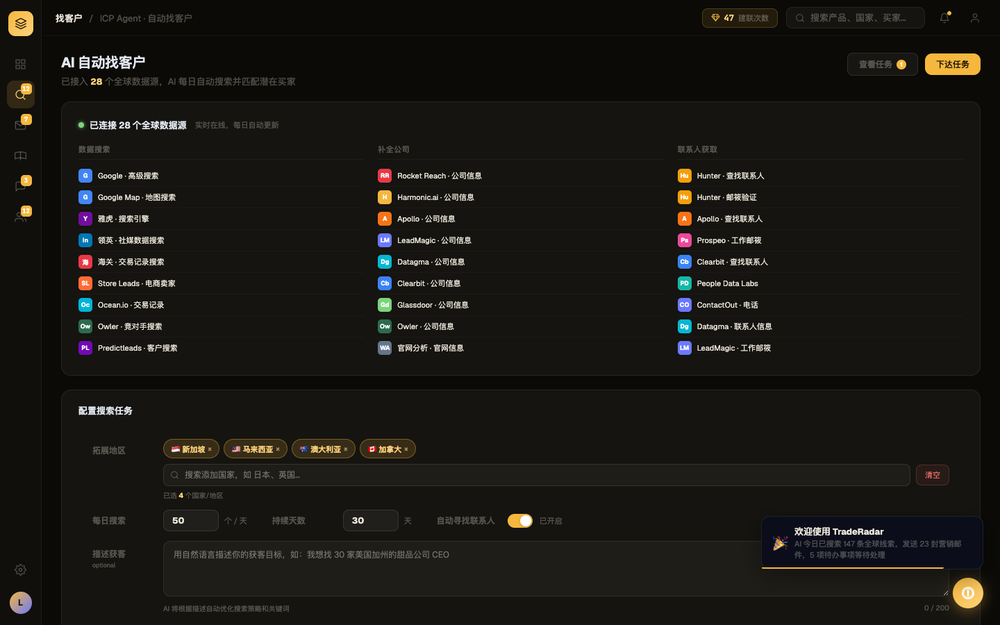

# Round 006 · 🟦 Standard · leads 去 emoji (T10-leads)

- **时间**:2026-06-16 · backlog:T10(dashboard 清完,转其它屏)
- **做了什么**:leads(找客户)按钮/区块标题的前导 emoji 去掉(📋查看任务→查看任务、⚡下达任务、🔍数据搜索、🏢补全公司、📞联系人获取、🔍寻找联系人);ICP 头部 🔍 图标(渐变+glow 圆)→ **扁平卡片 + 单色描边 SVG**(去渐变去 glow)。
- **验收(delta)**:build ✓ · 机检 `pass:true` 无新错 · **3/3 delta critic KEEP**(regression none;判定:装饰 emoji 移除 + glow 图标扁平化,更统一克制,无对齐/对比度损失)。
- **截图(前/后)**: 
- **backlog**:leads 图标 emoji 清完。**国旗 emoji 本轮未碰**(跨屏统一处理,见新增项)。
