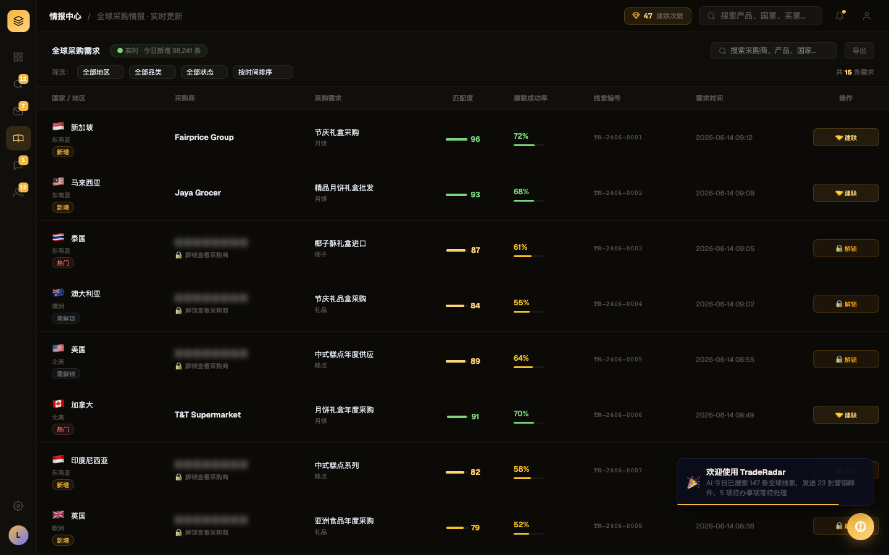
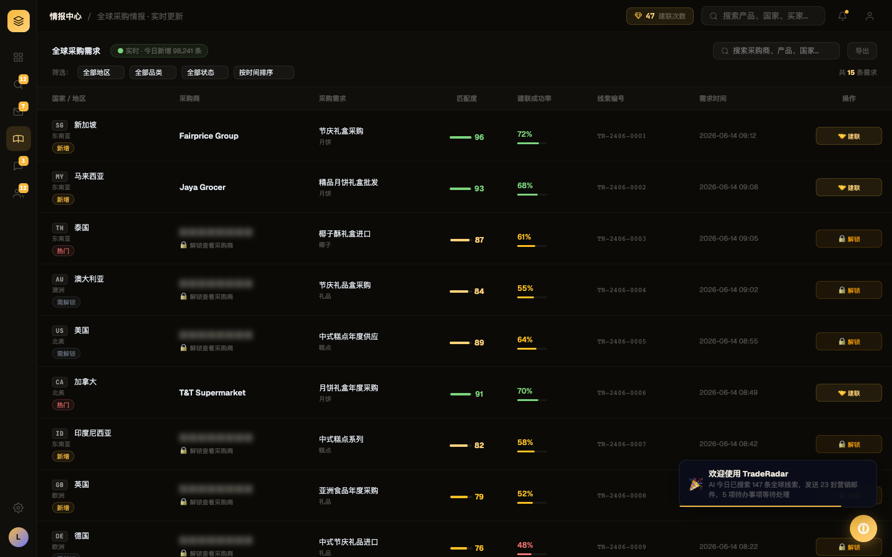

# Round 007 · 🟦 Standard · intel 国旗 → mono 国家码 (T10-flags 起步)

- **做了什么**:intel 表格 + 情报卡的国旗 emoji(🇸🇬🇲🇾🇹🇭…)→ **等宽 2 字母国家码徽标**(SG/MY/TH/AU/US…)。加了全局 `FLAG2CC` 映射 + `ccBadge()` 助手(跨屏复用,后续 leads/whatsapp 直接接)。
- **验收(delta)**:build ✓ · 机检 `pass:true` 无新错 · **3/3 delta critic KEEP**(regression none;判定:flag emoji → mono 码徽标,去 emoji slop,更贴 Bloomberg/Phosphor 终端,对齐/可读良好)。
- **截图(前/后)**: 
- **backlog**:intel 国旗清完;`ccBadge` 可复用 → leads/whatsapp/数据里的国旗下轮接上。
