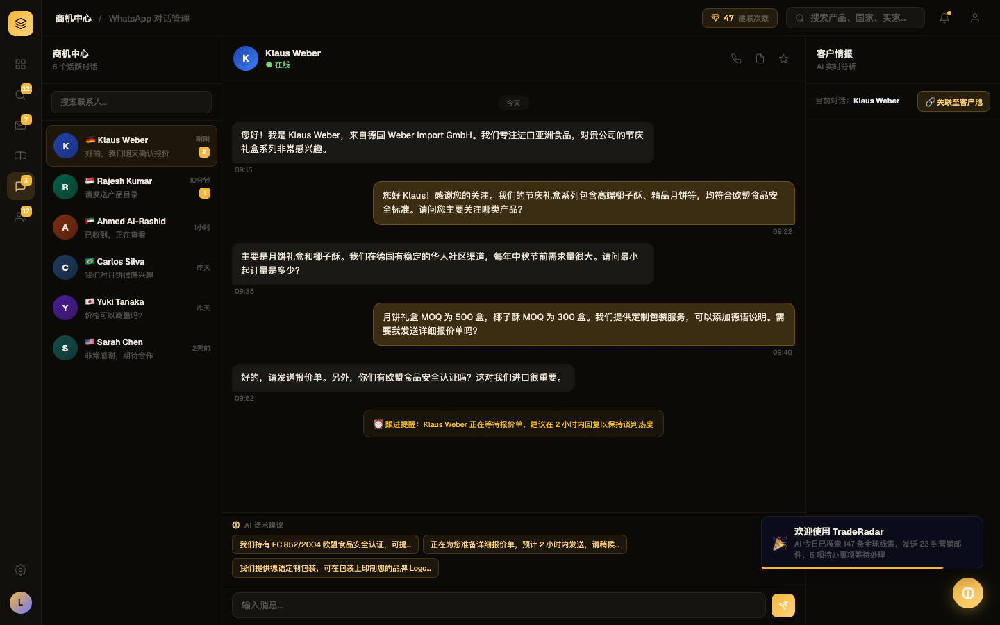
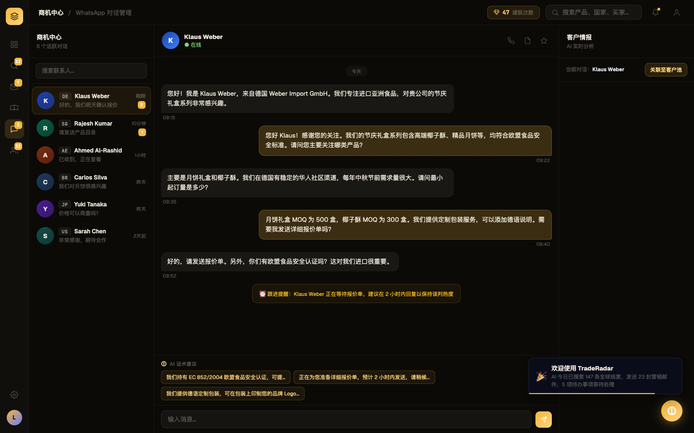

# Round 008 · 🟦 Standard · whatsapp 国旗→mono码 + 去 🔗 (T10)

- **做了什么**:whatsapp 联系人列表国旗(🇩🇪🇸🇬🇦🇪🇧🇷🇯🇵🇺🇸)→ mono 国家码徽标(复用 ccBadge,FLAG2CC 补了 BR/IN/IT/ES/MX);"关联至客户池"按钮去 🔗。
- **验收(delta)**:build ✓ · 机检 `pass:true` 无新错 · **3/3 delta critic KEEP**(regression none;判定:多彩国旗→单色码徽,更克制统一贴 Phosphor;🔗 去掉文本更干净)。
- **截图(前/后)**: 
