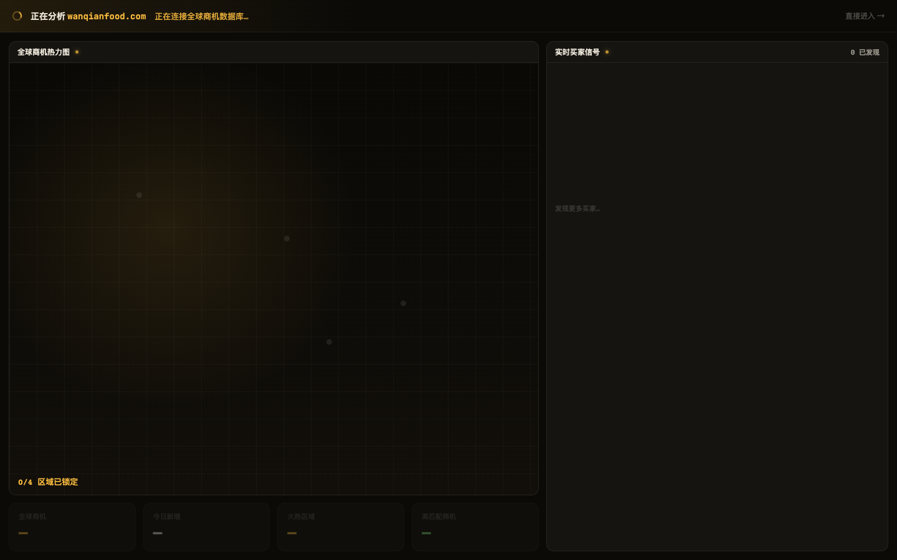
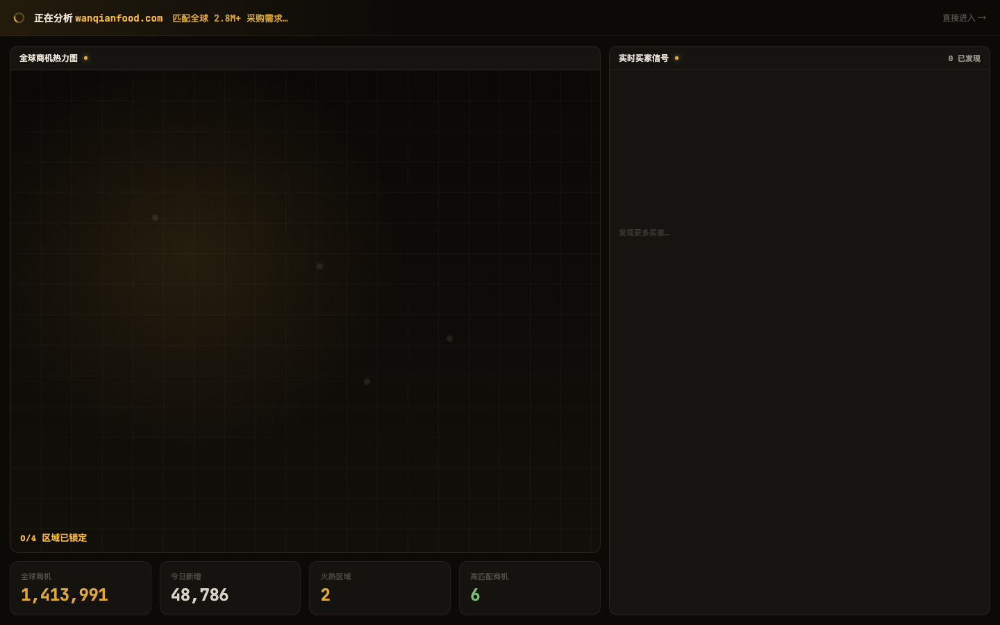
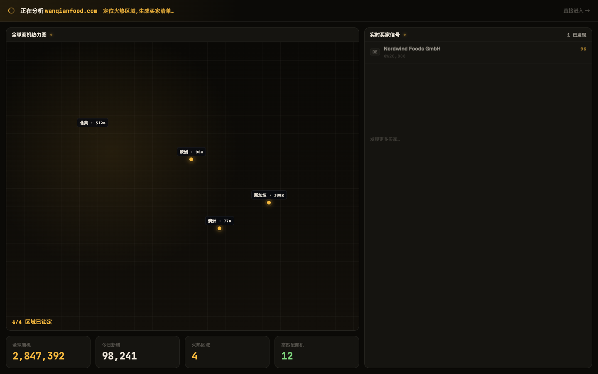

# Round 009 · 🟥 HERO · H1 AI 分析首启

## ⏸ 需要你 REVIEW —— 分支 `feat/hero-first-run`,满意就 merge
这是销售 Hero,**没有自动 merge**。review 通过后:`git checkout main && git merge feat/hero-first-run`;不满意告诉我改。

- **做了什么**:实装 journey-preview 的「分析 = 指挥台自我拼装」概念为真 Vue 组件 `FirstRunAnalysis.vue`:
  - 顶栏状态文案**循环真实阶段**(连接数据库→匹配 2.8M+ 需求→定位火热区域→完成),**无假 %**
  - 地图热点**逐区点亮**(北美 512K→欧洲→新加坡→澳洲,0/4→4/4)
  - KPI **从 0 count-up 到真值**(2,847,392 / 98,241 / 4 / 12)
  - 买家**逐行流入**(Nordwind Foods GmbH DE €420,000 匹配 96…)
  - 收束:总结条 +「进入工作台」CTA;尊重 prefers-reduced-motion
- **Hero 验收**:build ✓ · 序列截图 3 帧 ✓ · **3 delight critic KEEP**,wow **B/A/A**,**earned A/A/A**(一致认定真数据揭示、零假『活』),ttfw B。
- **动效弧线(三帧)**:
  - t0 冷启(空骨架)
  - t1 KPI 计数中(1,413,991→)
  - t2 收束(地图 4 区点亮 + 买家流入 + KPI 落定)
- **money shot**:t2 —— 4 个真区域热点 + 命名买家 Nordwind €420K/匹配96 + KPI 2,847,392。
- **遗留(merge 前可议)**:① t1 编排略不均(KPI 先动、地图/买家稍晚)→ 可错峰提前;② 与真实 login→输网址 流程的接线(现在用 `window.__showAnalysis()` 触发供 review)merge 时补上。
