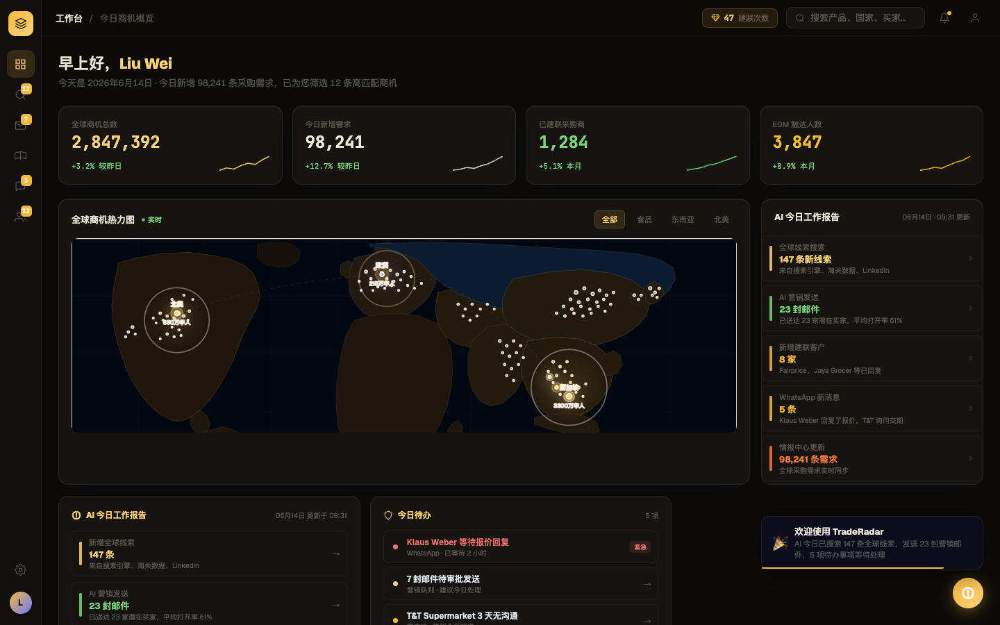
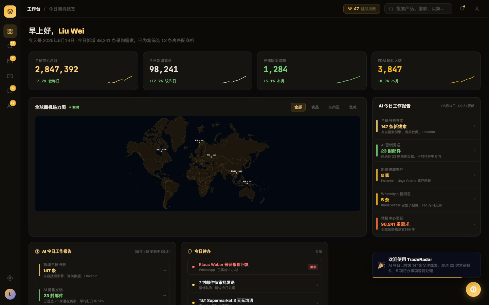

# Round 010 · 🟦 Standard · 热力图接真实世界地图(用户点名)

- **做了什么**:dashboard「全球商机热力图」手绘低多边形假大陆 → **真实世界地图**(`@svg-maps/world`,256 国真实轮廓)。新建可复用 `WorldHeatmap.vue`(暖近黑陆地 + 淡琥珀描边 + 琥珀 sonar 热点 + mono 标签),5 个真实地理坐标热点。删掉原手绘 SVG + 未用 canvas。
- **验收(delta)**:build ✓ · 机检 pass 无新错 · **3/3 delta critic KEEP**(真实地理替换粗糙色块,更准更克制更贴 Phosphor)。
- ⚠️ 过程教训:首跑漏刷 `.review/dashboard-after.png`→critic 误判无变化;刷新后重跑得真判定。delta 闸门依赖正确 before/after。
- **截图**: 
- **backlog**:WorldHeatmap 复用→ FirstRunAnalysis 换真地图;多窗格布局仍待做。
