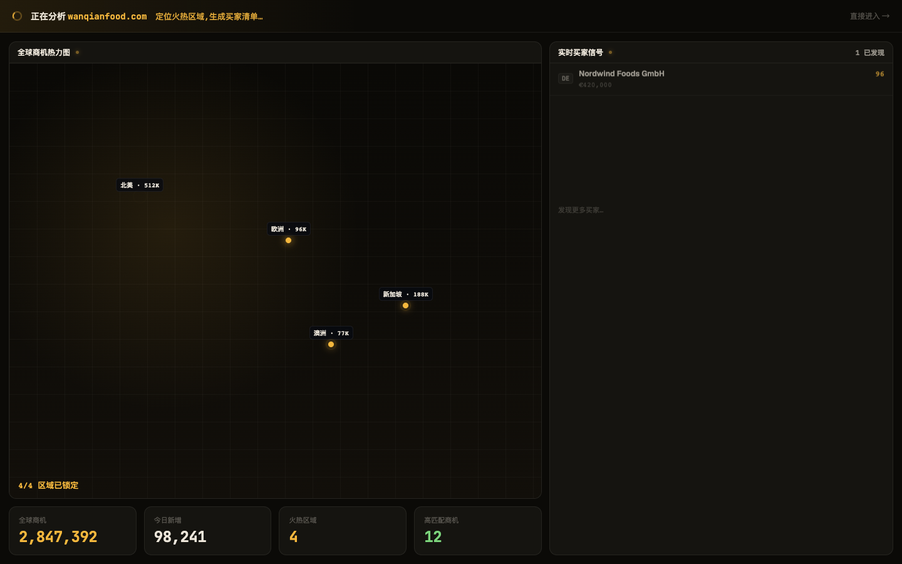
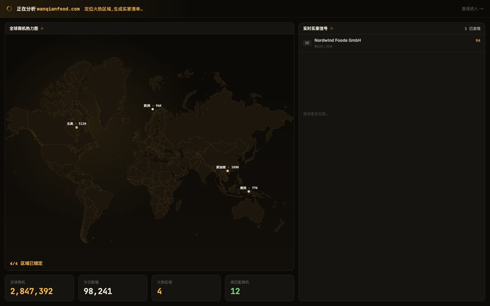

# Round 011 · 🟦 Standard · FirstRunAnalysis 地图换真实世界地图

- **做了什么**:H1 分析屏的「网格 + 随意圆点」假地图 → 复用 `WorldHeatmap.vue` 真实世界地图;热点改真实地理坐标,保留逐区点亮(`hotspots.slice(0, hotN)`)。dashboard 与首启分析现在同一套真实地图。
- **验收(delta)**:build ✓ · 机检 pass 无新错 · **3/3 delta critic KEEP**(真实大陆替换抽象点阵,地理可信、空间语义明确,风格仍 Phosphor)。
- **截图(前/后 · settled t2)**: 
