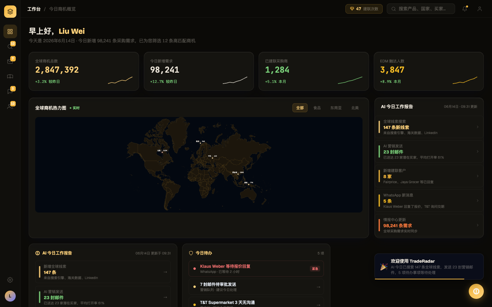
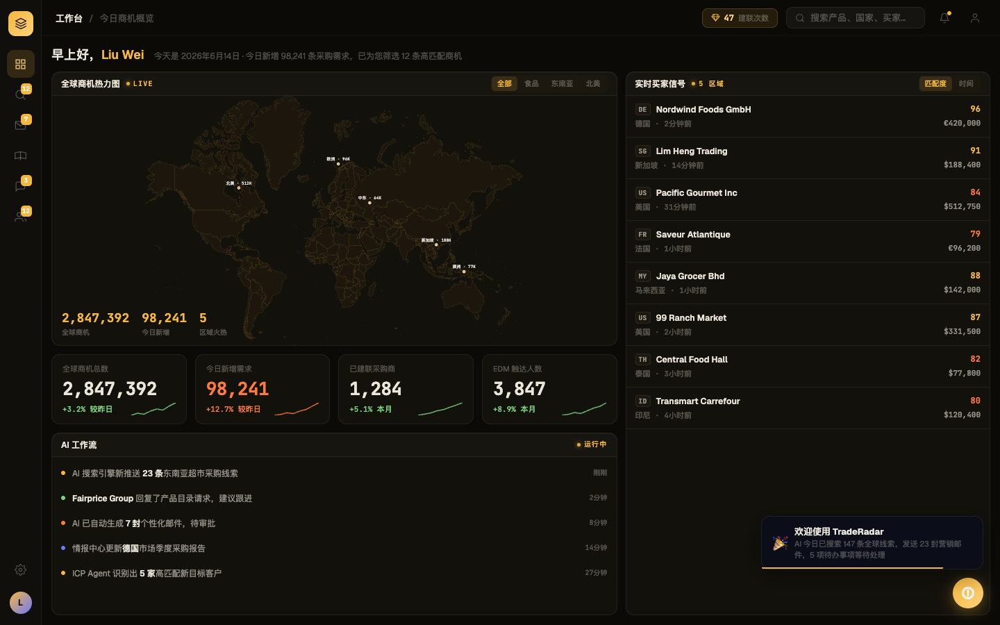

# Round 012 · 🟧 大件 · 多窗格指挥台布局(dashboard)

## ⏸ 需要你 REVIEW —— 不自动 merge
- **分支**:`feat/layout-command-center`(已 commit,停在分支等你验收)
- **决定**:满意 → 我 merge 回 main 并继续 loop;不满意 → 说哪里,我在分支上改或丢弃。

## 做了什么
把工作台从「问候 + 4 KPI 大卡横排 + 地图/AI报告分栏 + 底部 AI报告/待办」重排为 **layout-preview 的多窗格指挥台**:
- **地图 hero 窗格**(常驻主角,真实 WorldHeatmap + LIVE + 食品/区域过滤段 + 左下 map-stat 概览数字)
- **KPI 条**(4 格紧凑,保留 sparkline 生命线,今日新增=hot 橙)
- **AI 工作流 feed 窗格**(承接旧「AI 今日工作报告」语义,彩色 tone 点 + 时间戳)
- **右侧『实时买家信号』整列**(常驻全高,真实买家名/mono 国家码徽标/匹配分/金额/时间)
- 窄图标栏(原 SidebarNav 40px)与 TopBar 保留不动。
- 旧 `#ai-daily-report/#ai-report-list/#today-todo-list` 面板并入数据驱动 feed/buyers;legacy 渲染器有 `if(!el) return` 守卫,不报错(机检零错误证实)。配色全程 Phosphor 暖金,无 cyan/emoji 装饰,数字 mono。

## 验收(delta 闸门)
- build ✓ · 机检 dashboard pass,pageErrors/newErrors 均空 ✓
- **3/3 delta critic KEEP**,regression=none,new_slop=[]。critic 还指出 after **去掉了改前的 AI feed 重复**(额外净改进)。

## 截图(前 / 后)
- before:
- after: 
