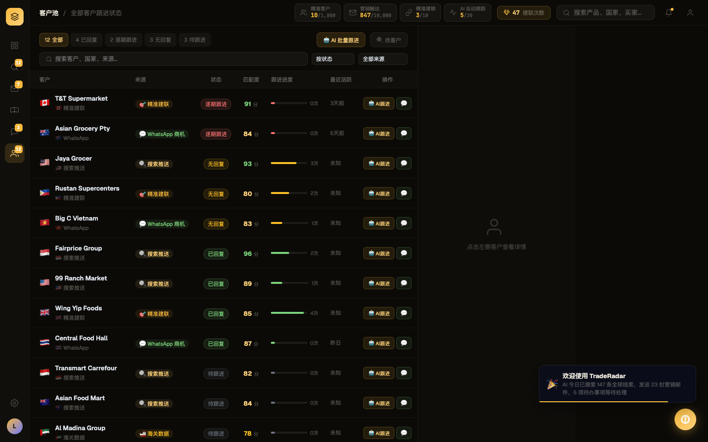
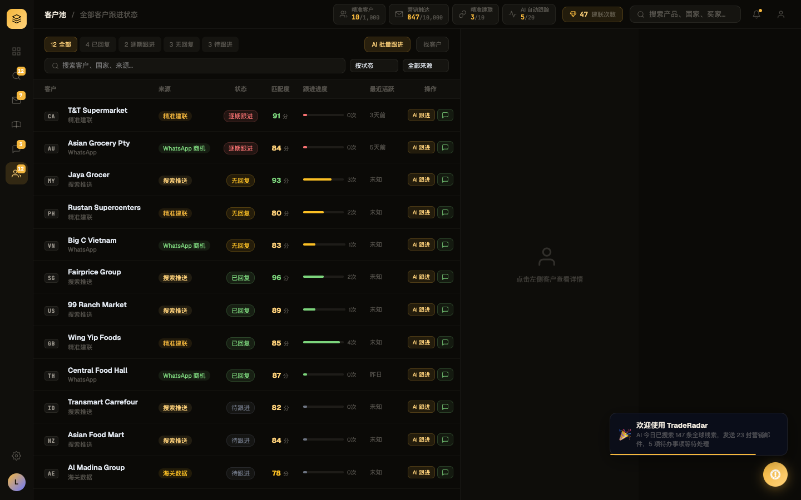

# Round 013 · 🟦 Standard · CP1 客户池去 AI 味(emoji 清扫)

- **做了什么**(用户去-AI-味方向 ①emoji,客户池是最重屏):
  - 国旗 emoji 🇸🇬🇲🇾🇺🇸… → 复用 `ccBadge()`/FLAG2CC **mono 两字母国家码徽标**(renderPoolTable + showPoolDetail + renderPoolCards 全覆盖)。
  - `🤖 AI跟进`/`🤖 AI 批量跟进`/`🤖 AI 生成跟进话术` → 纯文字「AI 跟进 / AI 批量跟进 / AI 生成跟进话术」。
  - `💬` 图标按钮 / `💬 发消息` / `💬 发送 WhatsApp` → **扁平描边 chat SVG**(+文字)。
  - 源标签 `🔍🎯💬🚢` 图标 + 详情 `ℹ️` + 头部 `🔍 找客户` + 下拉 select option emoji → 去掉。
  - pool 动作 toast 图标 🤖 → ◆。
- **验收(delta)**:build ✓ · 机检 pool pass 无新错 · **跨屏抽查 leads/whatsapp/dashboard 全 pass 零新错** · **3/3 delta critic KEEP**(regression none,critic 确认对齐/对比度无回退,更贴 Phosphor 终端风)。
- **截图(前/后)**: 
- 新候选:AiBubble 欢迎气泡仍有 🚀 emoji(记 CP-bubble)。
