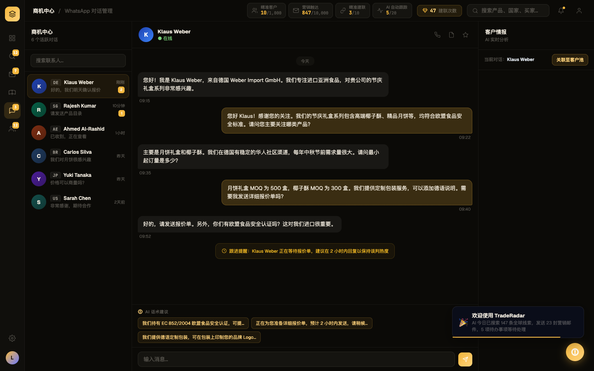

# Round 014 · 🟦 Standard · CP2 whatsapp 去 emoji

- **做了什么**:对话中部橙色「跟进提醒」提示条前导 `⏰` emoji → 扁平描边时钟 SVG(在 renderWaChat 的 follow-alert 模板里加图标,数据去 emoji)。whatsapp 动作 toast 图标 `💡/💬` → `◆`。
  - 注:「AI 话术建议」标签早已是 SVG(非 emoji);联系人国旗早已 ccBadge 化 —— 本屏可见 emoji 仅此一处。
- **验收(delta)**:build ✓ · 机检 whatsapp pass 无新错 · 跨屏抽查 pool/dashboard/intel 零新错 ✓ · **3/3 delta critic KEEP**(emoji→扁平 SVG,橙条对齐/对比度无回退,更贴 Phosphor)。
- **截图(前/后)**: 
- 新候选:**CP-intel-detail** —— intel 详情/enrich 卡(INTEL_DATA)满是 emoji 图标(🇩🇪🏢📅💰🛒📞📧📊🎯⏰),点行展开才可见,列表已干净。
