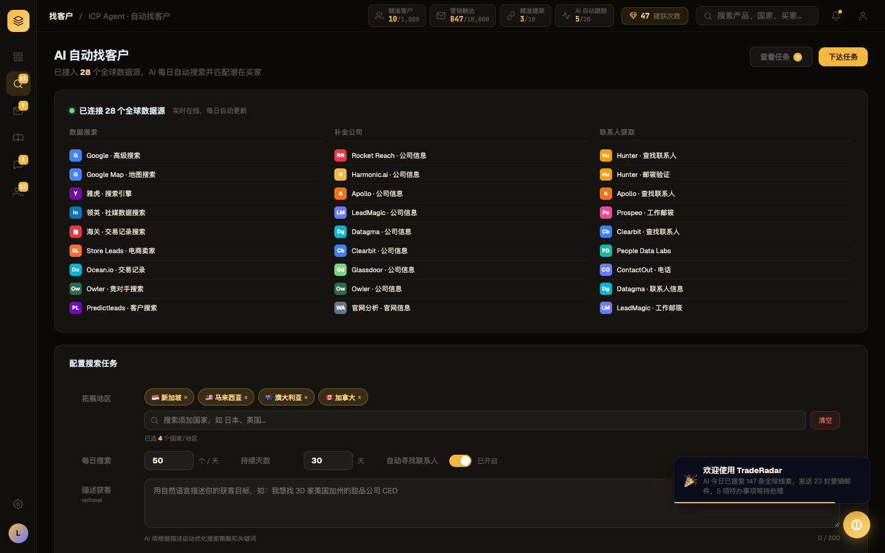
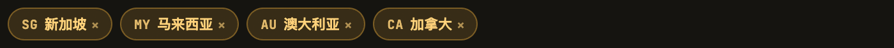

# Round 015 · 🟦 Standard · CP3 leads 地区标签去 emoji

- **做了什么**(emoji 第三屏 leads):
  - 「拓展地区」国家 chip 国旗 emoji 🇸🇬🇲🇾🇦🇺🇨🇦 → **borderless mono 国家码**(SG/MY/AU/CA,新增 `.rg-cc` 样式,× 关闭保留)——静态 4 chip(LeadsPage.vue)+ 动态添加(toggleRgCountry,用 FLAG2CC)。
  - 国家选择下拉行国旗 → `ccBadge()`(与 pool/intel 列表行一致)。
  - 大洲标签 🌏东南亚/🇺🇸北美/🇪🇺欧洲… → 去 emoji 纯文字(大洲非单国,码不适用)。
- **验收(delta)**:build ✓ · 机检 leads pass 无新错 · 跨屏抽查 pool/whatsapp/dashboard 零新错 ✓ · **3/3 delta critic KEEP**(码对齐可读、chip 不挤、× 保留、琥珀 chip 样式无回退)。
- **截图(前/后 + chip 特写)**:  
- emoji 三屏(pool/whatsapp/leads)收官。余 emoji 项:CP-bubble(欢迎气泡 🎉/🚀)、CP-intel-detail(intel 详情卡)。
