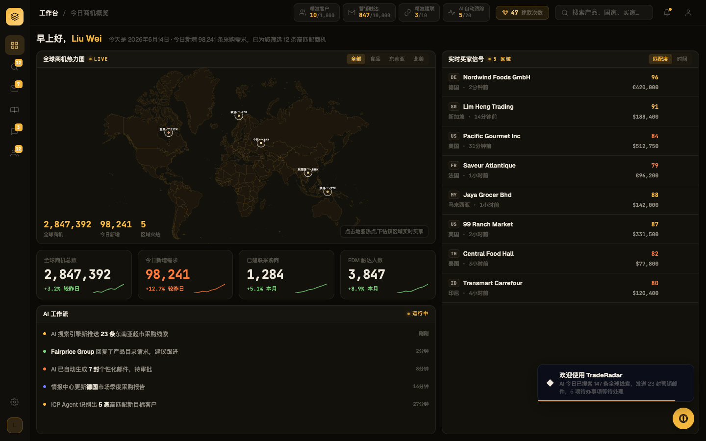
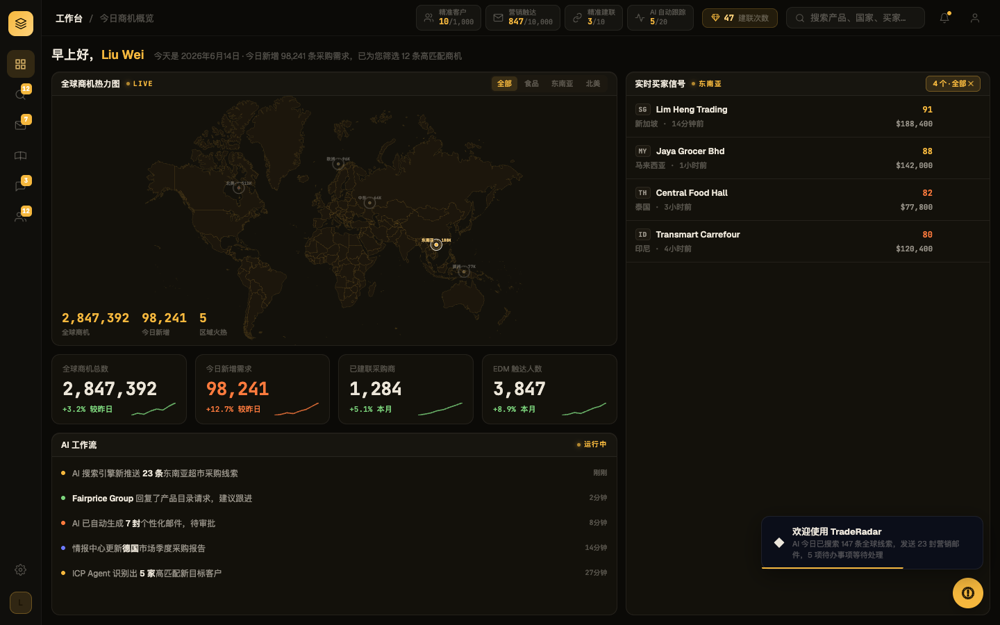
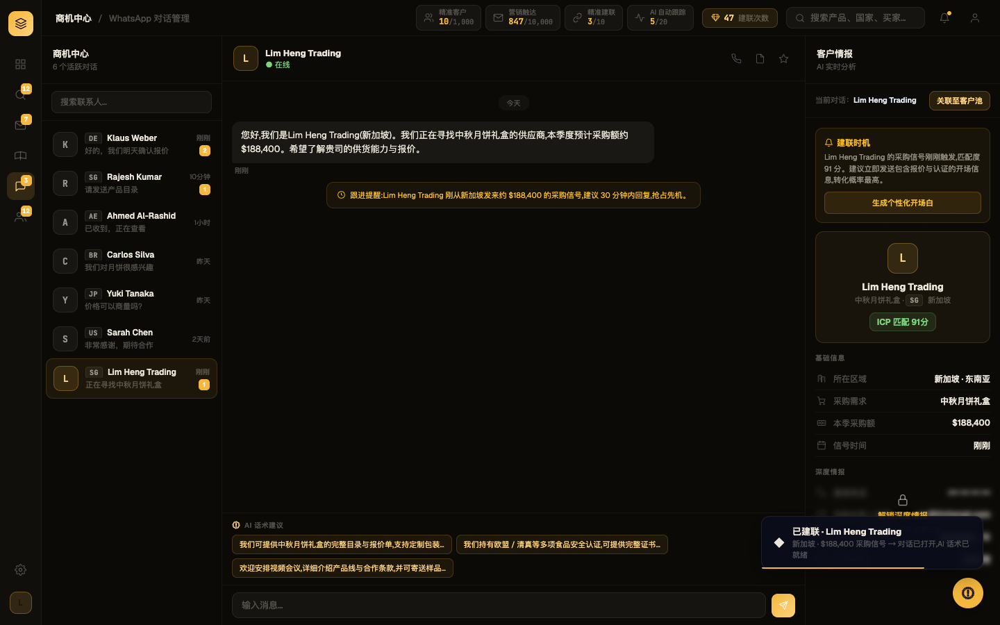

# Round 023 · 🟥 HERO H3 — 实时商机 / 建联 golden path

⏸ **需要你 REVIEW** — 分支 `feat/hero-realtime-signals`,满意就 merge 到 main。**未自动 merge,本轮不 ScheduleWakeup。**

- 时间:2026-06-16 · 档位:🟥 Hero(放大模式) · 来源:用户 AskUserQuestion 选「开 H3 实时商机 Hero」

## 做了什么(money-shot:从看见热点到开口聊,一次点击)
把原本三套**互不相连**的数据(仪表盘买家 / WhatsApp 联系人 / intel)接成一条真实流:
1. **地图热点可点**(WorldHeatmap.vue):热点加 `region` + 命中区 + 指针/hover/focus + 选中态(放大点、加速更亮 ping、高亮标签),非选中热点 dim 到 .32;emit `@hotspot`。
2. **下钻该区买家**(DashboardPage.vue):点热点 → 右侧「实时买家信号」筛到该区(`activeRegion` + computed),面板头显示区域名 + 「N个·全部✕」清除;空区给诚实空态「该区域暂无活跃买家信号」;地图角提示「点击热点下钻」。买家加 `region/country/flag/need`。
3. **一键建联**(每行 hover 显形的扁平 amber 建联键 + 整行可点):调 `connectBuyer()`。
4. **真实落地对话**(legacy connectBuyer):把点中的买家**物化为真实 WhatsApp 联系人**(按公司名去重,重复建联不造重复),把触发热点的采购信号物化为对话**首条 in 消息 + 跟进提醒**,复用 AI 话术 chips,并 seed 匹配的 `INTEL_DATA`(区域/需求/采购额/匹配分),navTo→renderWaContacts→selectWaContact→toast。selectWaContact 顺手同步 #wa-link-name。

**诚实**:对话/情报里每个值都来自被点买家的已知数据($188,400 / 中秋月饼礼盒 / 新加坡 / 匹配 91),未知字段(电话/邮箱/历史额/周期)诚实打码 `+•• / ████`,不编造。

## 验收(Hero 门)
- build ✓ · 机检 6 屏零 pageErrors/newErrors ✓
- **golden-path 脚本**(新增 `scripts/h3-golden.mjs`,交互驱动)端到端 **PASS**:东南亚热点存在 → 下钻筛到恰好 4 个买家 → 清除 chip 出现 → 建联 → WhatsApp 打开 → **聊天头 == 所建联买家(Lim Heng Trading)** → 对话已 seed 采购信号 → AI 话术 chips 存在 → 零错误。
- **3 帧序列**:t0 总览(可点热点+提示)→ t1 点东南亚(筛 4 个+热点高亮/他者 dim)→ t2 建联(WhatsApp 开,买家成真实联系人,信号 seed,情报面板匹配,confirm toast)。
- **delight 3/3 KEEP**(读 DELIGHT-RUBRIC):wow **A/A/B** · earned **A/A/B**。盲评一致认定「看见的买家 == 正在聊的买家」、wow 挣得来且诚实、Phosphor 干净(amber mono,WhatsApp 面不引入微信绿)。

## 截图(3 帧)

## critic 提的非阻塞项(留你定夺,可后续轮做)
- **建联键 hover 才显形**:首屏不可见(整行可点 + 角提示已缓解)。要不要常驻低调显示?
- **地图 ping 仍是装饰性**(每热点恒定脉冲)+ 热点量级标签(512K/96K…)是静态近似,非买家 feed 实时驱动。H3 红线「每个 ping 对应真信号」只在**点击交互**层兑现了;要把环境 ping 也接真信号是更大的活,单列候选。
- 物化联系人头像用统一 token 底(`c.color` 字段存了没用 —— 既有死字段)。

## 分支 / 后续
- 分支:`feat/hero-realtime-signals`(已 commit,未 merge)。预览满意 → `git checkout main && git merge feat/hero-realtime-signals`。
- 新增文件:`scripts/h3-golden.mjs`(golden-path 回归,可常驻)。
