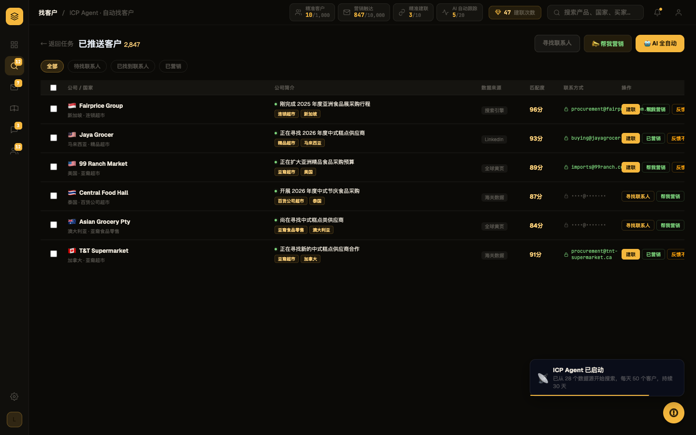
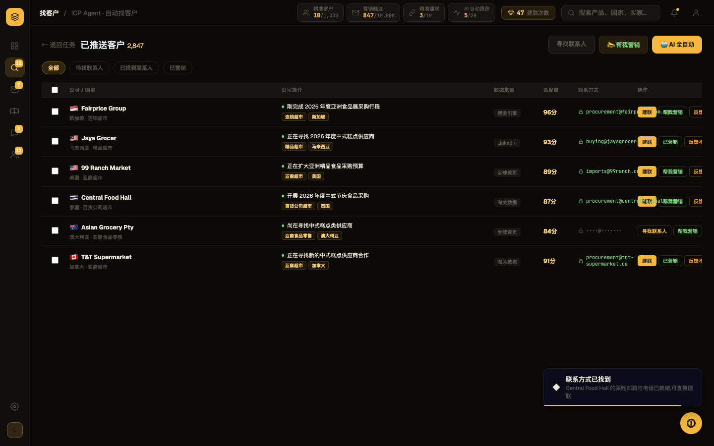
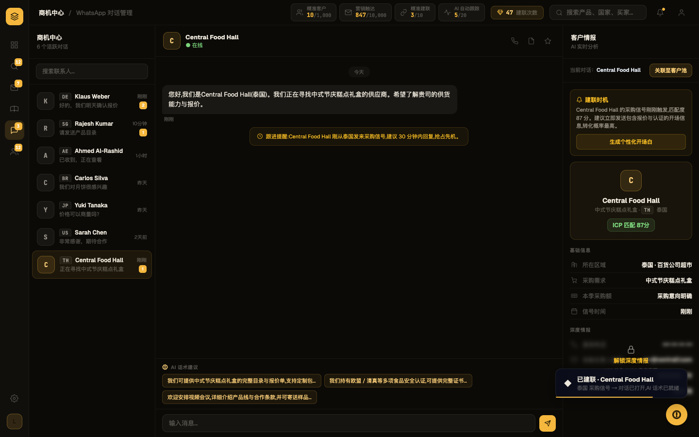

# Round 031 · 🟥 HERO H2 — 找客户 / ICP Agent golden path

⏸ **需要你 REVIEW** — 分支 `feat/hero-find-customers`,满意就 merge 到 main。**未自动 merge,本轮不 ScheduleWakeup。**

- 时间:2026-06-17 · 档位:🟥 Hero(放大模式) · 来源:程序 #3(用户 4 项全选)
- 注:taste-skill 自述不覆盖 dashboard/数据表/多步产品 UI,故据 DESIGN.md(Phosphor)为准。

## 做了什么(golden path:找到买家 → 看清为什么 → 解锁联系 → 开口)
把找客户结果从「只有裸分数」升级成一条连贯、可信的获客流:
1. **买家带匹配理由到达**(红线:分数必须有可见理由):每个买家行新增绿点**匹配理由**(`custMatchReason`,取自该买家**真实公开采购动态**,**强采购意向优先**——「在找供应商/采购/引入」压过泛信号)+ 行业·国家**匹配标签**。不再是裸分。
2. **联系方式 锁→解锁揭示**:pending 买家联系方式显示为**遮罩 + 挂锁 SVG**(`••••@••••`);点「寻找联系人」→ enrich → **解锁动画**(`icUnlock` 模糊淡入 + 挂锁→开锁图标)露出邮箱;操作按钮翻转为「建联」。邮箱用买家**真实官网域名**(`procurement@<域名>`,与既有部门邮箱同风格)、电话用**真实国家区号 + 掩码号段**(诚实,不伪造完整号码)。
3. **一键建联**:enriched 买家点「建联」→ 复用 H3 `connectBuyer`,把该买家落成真实 WhatsApp 联系人 + 种子对话(中式节庆糕点礼盒)+ AI 话术 + 匹配情报面板。`connectBuyer` 增强:无 $ 时不再硬塞「约 X」假额,改「采购意向明确」。

## 验收(Hero 门)
- build ✓ · 机检 6 屏零 pageErrors/newErrors ✓ · H3 golden 仍 PASS(共享 connectBuyer 改动未回退)✓
- **新增 `scripts/h2-golden.mjs` 交互驱动 golden-path 端到端 PASS**:12 行全带 .ic-why 匹配理由 + 24 标签;4 个锁定联系方式;enrich 解锁恰好 1(锁定 4→3);建联打开**同一买家**(Central Food Hall)WhatsApp;AI chips 就绪;零错误。
- **3 帧序列**:t0 结果(每买家带理由+锁定态)→ t1 解锁(揭示邮箱+按钮转建联+toast)→ t2 建联(WhatsApp 种子对话+情报匹配 ICP 87+无假 $)。
- **delight 2/3 KEEP**(读 DELIGHT-RUBRIC):wow **A/B/C** · earned **A/A/C**。
  - 两位 KEEP:红线达标(每分有理由)、lock→unlock 诚实真切、find→enrich→建联 同一买家贯穿、无假活、Phosphor 一致。
  - 第三位(对抗)REVERT,提两条**真实**honesty 问题 →**本轮已修**:① 匹配理由原来取首条 news 导致 Central Food Hall 显示泛「扩店」而非采购意向 → 改强意向优先(现显「开展2026年度中式食品采购」);② enrich 原合成 `contact@公司名.com` + 全掩码电话却宣称已获取 → 改真实官网域名邮箱 + 国家区号电话,文案不过度宣称。

## 截图(3 帧)

## 残留(非阻塞,留你定夺)
- 展开客户卡(点行展开)仍有 emoji(🏢🌐👥📅📰👤),CP-emoji 残留,可后续清。
- 「下达任务→结果」当前是状态切换,CUST_DATA 不随任务参数变(demo 固定数据);若要更强叙事可让结果反映 config,但属更大改。

## 分支 / 后续
- 分支:`feat/hero-find-customers`(已 commit + push,未 merge)。预览满意 → `git checkout main && git merge feat/hero-find-customers`。
- 新增:`scripts/h2-golden.mjs`。**至此用户 4 项程序全部完成**(①对齐✓②动效✓④工程高价值✓③H2✓);H2/H3 两个 Hero 均在分支待你最终 merge。
