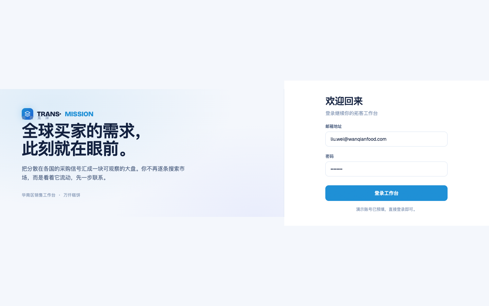
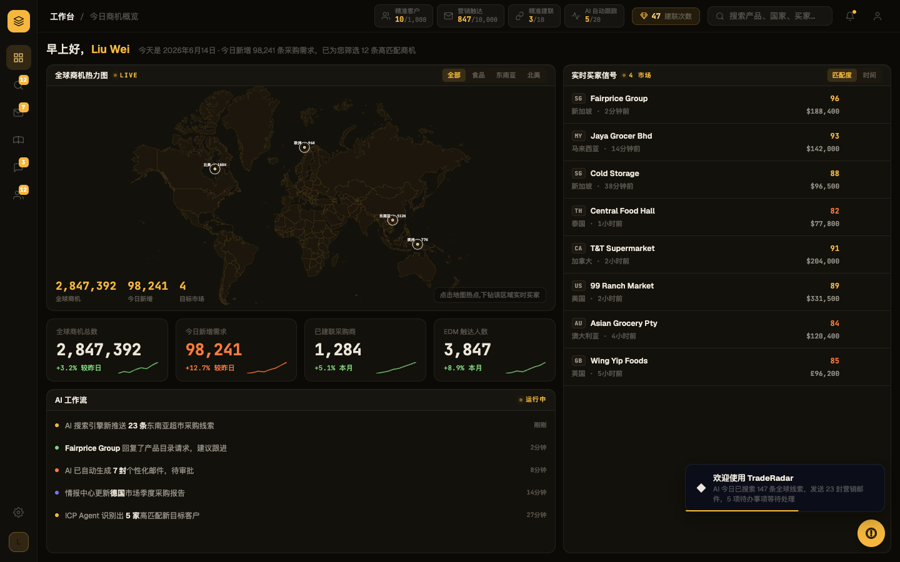
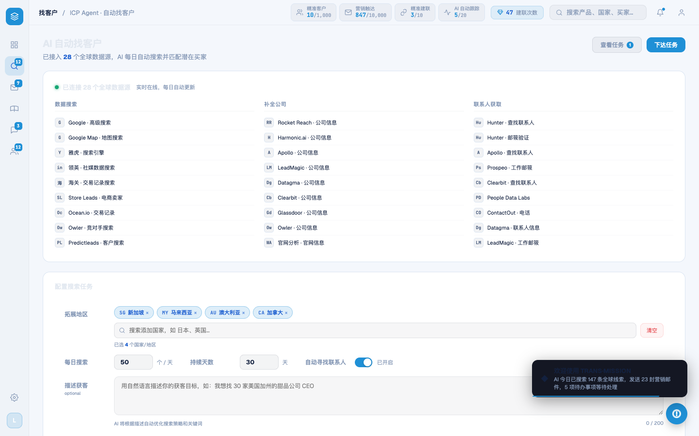
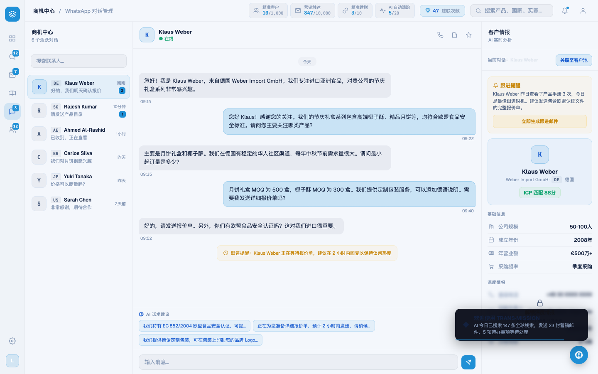

# Round 031 · 🟥 大件(R1)· 令牌反相 + 字面量批量替换 + 全站更名 TRANS·MISSION

⏸ **需要你 REVIEW** — 分支 `feat/rebrand-transmission`。色彩方向定调后再决定 merge / 继续逐屏精修。

- 时间:2026-06-24
- 档位:🟥 大件(R1,首轮,走 feat 分支,做完暂停等 review,**不 ScheduleWakeup**)
- 分支:`feat/rebrand-transmission`
- backlog 来源项:loop-procedure.md §8 第一项「R1 令牌反相 + 字面量批量替换 + 更名」(§3 锁定 R1 永远第一)

## 做了什么
1. **tokens.css 反相**:`:root` 全量改成 TRANS·MISSION 信号蓝亮色 —— 浅冷底 `#f4f7fc` / 白卡 `#ffffff` / 深 navy 字 `#13213f` / azure 强调 `#1f8fd6`;新增令牌 `--brand-navy #16306e`、`--brand-azure #2f9fe0`、`--brand-grad`(TM 渐变,仅品牌标记/hero/信号)、`--ink #fff`;语义色压深以在白底可读(green `#17a673`/red `#e5484d`/amber `#c8860a` 仅 warning/purple→royal `#1e5fd0`);`--shadow` 改柔和冷阴影。
2. **字面量批量替换**(perl,27 文件 + index.html + legacy-app.js,exact-match):按 §3 批量表 13 条全替,核心技巧 `255,248,235→19,33,63`(高 alpha=深 navy 字、低 alpha=极淡 navy 填充,亮色下都成立)。处理后**残留旧字面量 = 0**。
3. **全站更名**:`Trade<em>Radar</em>`→`TRANS·<em>MISSION</em>`(login)、onboarding 字标、`<title>`、legacy「TRANS·MISSION · AI 分析引擎」+「欢迎使用 TRANS·MISSION」toast;login 加 `创 拾 觅 深` 中文署名(letterspacing .42em,muted)。`grep trade.?radar` = 0。

## 验收
- **build** ✓(605ms,无告警)
- **机检**:9 屏(login/dashboard/leads/intel/whatsapp/pool/marketing/onboard/analysis)全 `pass:true` · `newErrors:[]`
- **golden h3** ✓ PASS(热点→下钻→建联→WA 对话 seed→话术 chips,errors:[])
- **逐屏肉眼**:login/leads/whatsapp 干净高级(白底+navy 字+azure 强调+实心 azure 按钮,无 glow/渐变复辟);dashboard 亮色化成立。
- **3 critic 两轴**:本轮为整站机械反相 + 更名,纯色/版式静图自检 —— 品牌契合(亮底 ✓ / azure 信号 ✓ / navy 厚重 ✓,镜像 logo 白底)+ 高级感/零 AI 味(前 30 轮去 emoji/渐变/glow 成果未被蓝色请回 ✓;对比度深 navy on 浅底达标 ✓)。以 **build+golden+机检零错 + 逐屏肉眼 + 残留字面量=0** 为闸门(同 §5 静图条款)。**裁决:KEEP**(暂停等用户色彩定调)。

## 截图
- login: → 
- dashboard: → 
- leads after: · whatsapp after:

## 残留 → backlog(预期内,亮色反相必逐屏修)
- **暗底残留 · toast**:`.toast` bg `rgba(10,14,26,.96)`(深 navy 块,全站 toast 含欢迎卡,亮色下显突兀)+ `box-shadow rgba(0,0,0,.4)` 过重 → 亮色化/减淡。
- **暗底残留 · 地图大陆**:`.wh-land path fill:#1c160c`(暖近黑,未被批量表命中)→ 浅冷大陆;`.wh-lbl fill:#fff8eb` fallback 也是浅字假设。
- **其它**:src 内仍 11 处 `rgba(0,0,0,…)` 阴影/遮罩 → 逐屏减淡(modal overlay 等)。
- 未命中的暖色变体(如 `#1c160c`、`#ff7a3d` hot dot)逐屏收成蓝/语义。

## commit / 分支 / push
- commit on `feat/rebrand-transmission` · push origin。**R1 暂停等 review,本轮不 ScheduleWakeup。**
