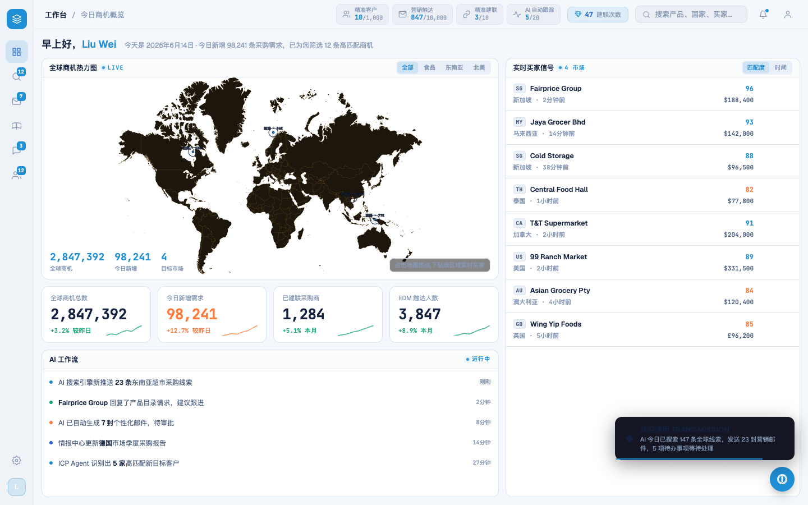
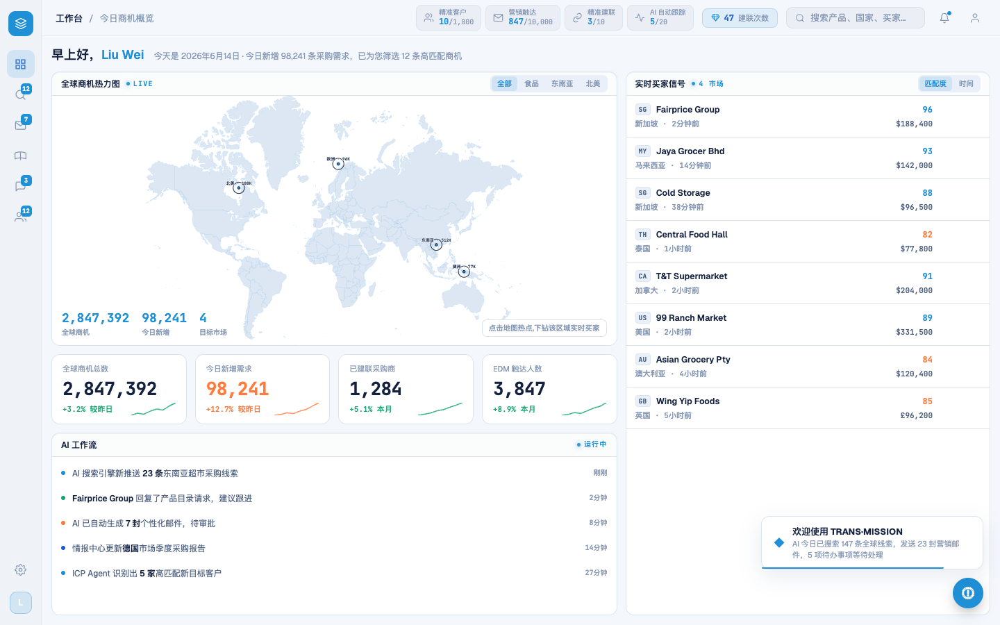

# Round 032 · 🟦 Standard · 工作台暗底残留清理(地图大陆 + toast + 地图提示)

- 时间:2026-06-24
- 档位:🟦 Standard(逐屏精修,自动落库;cron 1min 起搏,不 ScheduleWakeup)
- 分支:`feat/rebrand-transmission`(续 R1,用户重启 loop = 方向认可)
- backlog 来源项:loop-procedure.md §8 R1 残留①②(toast 深块 / 地图暖近黑大陆)

## 做了什么
亮色反相后工作台最显眼的暗底残留(对照 ../logo.jpg 白底气质):
1. **地图大陆**(WorldHeatmap):`.wh-land` 暖近黑 `#1c160c` → 浅冷大陆 `#dde7f3`;描边暖琥珀 `rgba(245,183,61,.16)`(批量漏的**带空格 rgb**)→ 淡 azure `rgba(31,143,214,.14)`;ping 默认/hot stroke 暖橙 → azure/亮 azure;hot dot `#ff7a3d` → `--brand-azure`;标签 halo 深底 `rgba(6,9,17,.7)` → 浅底 `rgba(244,247,252,.85)`(navy 字在浅图上可读)。
2. **toast**(全站):`.toast` 深 navy 块 `rgba(10,14,26,.96)` → 白卡 `var(--bg2)` + 冷边 `var(--card-border)` + 柔和冷阴影 `var(--shadow)`;`.toast-icon ◆` 加 azure 色。欢迎卡「欢迎使用 TRANS·MISSION」现为干净白卡 + navy 字 + azure 进度条。
3. **地图下钻提示** chip:`rgba(11,10,7,.5)` 暖黑块(rgb 形漏替)→ 浅磨砂 `rgba(255,255,255,.82)`。

## 验收
- **build** ✓(613ms)· **机检** dashboard `pass:true newErrors:[]` ✓ · 跨屏 leads/whatsapp 零新错 ✓
- **golden h3** ✓ PASS(errors:[]) —— 改了 WorldHeatmap(热点交互组件)故必跑,热点→下钻→建联链路未坏。
- **3 critic 两轴(before/after delta)**:① 品牌契合 —— 地图从暖近黑→浅冷大陆 + azure 信号,镜像 logo 白底,toast 白卡 on-brand ✓;② 高级感/零 AI 味 —— 无 glow/渐变复辟,navy 字+白 halo 对比达标,深字 on 浅 chip 可读 ✓。静图 delta 明确正向,以 build+golden+机检+逐屏肉眼为闸门。**裁决:KEEP。**

## 截图
-  → 

## 残留 → backlog(本轮审计新发现)
- **带空格 rgb 漏替**(批量表只命中无空格形):`rgba(245, 183, 61, …)` / `rgba(255, 248, 235, …)` 等仍在 `modals.css`、`FirstRunAnalysis.vue` 残留(6 处)→ 下轮补扫(含空格变体)。
- **暖橙 `--hot:#ff7a3d`**(DashboardPage):冷色主题里的暖橙强调(KPI 98,241 / spark / feed dot / 买家温度)—— 违反单一 azure 锁。需定调:收成亮 azure 强度色 vs 保留为「热度」语义。单独一轮(动 KPI 语义色,需 critic)。

## commit / 分支 / push
- commit on `feat/rebrand-transmission` · push origin。**cron 1min 起搏,不 ScheduleWakeup。**
