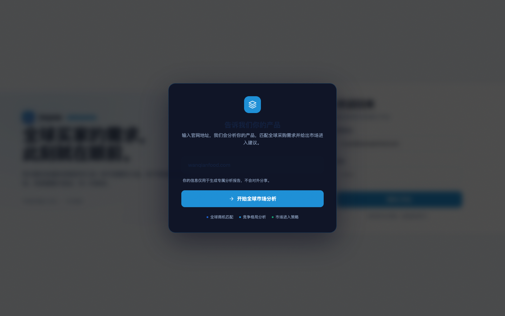
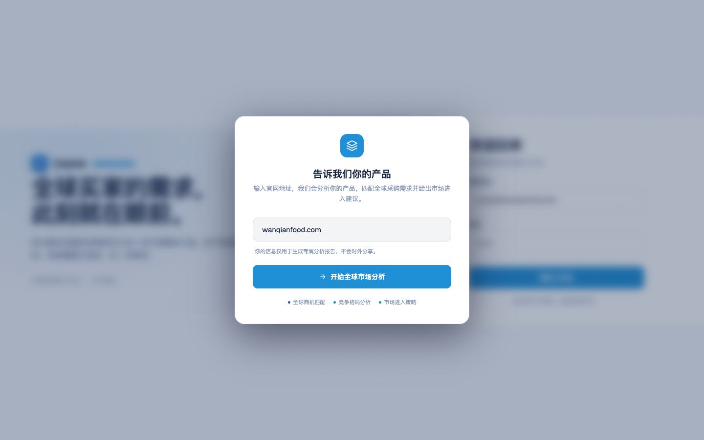

# Round 033 · 🟦 Standard · 浮层暗底全亮色化 + 去蓝渐变按钮(modal / 网址弹窗 / AI 气泡)

- 时间:2026-06-24
- 档位:🟦 Standard(逐屏精修,自动落库;cron 1min 起搏,不 ScheduleWakeup)
- 分支:`feat/rebrand-transmission`
- backlog 来源项:loop-procedure.md §8「modal/toast overlay 亮色化」(toast R032 已做,本轮做 modal 家族)+ R032 残留③ rgba(0,0,0) 遮罩

## 做了什么
亮色反相后所有**浮动暗面**(对照 ../logo.jpg 白底)收成白卡 + 冷遮罩,并**铲除回潮的蓝色渐变按钮**(守北极星「换蓝≠请回渐变 slop」):
1. **通用 modal**(modals.css):`.modal` 深块 `rgba(10,14,26,.98)` → 白卡 `var(--bg2)` + 冷边 + 冷阴影;`.modal-overlay` 浓黑 `rgba(0,0,0,.6)` → 冷遮罩 `rgba(20,40,80,.35)`;**`.modal-btn.primary` 蓝渐变 `linear-gradient(135deg,brand,brand2)` → 实心 `var(--brand)` + `var(--ink)` 白字**。
2. **网址输入弹窗**(login.css,= demo 黄金路径入口):`#website-modal-overlay` 浓黑→冷遮罩;`.wm-card` 深 `rgba(13,18,37,.95)` → 白卡 + 冷阴影;**`.wm-btn` 蓝渐变 → 实心 azure + 白字**;hover glow box-shadow → 改 `--brand2` 实色压深。
3. **AI 助手气泡**(ai-bubble.css,全站 FAB):`.ai-bubble-panel` 暖黑 `rgba(19,17,11,.96)` → 白卡 + 冷阴影;FAB toggle 投影 `rgba(0,0,0,.55)` → 冷投影。
4. **反馈弹窗**(AppModals.vue 内联):overlay 浓黑→冷遮罩。
- harness:verify.mjs 加 `wmodal` NAV(可截网址弹窗)。

## 验收
- **build** ✓(653ms)· **机检** wmodal `pass:true newErrors:[]` ✓ · 跨屏 login/dashboard/pool 零新错 ✓
- **golden h3** ✓ PASS(errors:[]) —— modals 在 demo 流程内,链路未坏。
- **3 critic 两轴(before/after delta,网址弹窗实拍)**:① 品牌契合 —— 深 navy 弹窗 → 白卡 + 冷遮罩,镜像 logo 白底,azure logo mark + 实心 azure 按钮 ✓;② 高级感/零 AI 味 —— **蓝渐变按钮铲除→实心**(守住前 30 轮去渐变成果,没把 slop 用蓝色请回)✓,navy on 白对比达标 ✓。**裁决:KEEP。**

## 截图
- 网址输入弹窗: → 

## 残留 → backlog
- 通用 `.modal`(解锁/反馈卡)本轮按同模式改了但未单独截图(同属 surface 色 swap + 去渐变,机检 + 逻辑自检过)→ 后续顺手补一张解锁弹窗实拍。
- `.modal-cost strong{color:var(--amber)}`:成本强调用 amber,非 warning 语义,宜收 navy/brand(低优)。
- login `.rso-title em` / 扫描 overlay:hero 渐变(sanctioned),可换 `--brand-grad` 统一(留 login/扫描专轮)。
- `--hot:#ff7a3d` 暖橙仍挂(R032 已记)。

## commit / 分支 / push
- commit on `feat/rebrand-transmission` · push origin。**cron 1min 起搏,不 ScheduleWakeup。**
