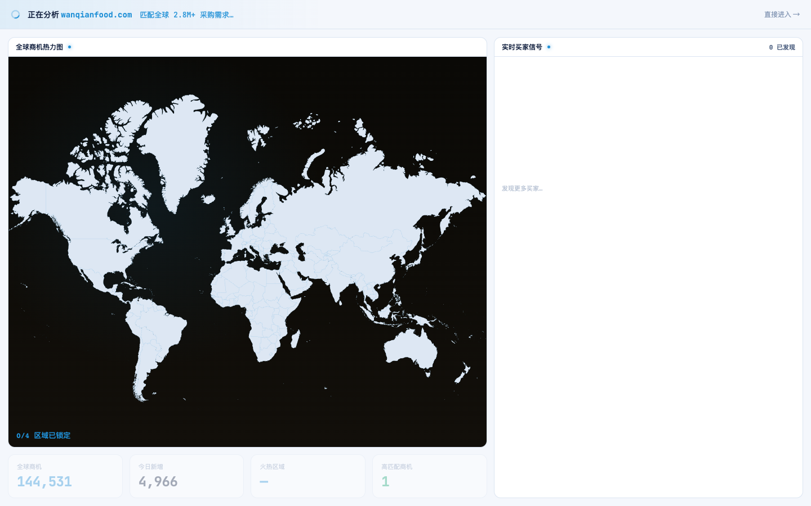
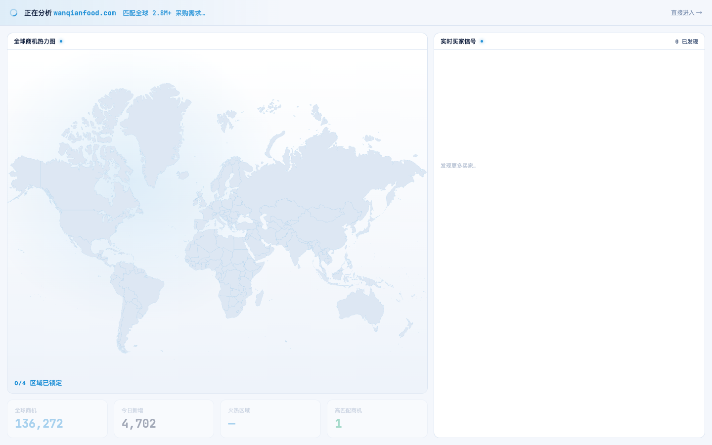

# Round 034 · 🟦 Standard · 首启 FirstRunAnalysis 暗底地图亮色化

- 时间:2026-06-24
- 档位:🟦 Standard(逐屏精修,自动落库;cron 1min 起搏,不 ScheduleWakeup)
- 分支:`feat/rebrand-transmission`
- backlog 来源项:loop-procedure.md §8「首启 FirstRunAnalysis 亮色蓝信号化」

## 做了什么
首启分析屏审计:header / KPI 条 / 右侧买家面板 R1 已亮,但**地图主体仍是暗近黑**(浅大陆浮在黑底上,与全站亮色相反)。收成亮:
1. **地图主体** `.fra-mapbody`:暗渐变 `linear-gradient(180deg,#0a0906,#120f0a)` → 浅冷 `linear-gradient(180deg,#ffffff,#eef3fa)`;保留 azure 径向信号辉光(`rgba(31,143,214,.12)`,略提)。浅大陆 `#dde7f3`(R032)现读作软灰蓝陆块,与工作台地图一致。
2. **热点标签 chip** `.fra-hl`:暗底 `rgba(6,9,17,.7)` → 浅磨砂 `rgba(255,255,255,.85)`(navy 字 + 冷边在浅图上可读)。

## 验收
- **build** ✓(562ms)· **机检** analysis `pass:true newErrors:[]` ✓
- **golden h3** ✓ PASS(errors:[],回归安全)
- **3 critic 两轴(before/after delta,首启实拍)**:① 品牌契合 —— 暗近黑地图面板 → 浅冷 + azure 辉光,镜像 logo 白底,与工作台地图统一 ✓;② 高级感/零 AI 味 —— 全屏一致亮色,无暗底突兀,navy 数字/标签对比达标,无 slop ✓。**裁决:KEEP。**

## 截图
-  → 

## 残留 → backlog
- `--hot:#ff7a3d` 暖橙(R032 记)、modal-cost amber、rso/扫描 hero 渐变(可换 --brand-grad)仍待。
- 首启动效(逐区点亮/KPI count-up/买家流入)本轮未触动,纯色面板亮色化;后续可专轮抠 hero 节奏。

## commit / 分支 / push
- commit on `feat/rebrand-transmission` · push origin。**cron 1min 起搏,不 ScheduleWakeup。**
