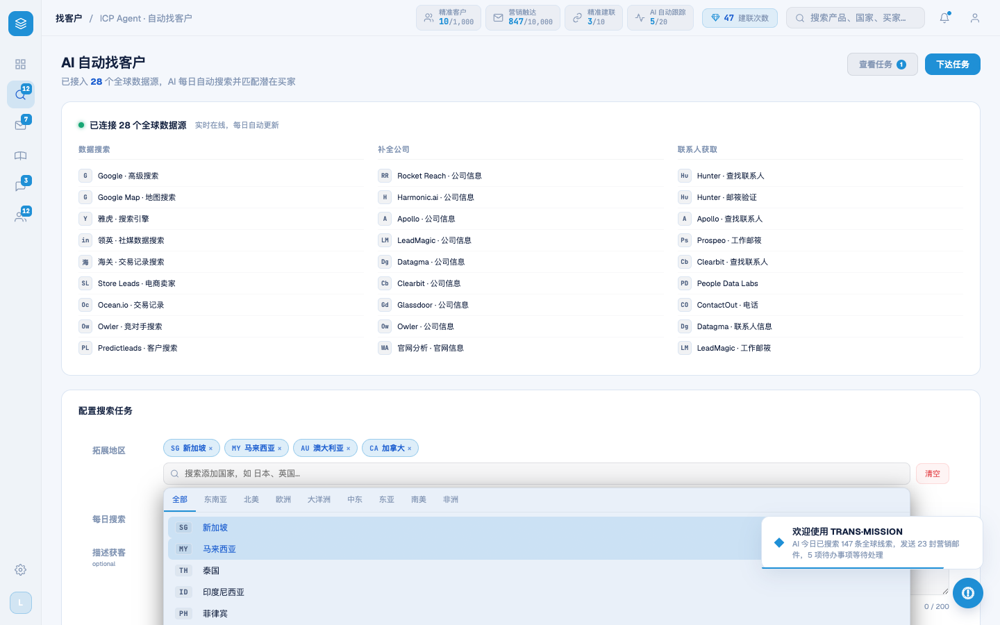

# Round 035 · 🟦 Standard · 暗主题浅字残留 → navy(隐形文字对比修复)

- 时间:2026-06-24
- 档位:🟦 Standard(逐屏精修,自动落库;cron 1min 起搏,不 ScheduleWakeup)
- 分支:`feat/rebrand-transmission`
- backlog 来源项:本轮审计 marketing/intel/pool 时发现(R032 残留③「浅字 on 暗底假设会翻」的具体落点)

## 做了什么
审计发现 **39 处暗主题浅 slate 文字色**(`#e2e8f0`/`#cbd5e1`)散落在 leads 区域下拉(`.rg-country-item`)、客户池 mini-list(`.cpool-*`/`.icp-person-name`)、反馈弹窗(AppModals textarea/标题)、pool/leads hover 态(`.pool-sort-btn`/`.pool-tab`/`.cpool-filter:hover`)等 —— 反相成亮色后这些字 **near-invisible(#e2e8f0 in light ≈ 1.05:1 对比,看不见)**。全部为**纯文字色用法**(grep 确认零 background/border/stroke),安全映射到 navy 令牌:
- `#e2e8f0` → `var(--t-primary)`(#13213f,~13:1 AA 过)
- `#cbd5e1` → `var(--t-sec)`(#4a5d7e)
- 扫 src/**(.vue/.css/.js)+ public/legacy-app.js,残留 = 0。
- harness:verify.mjs 加 `feedback` / `leadsrg` NAV。

## 验收
- **build** ✓(540ms)· **机检** 8 屏(login/dashboard/leads/intel/whatsapp/pool/marketing/analysis)全 `newErrors:[]` ✓ · `leadsrg` 下拉 `pass:true` ✓
- **golden h3** ✓ PASS(errors:[])
- **3 critic 两轴**:① 品牌契合 —— 修复后文字回到 navy 主/次色,符合「深 navy 字 on 浅底」基调 ✓;② 高级感/零 AI 味 —— **隐形文字 = 真实对比 bug(WCAG 不达标),修复后 AA 过**,无 slop ✓。下拉实拍为正向证据;隐形→可见的 delta 多在下拉/hover/弹窗等非默认态,按 §5 以 build+机检+golden+对比度逻辑为闸门并注明。**裁决:KEEP。**

## 截图
- 区域下拉(修复后,country 列表 navy 可读;修复前为 #e2e8f0 隐形):

## 残留 → backlog(本轮审计新发现)
- 🟦 **marketing 左栏邮件队列国旗 emoji**(🇩🇪🇮🇳🇺🇸… `renderMktList` 的 `.mkt-item-flag`):earlier emoji→mono 清理(R007/R015)漏了营销屏,AI 味。改 `ccBadge(m.flag)`(infra 已存在,intel/leads/pool 一致)。低风险,下轮顶。
- `--hot:#ff7a3d` 暖橙 / modal-cost amber / rso hero 渐变仍待。

## commit / 分支 / push
- commit on `feat/rebrand-transmission` · push origin。**cron 1min 起搏,不 ScheduleWakeup。**
