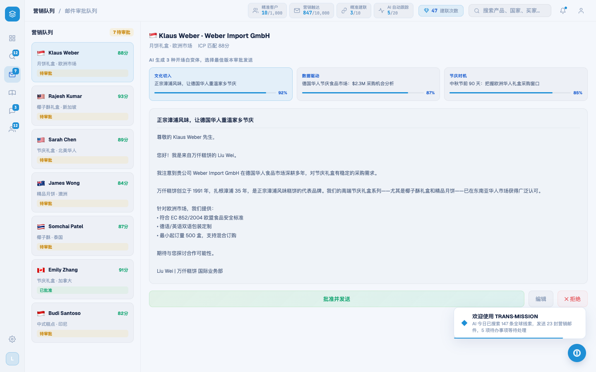
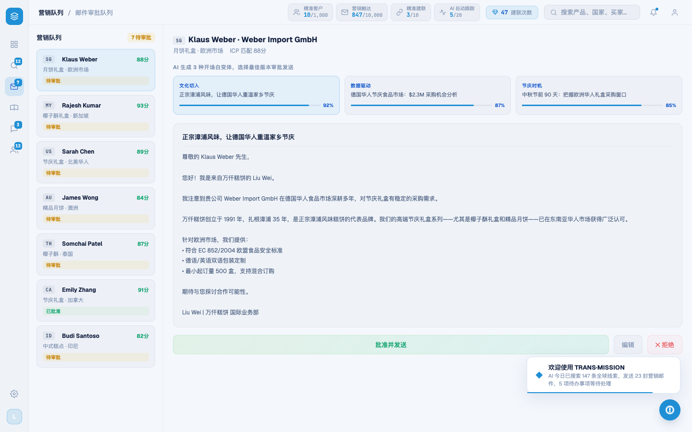

# Round 036 · 🟦 Standard · 营销屏国旗 emoji → mono 国家码(ccBadge)

- 时间:2026-06-24
- 档位:🟦 Standard(逐屏精修,自动落库;cron 1min 起搏,不 ScheduleWakeup)
- 分支:`feat/rebrand-transmission`
- backlog 来源项:R035 审计发现「marketing 左栏国旗 emoji,R007/R015 emoji→mono 清理漏了营销屏」

## 做了什么
营销审批屏是 emoji→mono 国家码统一(R007/R015)唯一漏网的屏。两处国旗 emoji → 复用既有 `ccBadge()`(终端风 mono 码,与 intel/leads/pool 一致):
1. **左栏邮件队列**(`renderMktList`):`
${m.flag}
` → `${ccBadge(m.flag)}`。
2. **右侧详情头**(`mkt-review-name`):`${item.flag} ${item.name}` → `${ccBadge(item.flag)}${item.name}`。
- 7 国旗(SG/MY/US/AU/TH/CA/ID)全在 FLAG2CC 映射内。`.mkt-item-flag` CSS 规则失效但无害,留置。

## 验收
- **build** ✓(556ms)· **机检** marketing `pass:true newErrors:[]` ✓
- **golden h3** ✓ PASS(errors:[],改 legacy-app.js 共享文件故跑)
- **3 critic 两轴(before/after delta,营销屏实拍)**:① 品牌契合 —— 国旗 emoji → mono 码,终端风,与全站国家码一致 ✓;② 高级感/零 AI 味 —— **emoji 装饰清除**(守北极星「无 emoji 装饰」),营销屏现与 intel/leads/pool 同档 ✓。**裁决:KEEP。**

## 截图
-  → 

## 残留 → backlog
- `--hot:#ff7a3d` 暖橙(KPI 语义色,专轮)· modal-cost amber · rso/扫描 hero 渐变(可换 --brand-grad)仍待。
- 全站 emoji→mono 国家码统一**收官**(leads/intel/whatsapp/pool/marketing 全覆盖)。

## commit / 分支 / push
- commit on `feat/rebrand-transmission` · push origin。**cron 1min 起搏,不 ScheduleWakeup。**
