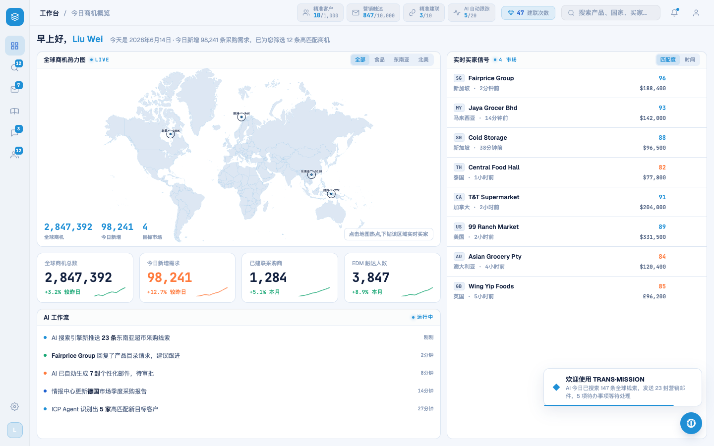
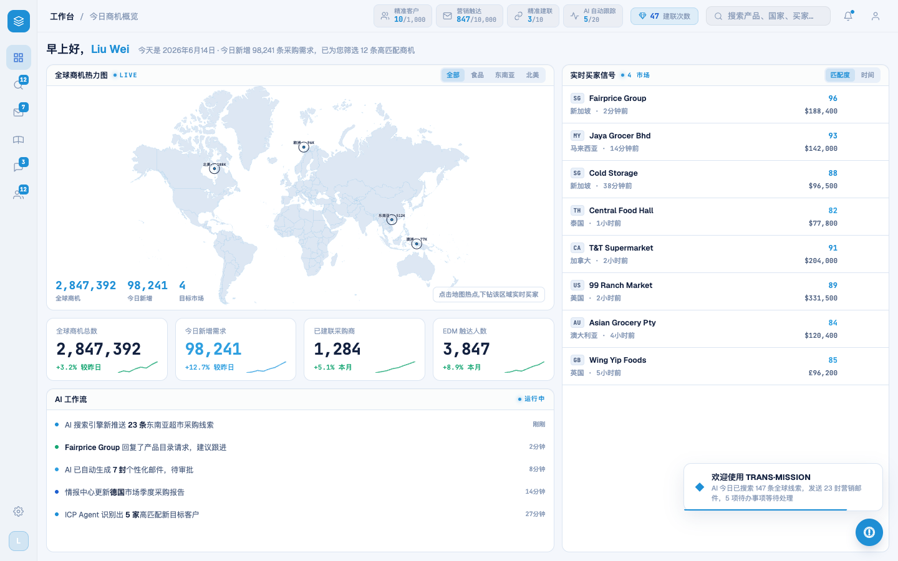

# Round 037 · 🟦 Standard · 暖橙 --hot → 亮 azure(单一 azure 锁收口)

- 时间:2026-06-24
- 档位:🟦 Standard(逐屏精修,自动落库;cron 1min 起搏,不 ScheduleWakeup)
- 分支:`feat/rebrand-transmission`
- backlog 来源项:R032/R036 残留「`--hot:#ff7a3d` 暖橙违反单一 azure 锁」

## 做了什么
冷色主题里最后的暖色强调 `--hot:#ff7a3d`(工作台 hot KPI 值/delta/spark、AI feed dot、买家温度;首启 KPI/mt)收成 **亮 azure** —— 与 R032 地图 hot dot(已用 `--brand-azure`)统一,「热度/强度」= 亮 azure,守北极星单一强调色:
1. **tokens.css**:新增全局 `--hot:var(--brand-azure)`(#2f9fe0)。
2. **DashboardPage** `.dash-cc`:本地 `--hot:#ff7a3d` 覆盖 → `var(--brand-azure)`。
3. **FirstRunAnalysis**:之前 `var(--hot)` 无本地定义(失效),现继承全局 azure(hot KPI/`.fra-mt.mid`/`.fra-hot.on` 正确点亮)。
4. **legacy feed 数据**:情报更新项 `color:'#ff7a3d'` → `'#2f9fe0'`。
- 全站 `#ff7a3d` 残留 = 0。

## 验收
- **build** ✓(601ms)· **机检** dashboard + analysis `newErrors:[]` ✓
- **golden h3** ✓ PASS(errors:[])
- **3 critic 两轴(before/after delta,工作台实拍)**:① 品牌契合 —— 移除最后暖橙,全屏冷 azure 一致,镜像 logo 蓝谱 ✓;② 高级感/零 AI 味 —— **单一 azure 锁恢复**(绿/红仅语义),hot KPI 仍可辨(azure 值 vs 普通 KPI navy 值),大号粗体值 azure 对比达标 ✓。**裁决:KEEP。**

## 截图
-  → (98,241 hot KPI 橙→azure)

## 残留 → backlog
- `modal-cost strong{color:var(--amber)}`:成本强调用 amber 非 warning 语义 → 收 navy/brand(低优)。
- rso/扫描 hero 渐变(`.rso-title em` `linear-gradient(brand2,cyan)`)可换 `--brand-grad`(navy→azure)统一 hero(login/扫描专轮)。
- 首启动效 hero 节奏(逐区点亮/count-up)专轮。

## commit / 分支 / push
- commit on `feat/rebrand-transmission` · push origin。**cron 1min 起搏,不 ScheduleWakeup。**
