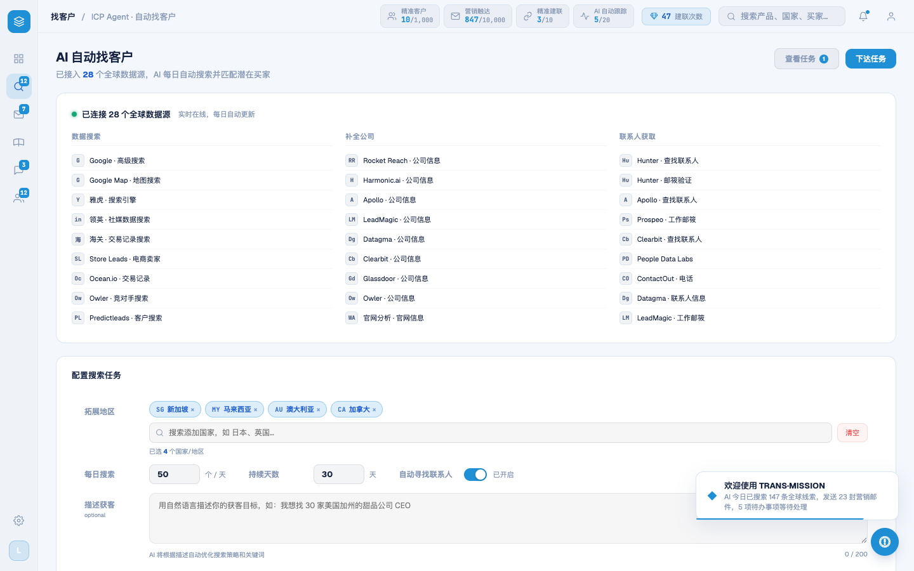

# Round 038 · 🟦 Standard · 实时屏按钮去蓝渐变 + 去 glow(login/leads/marketing)

- 时间:2026-06-24
- 档位:🟦 Standard(逐屏精修,自动落库;cron 1min 起搏,不 ScheduleWakeup)
- 分支:`feat/rebrand-transmission`
- backlog 来源项:§8「按钮系统 azure + 白字(保去 slop)」+ 本轮审计(R1 字面量替换把旧 amber 渐变按钮变成**蓝渐变 + glow**,正是 B7/CP5 清掉、北极星禁止的「用蓝色请回 slop」)

## 审计关键发现(先排雷)
全屏扫 `linear-gradient`/glow 发现两块**死代码 UI**(live 流程是 login→网址弹窗→FirstRunAnalysis→`enterApp()`):
- `#reg-scan-overlay`(`.rso-*` 假扫描)—— `startScan` 在 `__showAnalysis` 后 `return`,该分支不可达。
- `#s-onboard`(`runOnboarding`/`OB_CONTENTS` 章节)—— 仅由上面死分支(L269)触达。
→ **不抛光死 UI**(守「活必须挣来」红线),归 T11 删死代码;本轮只动 live 按钮。

## 做了什么(只动 live 屏按钮)
- **login**:`.login-btn` 蓝渐变 → 实心 `var(--brand)` + 白字;hover glow `box-shadow 0 8px 24px` → `filter:brightness(1.05)`;`.lg-mark` 品牌标记保留渐变但换 `--brand-grad`(navy→azure,sanctioned)+ glow 22px 光晕 → 微 drop-shadow。
- **leads**:`.icp-task-btn.primary` 蓝渐变+glow → 实心 azure + `--ink`,去 glow;`.icp-task-btn.auto`、`.btn-connect` tint 渐变 → 扁平 tint 底。
- **marketing**:`.btn-approve` 绿 tint 渐变 → 扁平绿 tint。

## 验收
- **build** ✓(579ms)· **机检** login/leads/marketing `newErrors:[]` ✓
- **golden h3** ✓ PASS(errors:[])
- **3 critic 两轴(login 实拍 before/after)**:① 品牌契合 —— 主按钮实心 azure + 白字,品牌标记 --brand-grad,符合 logo 蓝谱 ✓;② 高级感/零 AI 味 —— **蓝渐变 + glow slop 铲除**(守住 B7/CP5 成果,没把 slop 用蓝色请回),hover 改物理亮度而非光晕 ✓。**裁决:KEEP。**

## 截图
- login: → (登录按钮 渐变→实心 azure)
- leads after:

## 残留 → backlog
- ⬜ **T11 删死代码**:`#reg-scan-overlay`/`.rso-*` + `#s-onboard`/`runOnboarding`/`OB_CONTENTS`(含其内蓝渐变按钮、暖橙残留 orb)死代码,确认无引用后删(Utility,高确定)。
- `modal-cost strong{color:var(--amber)}` amber 强调(低优)。
- onboarding.css `.ob-cta-btn` 等渐变属死 UI,随 T11 一并删,不单独抛光。

## commit / 分支 / push
- commit on `feat/rebrand-transmission` · push origin。**cron 1min 起搏,不 ScheduleWakeup。**
