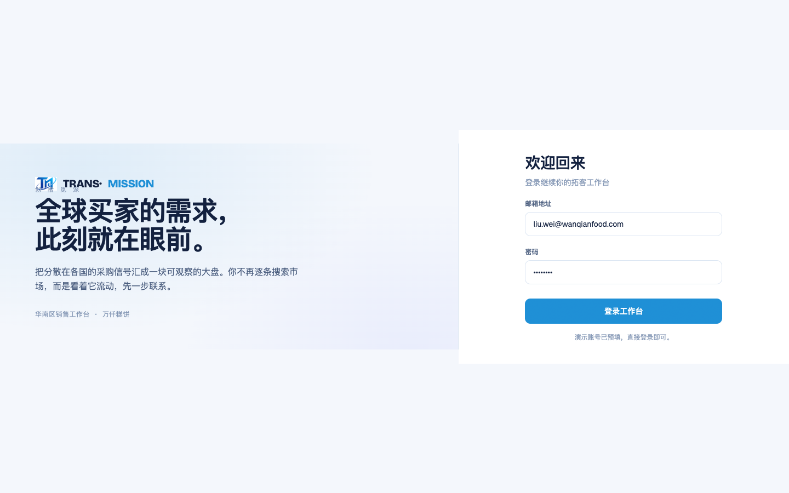
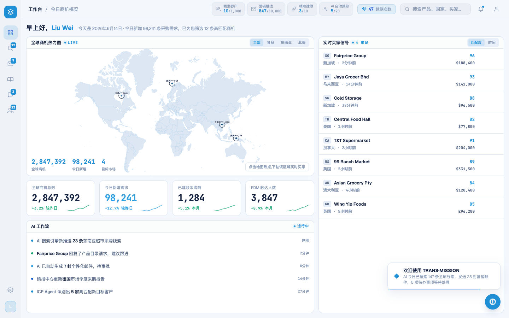
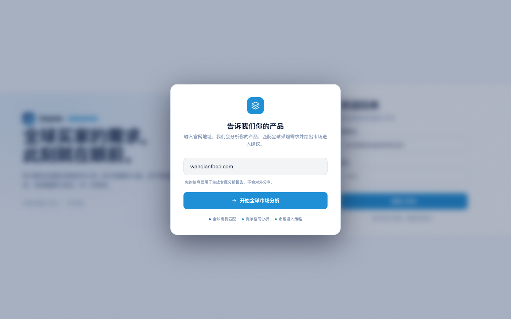
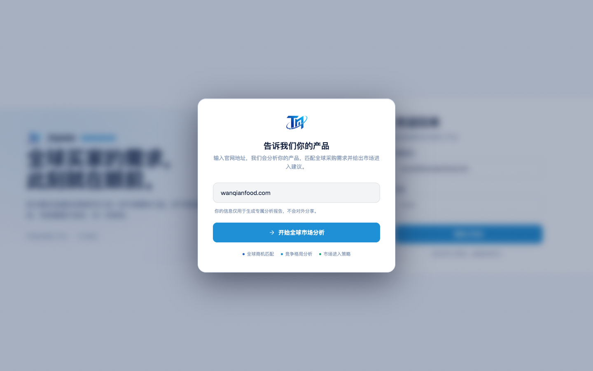

# Round 039 · 🟦 Standard · 真实 logo 实图接入(替换 CSS 复刻 TM)

- 时间:2026-06-25
- 档位:🟦 Standard(逐屏精修,自动落库;cron 1min 起搏,不 ScheduleWakeup)
- 分支:`feat/rebrand-transmission`
- backlog 来源项:§8「logo 实图接入(用户 2026-06-25 点名:所有用到 logo 的地方换真实 logo)」—— 影响高·把握高·风险低,优先

## 做了什么
把所有 live 处的「彩色方块底 + 通用 3 层立方 SVG」(读着像通用 AI-SaaS 占位 logo)换成**真实透明 logo PNG**(`public/logo-mark.png`,navy→azure TM monogram + 轨道 swoosh + 节点圆点):
1. **SidebarNav `.sb-logo`**(每屏可见 34px):SVG + `background:var(--brand)` 方块 → ``,容器透明 object-fit:contain。
2. **LoginScreen `.lg-mark`**(登录左侧品牌行):SVG + `--brand-grad` 方块 + glow → img monogram(留 crisp 文字字标 "TRANS·MISSION" + 创拾觅深 署名)。
3. **LoginScreen `.wm-logo`**(网址输入弹窗):SVG + `--brand` 方块 → img monogram。
4. **index.html favicon** → `/logo-mark.png`。
- `.rso-logo`(扫描层)= T11 死 UI,跳过。live 三处 mark 已无 CSS 复刻 SVG(grep 确认全 img)。

## 验收
- **build** ✓(574ms)· **机检** login/dashboard/wmodal `newErrors:[]` ✓
- **golden h3** ✓ PASS(errors:[])
- **3 critic 两轴(login/dashboard/wmodal 实拍 before/after)**:① 品牌契合 —— 用**真实 logo**(TM monogram+swoosh),最大化 logo 还原度,透明叠在亮色 UI 干净不脏 ✓;② 高级感/零 AI 味 —— 去掉「azure 圆角方块 + 通用立方 SVG」(典型 AI 占位感)→ 真品牌标记,**产品北极星**:统一真 logo 强化掌控/信任感 ✓。**裁决:KEEP。**

## 截图
- login: → 
- 侧栏(工作台): → 
- 网址弹窗: → 

## 残留 → backlog
- `logo-full.png`(含字标+署名全锁版)暂未用 —— login 现用 monogram+crisp 文字(排版更利落);若后续要官方锁版可评估。
- T11 删死代码(scan/onboard,含 rso-logo)· modal-cost amber 仍待。

## commit / 分支 / push
- commit on `feat/rebrand-transmission`(含 verify.mjs unlockm NAV)· push origin。**cron 1min 起搏,不 ScheduleWakeup。**
