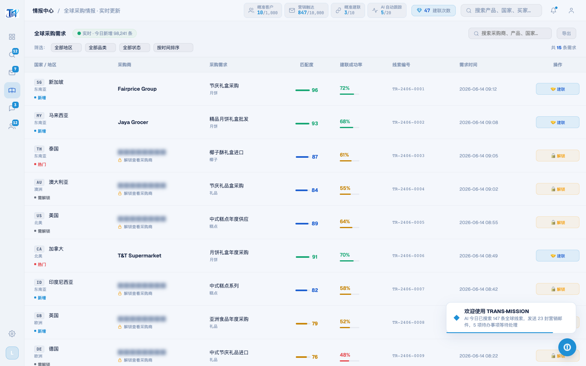
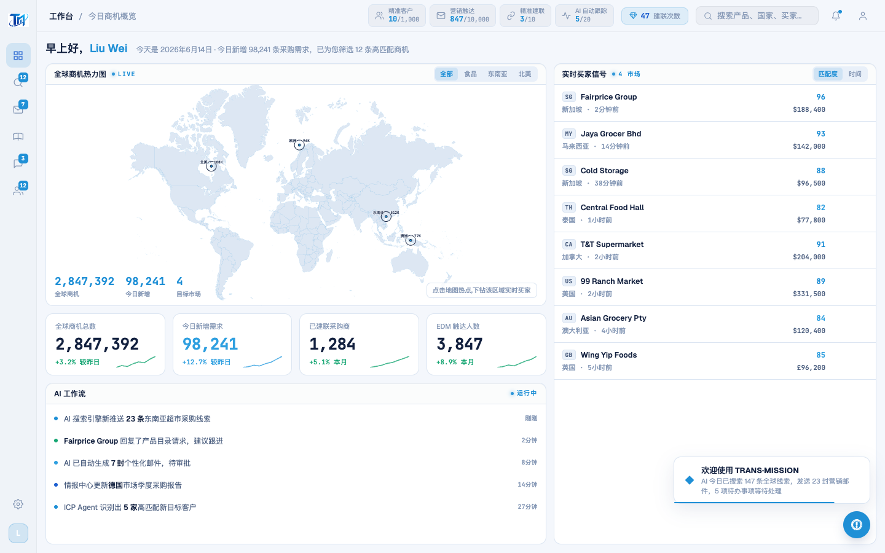

# Round 040 · 🟦 Standard · 语义色旧 RGB 三元组残留补扫(tint 底统一到深化令牌)

- 时间:2026-06-25
- 档位:🟦 Standard(逐屏精修,自动落库;cron 1min 起搏,不 ScheduleWakeup)
- 分支:`feat/rebrand-transmission`
- backlog 来源项:本轮审计(查 amber 是否装饰滥用时发现 `.lead-tag.hot/.urgent` 等用**旧语义色 rgb 三元组**做 tint 底,R1 批量表只命中 hex + 4 个三元组,漏了语义色 rgb 形)

## 做了什么
语义色文字早已是深化令牌(`--green #17a673`/`--red #e5484d`/`--amber #c8860a`/`--purple→#1e5fd0`),但**大量 tint 背景仍用旧亮 hue 的 rgb 三元组**(`rgba(251,191,36,.1)` 等),与令牌不一致。机械补扫(exact-match,弹性空格,13 文件 + legacy):
- `251,191,36`(旧 amber #fbbf24)→ `200,134,10`(#c8860a)
- `248,113,113`(旧 red #f87171)→ `229,72,77`(#e5484d)
- `123,212,123`(旧 green #7bd47b)→ `23,166,115`(#17a673)
- `107,120,255`(旧 purple #6b78ff)→ `30,95,200`(#1e5fd0 royal)
共 66 处。残留旧三元组 = 0。

## 验收
- **build** ✓(1.17s)· **机检** dashboard/intel/marketing/leads/whatsapp/pool 全 `newErrors:[]` ✓
- **golden h3** ✓ PASS(errors:[])
- **3 critic 两轴**:① 品牌契合 —— 语义 tint 底与深化令牌同源,冷亮主题一致 ✓;② 高级感/零 AI 味 —— 语义色(绿正向/红负向/amber 警示/locked)tint 与文字 hue 统一,无撞色;单一 azure 锁不受影响 ✓。tint 低 alpha,静图 delta 细微,以 build+机检+golden+intel 实拍一致性 + exact-match 逻辑为闸门(§5)。**裁决:KEEP。**

## 截图
- intel: → (建联成功率/locked tint 统一深化)
- dashboard: → 

## 残留 → backlog
- `.lead-tag.hot`(amber tint)= 未使用死样式;随 T11 或保留观察。
- T11 删死代码(scan/onboard,含 rso markup —— 注:LoginScreen 仍保留 #reg-scan-overlay markup)· modal-cost amber(成本=轻警示,暂留)。
- **收敛提示**:视觉 rebrand 主体已完成(反相/更名/暗底/对比/emoji/单一azure/按钮/真logo/语义tint)。剩余多为低价值微调或 T11(风险/非视觉)。若后续 2 轮仍只挖到低价值 → 按 §6 发 digest 问方向(merge main? 转产品北极星功能轴? T11 专轮?)。

## commit / 分支 / push
- commit on `feat/rebrand-transmission` · push origin。**cron 1min 起搏,不 ScheduleWakeup。**
