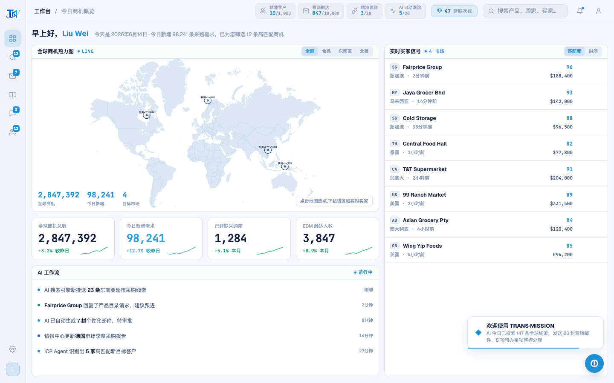
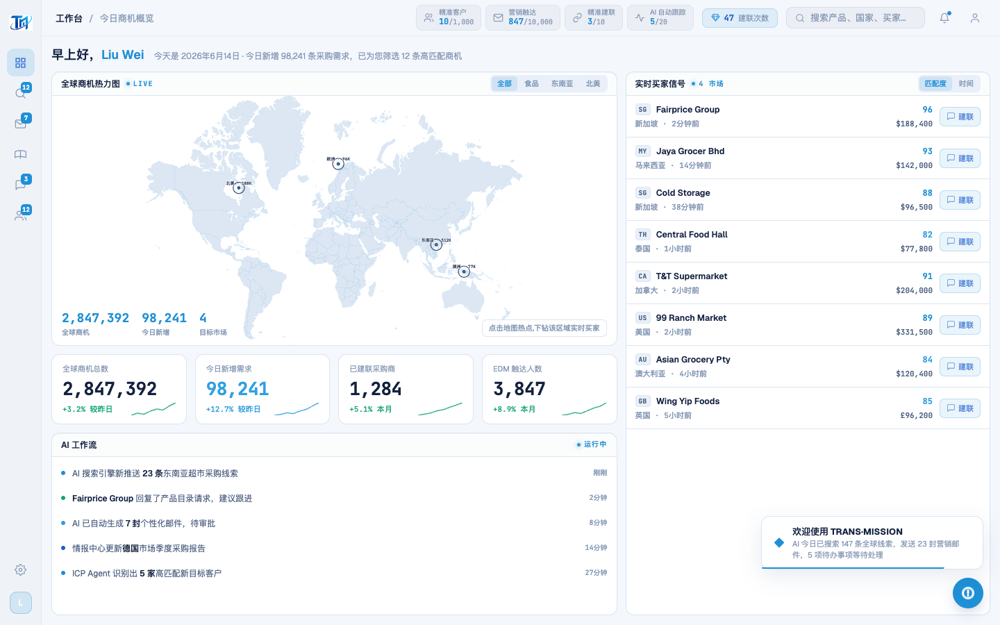

# Round 041 · 🟦 Standard(产品轴首轮)· 实时买家信号「建联」行动常驻可见(明确下一步)

- 时间:2026-06-25
- 档位:🟦 Standard(产品北极星轴,自动落库;cron 1min 起搏,不 ScheduleWakeup)
- 分支:`feat/rebrand-transmission`
- backlog 来源项:产品北极星审计(用户 2026-06-25 选定转产品轴)—— 工作台「实时买家信号」每行有 score+金额但**无可见行动**(`.bconnect` opacity:0,仅 hover 显形,R023 critic 已留候选)→ 缺「明确下一步」,卖方不知每条买家可一键建联。

## 做了什么
把右侧买家信号行的「一键建联」从**hover 才显形**改为**常驻低调可见**:
- `.brow .bconnect` 默认 `opacity:0; transform:translateX(4px)`(隐藏滑入)→ `opacity:.72`(常驻 azure-soft 小药丸,带 chat 图标);hover/选区 → `opacity:1` 点亮,再 hover → 实心 azure 填充(原逻辑保留)。
- 行动列右对齐成一条(整齐);点击走真实 H3 `connectBuyer`(把买家物化为真实 WhatsApp 联系人 + seed 对话 = **真实挣来的成就感反馈**,非假 %)。

## 验收
- **build** ✓(658ms)· **机检** dashboard `newErrors:[]` ✓
- **golden h3** ✓ PASS(errors:[]) —— 建联点击→物化→WA 对话链路未坏,行动真实可用。
- **两北极星裁决**:
  - **产品**:① 明确下一步 ✓(每条买家常驻可见「建联」)② 有事做 ✓(右列成一条行动队列)③ 成就感 ✓(点击=真实建联,WA 出现新联系人+对话,真实挣来)。无假数据/空转。
  - **视觉**:azure-soft 药丸、右对齐、低调(.72)、hover 点亮——单一 azure、零 slop、整齐。
  - **KEEP。**

## 截图
- (买家行无可见行动)→ (每行常驻「建联」)

## 残留 → backlog(产品轴候选,后续审计补)
- 工作台「今日明确待办」聚合(逾期跟进/待建联/待解锁 → 一处清单),强化「每天有事做」。
- 完成动作的即时正反馈(建联/解锁/发邮件 → 状态推进 + 列表 +1 + 阶段点亮),强化「成就感/希望」;红线:真实挣来。
- 数字可读性:KPI/feed 数字是否都有「这对我意味着什么」的解读。

## commit / 分支 / push
- commit on `feat/rebrand-transmission` · push origin。**cron 1min 起搏,不 ScheduleWakeup。**
