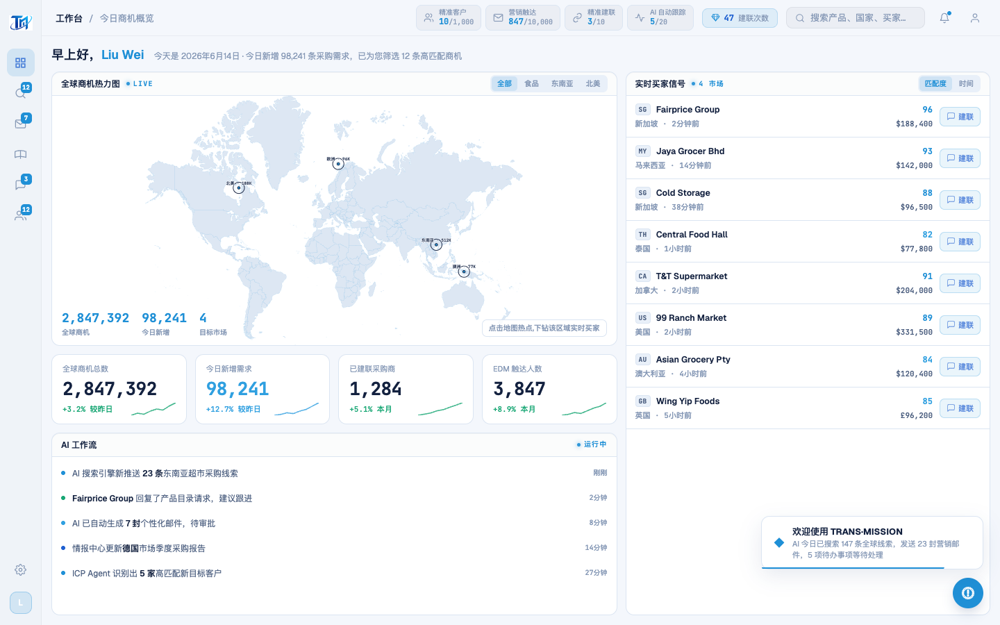
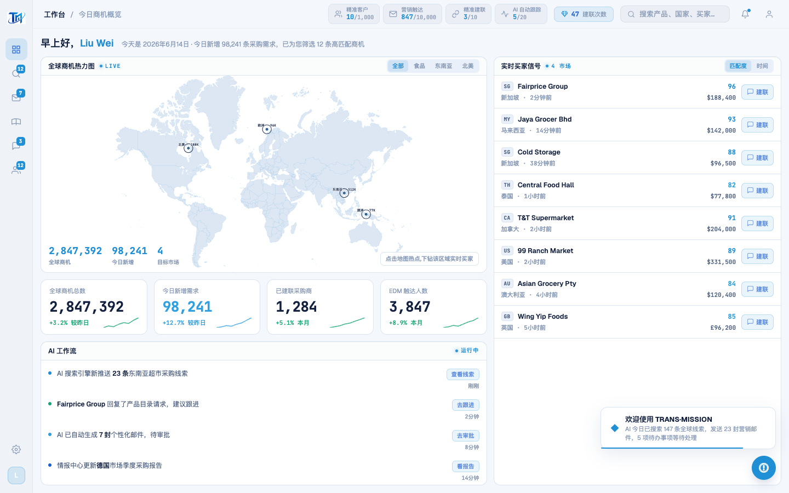

# Round 042 · 🟦 产品轴 · AI 工作流 feed 行动化(narration → 明确下一步)

- 时间:2026-06-25
- 档位:🟦 Standard(产品北极星轴,自动落库;cron 1min 起搏,不 ScheduleWakeup)
- 分支:`feat/rebrand-transmission`
- backlog 来源项:§8b 产品轴审计 —— 工作台「AI 工作流」feed 是 AI 活动叙述,可点击跳转但**无可见行动线索**;其中「待审批」「建议跟进」本就是卖方任务,却读着像被动播报 → 缺「明确下一步」。

## 做了什么
延续 R041 模式,给 feed 每行加**常驻行动线索**(诚实地从该条意义派生的动词):
- feed 数据每项加 `action`:查看线索 / 去跟进 / 去审批 / 看报告 / 查看客户。
- 渲染:右侧 `.fmeta` 竖排 = `.faction` 行动药丸(azure-soft,opacity:.72 常驻)+ `.fa` 时间(下,muted)。hover → 药丸点亮实心 azure。整行 `@click nav(f.page)` 保留。
- feed 现读作**可执行任务队列**(不是被动叙述);右列行动药丸对齐(整齐)。

## 验收
- **build** ✓(696ms)· **机检** dashboard `newErrors:[]` ✓
- **golden h3** ✓ PASS(errors:[])
- **两北极星裁决**:
  - **产品**:① 明确下一步 ✓(每条 AI 活动直接给卖方动作)② 有事做 ✓(feed=任务队列)③ 整齐 ✓(行动药丸右对齐)。动词由真实条目语义派生,无假数据/空转。
  - **视觉**:azure-soft 药丸、单一 azure、hover 点亮——与 R041 买家行动一致,零 slop。
  - **KEEP。**

## 截图
- (feed 仅叙述+时间)→ (每行常驻行动药丸)

## 残留 → backlog(§8b 产品轴)
- 「今日明确待办」聚合(逾期跟进/待建联/待解锁 → 一处清单)仍是最大「有事做」杠杆,但需新组件(中风险),后续专轮。
- 完成动作即时正反馈(状态推进+列表+1+阶段点亮,真实挣来)。
- 数字可读性、空态/死路审计。

## commit / 分支 / push
- commit on `feat/rebrand-transmission` · push origin。**cron 1min 起搏,不 ScheduleWakeup。**
