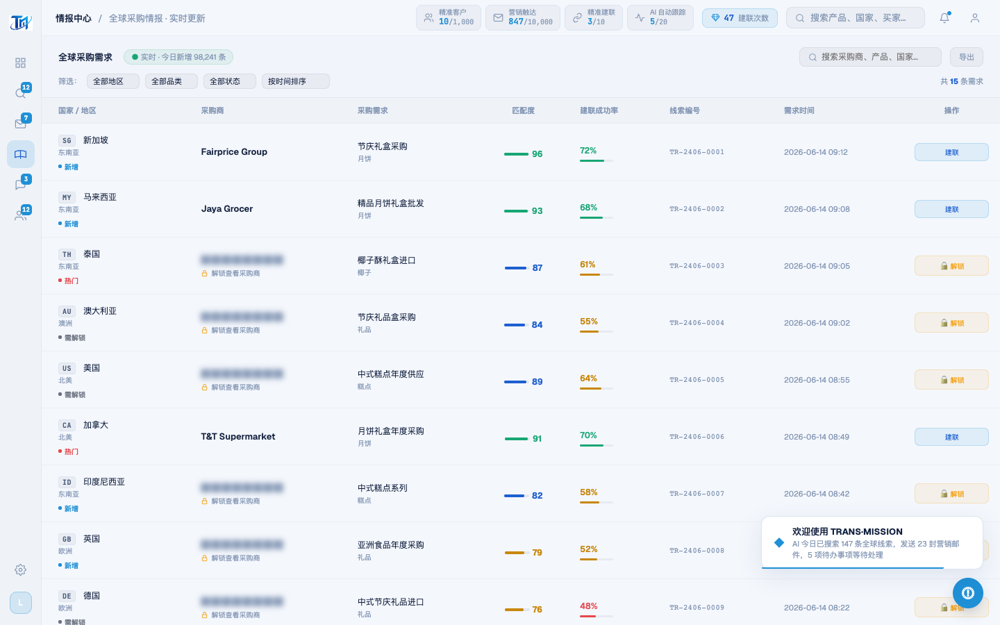

# Round 043 · 🟦 产品轴 · 成就感反馈层去 emoji(toast 图标统一 ◆ + 建联键去 🤝)

- 时间:2026-06-25
- 档位:🟦 Standard(产品北极星轴,自动落库;cron 1min 起搏,不 ScheduleWakeup)
- 分支:`feat/rebrand-transmission`
- backlog 来源项:§8b 审计「完成动作即时正反馈」时发现 —— toast 是卖方主要**成就感反馈通道**,但 ~20 处 toast 仍传 emoji 图标(⚠️🧠⚡✅📧📄📨📡✏️✕🤝🔓✉️ + 空 ''),且 intel「🤝 建联/立即建联」按钮带 emoji → 既违视觉北极星(无 emoji 装饰),反馈层又不一致。

## 做了什么
统一卖方反馈层到干净的 ◆ azure 标记(零 emoji):
- **33 处 toast 调用**首参图标 → `◆`(`s/toast('…'/toast('◆'/`,ASCII 安全 `\x{25c6}` 避免 shell UTF-8 双编码;hexdump 验证 `E2 97 86` = U+25C6 单字符,无损)。toast-icon CSS 已是 azure(R032),现全站反馈一个干净 ◆。
- **intel 建联键**:`🤝 建联`/`🤝 立即建联` → `建联`/`立即建联`(去 emoji 前缀)。

## 验收
- **build** ✓(584ms)· **机检** marketing/intel/pool/whatsapp/dashboard 全 `newErrors:[]` ✓
- **golden h3** ✓ PASS(errors:[])
- **两北极星裁决**:
  - **视觉**:反馈层 + 建联键 ~20 emoji 清除,统一 ◆ azure(无 emoji 装饰、单一 azure)✓
  - **产品**:成就感反馈(toast)读着干净/高级/一致,不再 emoji 装饰;toast 仍在真实动作时触发(诚实)✓
  - intel 实拍建联键无 emoji + 欢迎 toast ◆ azure。**KEEP。**

## 截图
- (建联键无 emoji;右下 toast ◆ azure)

## 残留 → backlog
- 🟦 **通知数据 emoji 图标**(NOTIF/feed 数据 `{icon:'🤝'/'💬'/'🔔'…}` 765/2037 等)→ 换扁平 SVG/◆(下轮)。
- 🔴 **confirmUnlock 假反馈(红线!)**:解锁 toast 称「完整联系方式已显示」但 UI 未真正揭示被打码 ██████ 数据 = 假成就感,违「真实挣来」红线 → 需让解锁真正 un-mask 该行(专轮,中风险)。
- §8b:今日待办聚合、数字可读性、空态审计。

## commit / 分支 / push
- commit on `feat/rebrand-transmission` · push origin。**cron 1min 起搏,不 ScheduleWakeup。**
