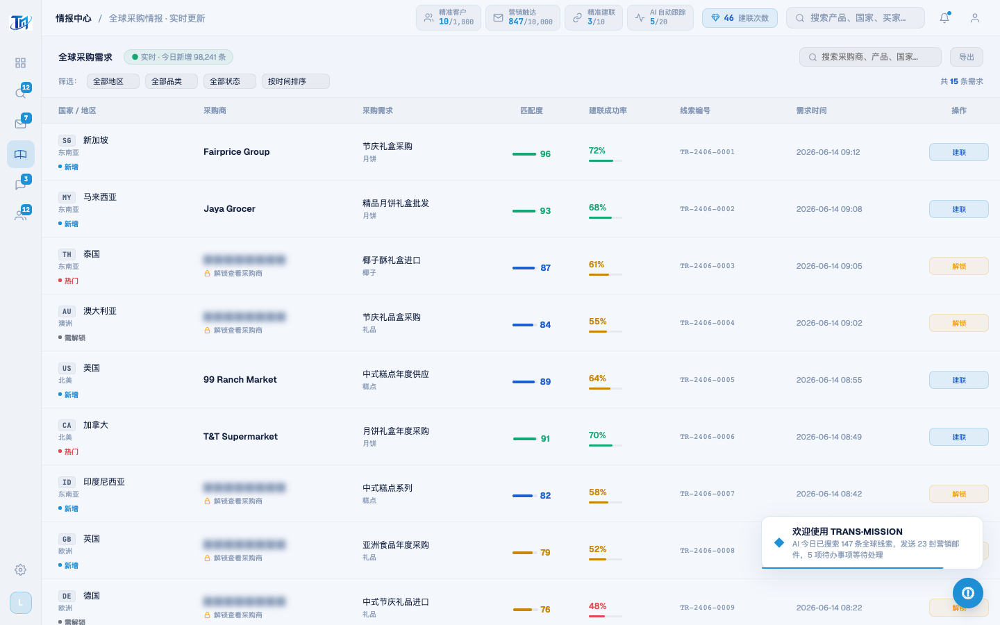

# Round 044 · 🔴→✅ 产品轴 · 情报解锁「假反馈」修成真实揭示(红线)

- 时间:2026-06-25
- 档位:🟦 Standard(产品北极星轴,自动落库;cron 1min 起搏,不 ScheduleWakeup)
- 分支:`feat/rebrand-transmission`
- backlog 来源项:R043 发现的 🔴 红线项 ——「confirmUnlock 假反馈」:点解锁 toast 称「完整信息已显示」但 UI 未真正 un-mask ██ 数据 = 假成就感,违「成就感必须真实挣来」红线。

## 做了什么
让情报中心表格的「解锁」真正发生(把假反馈变成真实、可见、挣来的反馈):
- `INTEL_TABLE_DATA` 行本就含真实 `buyer` 等数据,锁定时仅 `blur(4px)` 遮罩 + 显「解锁」。
- 新增 `intelUnlockTarget` + `openIntelUnlock(id)`:锁定行点击/解锁键 → 记录目标行 → 开弹窗(取代裸 `showModal`)。
- 重写 `confirmUnlock()`:命中目标行 → `unlocked=true`、`status:locked→new`、**真实扣 1 次建联次数(credits 47→46,刷新 `credits-val`)**、`renderIntelTable()` 重渲染(采购商名 un-blur、徽标「需解锁→新增」、操作「解锁→建联」)、toast **诚实点名**该采购商 + 剩余次数。无目标时(whatsapp 情报面板 / AI 卡片 lock overlay)走原 generic fallback,未触碰。
- 顺手:解锁键去 `🔒` emoji。

## 验收
- **build** ✓(611ms)· **机检** intel + intelunlock(驱动 openIntelUnlock(4)→confirmUnlock)`newErrors:[]` ✓
- **golden h3** ✓ PASS(errors:[])
- **实拍验证**(after):99 Ranch Market(id4)解锁后**采购商名真实显示**、徽标转「新增」、操作转「建联」;顶部**建联次数 47→46**(真实状态推进);其余锁定行仍遮罩。
- **两北极星裁决**:
  - **产品**:成就感**真实挣来**(真揭示 + 真扣次数,非假 toast)✓;有希望(进展可见)✓;整齐(表格干净重渲染)✓。**修掉红线假反馈。**
  - **视觉**:解锁键去 emoji、单一 azure、◆ toast。
  - **KEEP。**

## 截图
- (全锁定,解锁=假 toast)→ (99 Ranch 真解锁 + 次数 46)

## 残留 → backlog
- whatsapp 情报面板 / AI 卡片 lock overlay 仍 generic fallback(可后续接 openIntelUnlock 同款真实揭示,需各自数据 un-mask)。
- 通知数据 emoji 图标(765/2037 🤝💬🔔)· §8b 今日待办聚合 / 数字可读性 / 空态审计。

## commit / 分支 / push
- commit on `feat/rebrand-transmission`(含 verify.mjs intelunlock NAV)· push origin。**cron 1min 起搏,不 ScheduleWakeup。**
