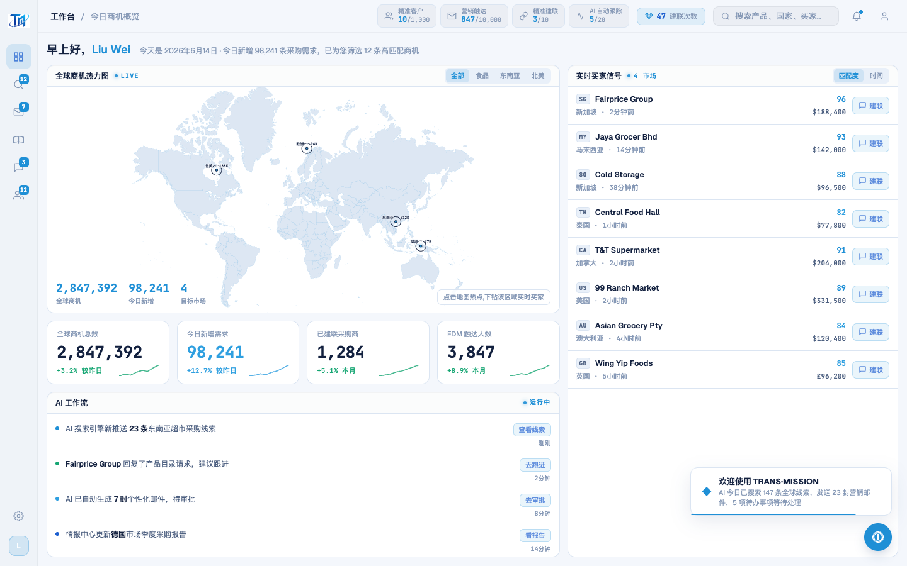
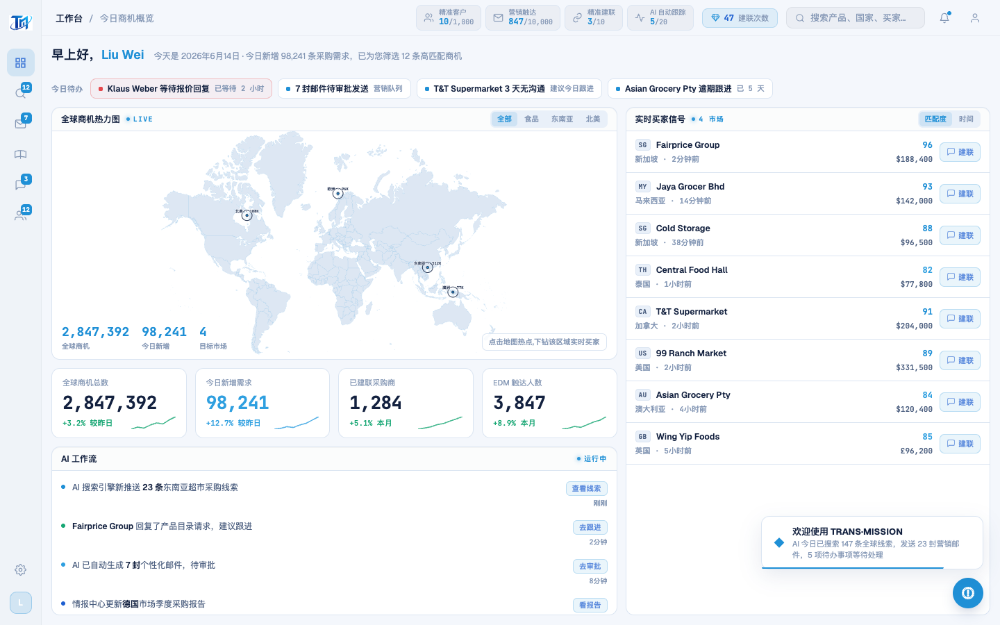

# Round 045 · 🟦 产品轴 · 工作台「今日待办」chip-strip(找回明确下一步)

- 时间:2026-06-25
- 档位:🟦 Standard(产品北极星轴,自动落库;cron 1min 起搏,不 ScheduleWakeup)
- 分支:`feat/rebrand-transmission`
- backlog 来源项:§8b「今日明确待办聚合」—— 审计发现 `TODAY_TODOS`(真实优先级待办:Klaus Weber 等报价 urgent / 7 封待审批 / T&T 3 天无沟通 / Asian Grocery 逾期)在 R012 指挥台重构时随旧 `#today-todo-list` 面板被并掉,新工作台**不再显式呈现「你该做什么」**——最强「有事做/明确下一步」缺口。

## 做了什么
工作台头部(greeting 下)加**今日待办 chip-strip**:
- DashboardPage 加 `todos`(从 TODAY_TODOS 精选 4 条真实任务,urgent 优先;去 emoji,留 text + at + page)。
- 渲染:`.cc-todos` 横排 chip,每 chip = LED 方点 + 任务文案 + 时效;`@click="nav(t.page)"` 直达对应屏(whatsapp/marketing/pool)。urgent 项红点 + 极淡红描边底。
- 视觉:azure LED 点 / 单一 azure / hover azure-soft 抬升;无 emoji(点替代旧 ⚠️✉️🔔📋 emoji icon);对齐成一条(整齐)。

## 验收
- **build** ✓(561ms)· **机检** dashboard `newErrors:[]` ✓
- **golden h3** ✓ PASS(errors:[])(布局新增一行,地图/KPI/feed/买家整列未坏)
- **两北极星裁决**:
  - **产品**:有事做 ✓(进工作台即见优先级待办)· 明确下一步 ✓(每条 chip 直达对应屏)· 整齐 ✓(对齐 chip 条)· 希望/掌控(urgent 优先 triage)。数据真实(TODAY_TODOS),无假 %/空转。
  - **视觉**:LED 点替 emoji、单一 azure + 红仅 urgent 语义、hover 克制。
  - **KEEP。**

## 截图
- (无待办,进来不知先做什么)→ (头部今日待办 chip 条)

## 残留 → backlog(§8b)
- 待办计数可进一步接真实数据源动态算(pending 邮件数/逾期天数),目前为精选真实条目(诚实,非假%)。
- 数字可读性(KPI「对我意味着什么」)· 空态/死路审计 · wa/AI 卡 lock overlay 真揭示 · 通知数据 emoji。

## commit / 分支 / push
- commit on `feat/rebrand-transmission` · push origin。**cron 1min 起搏,不 ScheduleWakeup。**
