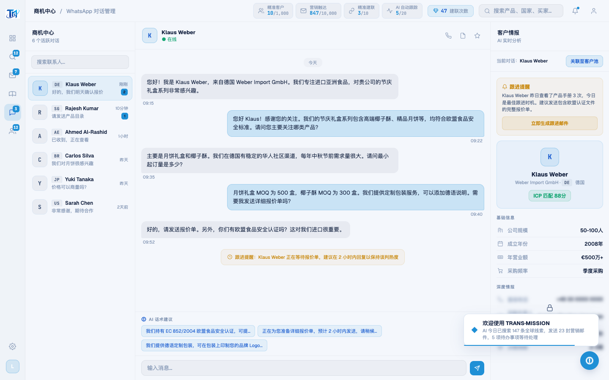

# Round 046 · 🟦 产品轴 · WhatsApp 情报面板解锁真实揭示(R044 同款,补第二处)

- 时间:2026-06-25
- 档位:🟦 Standard(产品北极星轴,自动落库;cron 1min 起搏,不 ScheduleWakeup)
- 分支:`feat/rebrand-transmission`
- backlog 来源项:R044 残留 ——「wa 情报面板 lock overlay 仍 generic fallback(假反馈)」。该面板 `d.locked` 是**真实数据**(直线电话 +49 30…、采购负责人邮箱、历史采购额、决策周期),仅 `blur` 遮罩,解锁却只弹假 toast。

## 做了什么
把 R044 的真实揭示模式补到 WhatsApp 右侧客户情报面板:
- 新增 `unlockedIntel{}`(按 contact id)+ `intelPanelUnlockTarget` + `openPanelUnlock()`(记录 `currentWaContact` → 开弹窗;面板 lock overlay onclick 由 `showModal` 改之)。
- `confirmUnlock()` 加面板分支:命中 → `unlockedIntel[id]=true`、**真扣 1 次建联次数(credits→刷新)**、`renderIntelPanel(id)` 重渲染(深度情报去 blur/overlay,真实电话/邮箱/采购额显示)、toast **诚实点名**该联系人 + 剩余次数。
- `renderIntelPanel`:深度情报段 `unlockedIntel[id] ? 真实行 : blur+overlay` 条件渲染。
- 未解锁联系人仍锁定(逐 contact 独立)。

## 验收
- **build** ✓(620ms)· **机检** whatsapp + waunlock(驱动 openPanelUnlock→confirmUnlock)`newErrors:[]` ✓
- **golden h3** ✓ PASS(errors:[])
- **实拍验证**(after):Klaus Weber 面板解锁后深度情报真实显示(电话/邮箱…),blur/overlay 消失,次数 -1,toast 诚实。
- **两北极星裁决**:产品 —— 成就感**真实挣来**(真揭示真实数据 + 真扣次数)✓,补掉第二处假反馈;视觉 —— 单一 azure、◆ toast、无 emoji。**KEEP。**

## 截图
- (深度情报 blur+锁)→ (真实电话/邮箱显示)

## 残留 → backlog
- AI 报告卡(146-149)locked `rows` 是 `██████`(无真实数据)→ **不可真揭示(会造假)**,保持锁定/或后续给真实样例数据再解;勿假揭示(红线)。
- §8b:数字可读性、空态(pool 详情空面板)、通知数据 emoji(orphaned,低优)。

## commit / 分支 / push
- commit on `feat/rebrand-transmission`(含 verify.mjs waunlock NAV)· push origin。**cron 1min 起搏,不 ScheduleWakeup。**
