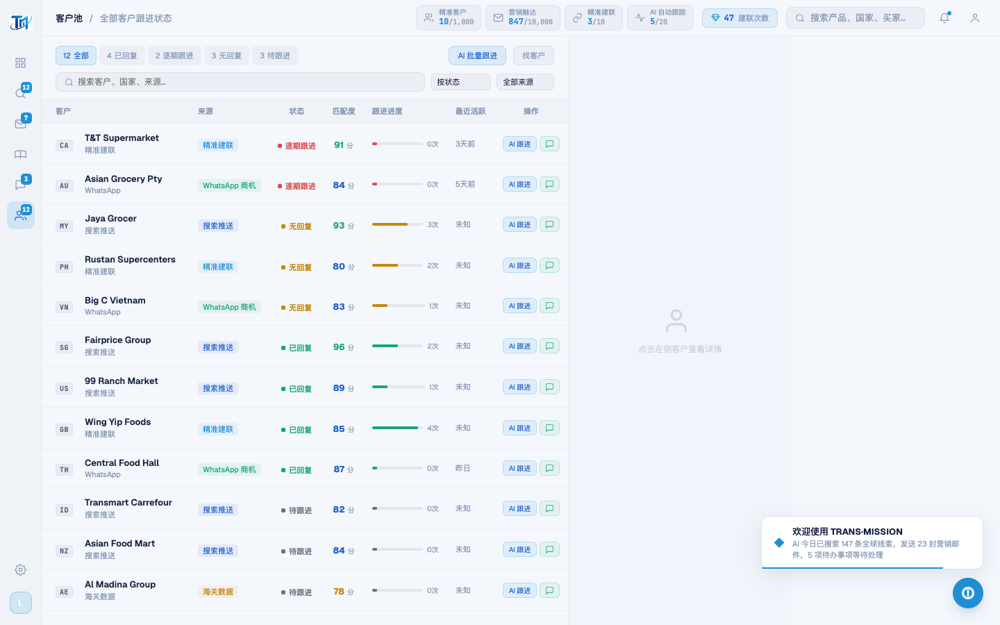
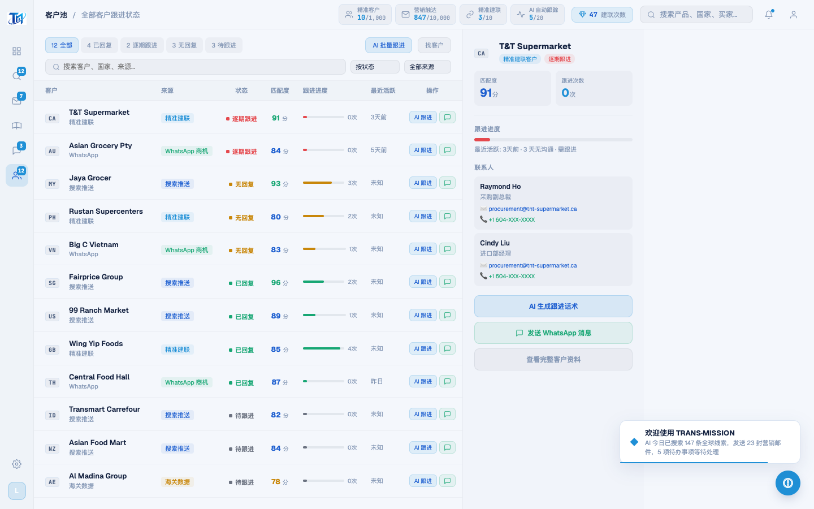

# Round 047 · 🟦 产品轴 · 客户池进入即填充(消灭半屏空态 → 最紧急客户直达)

- 时间:2026-06-25
- 档位:🟦 Standard(产品北极星轴,自动落库;cron 1min 起搏,不 ScheduleWakeup)
- 分支:`feat/rebrand-transmission`
- backlog 来源项:§8b 空态审计 —— 客户池右侧详情面板(320px)进入时为空占位「点击左侧客户查看详情」,约半屏空白 = 空仪表盘/缺明确下一步。

## 做了什么
`renderPoolTable()` 末尾:**无选中时自动选最紧急客户**(默认按状态排序 `overdue:0` 在首)→ `showPoolDetail(allItems[0].name)`。
- 进入客户池即显示最紧急客户(T&T Supermarket 逾期跟进)完整详情:匹配度/跟进进度(3 天无沟通·需跟进)/真实联系人(Raymond Ho 采购副总、Cindy Liu)/行动键(AI 生成跟进话术 · 发送 WhatsApp · 查看完整资料)。
- **仅 `!selectedPoolItem` 时触发**——不覆盖用户点选;search/filter 重渲染不抢已选;空结果不选。

## 验收
- **build** ✓ · **机检** pool `newErrors:[]` ✓ · **golden h3** ✓ PASS(errors:[])
- **实拍**(after):右面板从空占位 → T&T Supermarket 详情已填充(联系人+行动键),首行高亮选中。
- **两北极星裁决**:产品 —— 消灭半屏空态 ✓;有事做/明确下一步 ✓(最紧急客户 + 行动键直接可点);整齐 ✓;希望(逾期优先 triage)。真实数据,无假。视觉 —— 详情面板 navy/azure on-brand,无新 slop。**KEEP。**

## 截图
- (右半屏空「点击查看」)→ (最紧急客户详情已填充)

## 残留 → backlog(§8b 渐入尾声)
- 其它 master-detail 屏空态(如有)同款处理。
- 数字可读性(KPI「对我意味着」)· 待办接真实计数动态算。
- **收敛提示**:产品轴主干(明确下一步/有事做/真实成就感/无空态)已大体补齐(R041-R047)。后续若只剩低价值微调,按 §6 发 digest 问方向(merge main? 新方向?)。

## commit / 分支 / push
- commit on `feat/rebrand-transmission` · push origin。**cron 1min 起搏,不 ScheduleWakeup。**
