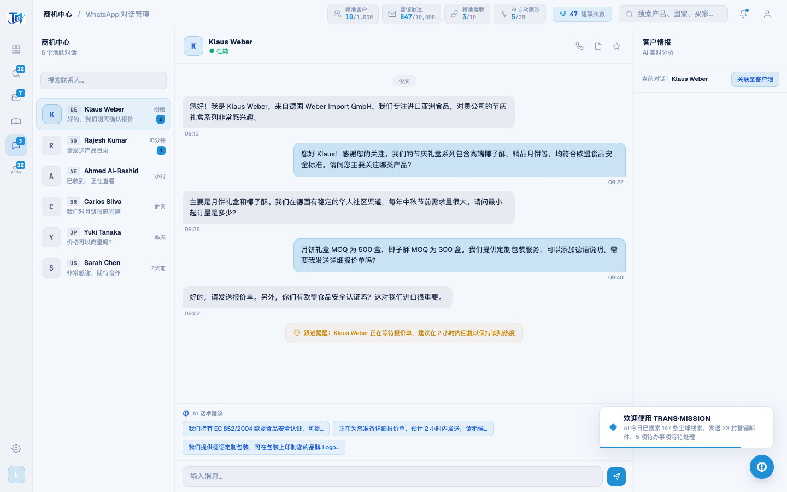
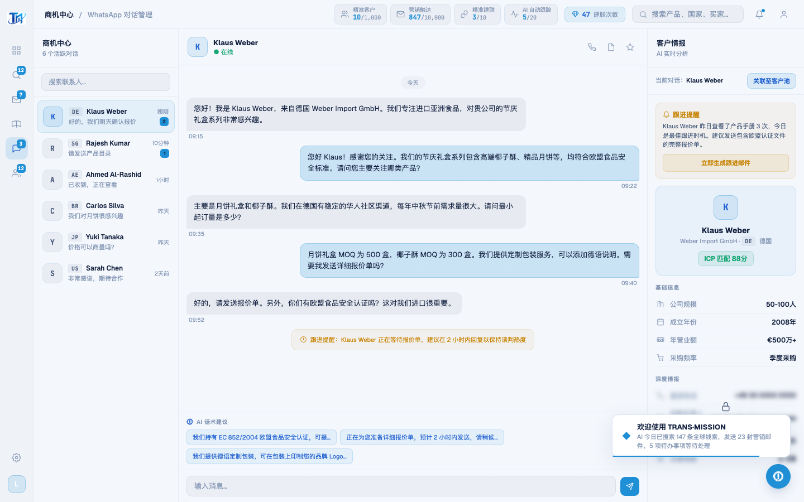

# Round 048 · 🟦 产品轴 · WhatsApp 进入即填充客户情报面板(消空态)

- 时间:2026-06-25
- 档位:🟦 Standard(产品北极星轴 微调收尾;cron 1min 起搏,不 ScheduleWakeup)
- 分支:`feat/rebrand-transmission`
- backlog 来源项:§8b 空态审计(续 R047)—— 真实进入 WhatsApp(enterApp→navTo)时,聊天中栏有内容,但**右侧「客户情报」面板空白**(只有 header,无 基础信息/深度情报)。因 `enterApp` 只 `renderWaChat(0)`、未 `renderIntelPanel(0)`;截图早先「看着满」是 verify NAV 额外 `selectWaContact(0)` 掩盖了 bug。

## 做了什么
`enterApp()`:`renderWaChat(0)` → `selectWaContact(0)`(完整选中:聊天头/聊天/**情报面板** + currentWaContact)。
- 进入 WhatsApp 即同时填充聊天 + 右侧客户情报(Klaus Weber 跟进提醒 + 基础信息 + 深度情报锁),不再半空。
- 联系人列表已先 `renderWaContacts()`(wa-c-0 存在),init 调用安全;不改视觉。

## 验收
- **build** ✓(670ms)· **机检** waentry(模拟真实进入,无强制 select)+ whatsapp + dashboard 全 `newErrors:[]` ✓
- **golden h3** ✓ PASS(errors:[])(selectWaContact 在 init 调用未破坏建联链路)
- **实拍 before/after**:before 右情报面板空(仅 header)→ after 满(跟进提醒/基础信息/深度情报锁)。
- **两北极星裁决**:产品 —— 消除右面板空态,进入即见完整客户上下文(有事做/明确下一步:跟进提醒+解锁/建联)✓,真实数据;视觉 —— 无变化,on-brand。**KEEP。**

## 截图
- (右情报面板空)→ (情报面板已填充)

## 残留 → backlog(§8b 收尾)
- 其它 master-detail/进入态空白(若有)同款扫一遍。
- 数字可读性 · 动态待办计数 · 通知数据 emoji(orphaned 低优)。

## commit / 分支 / push
- commit on `feat/rebrand-transmission`(含 verify.mjs waentry NAV)· push origin。**cron 1min 起搏,不 ScheduleWakeup。**
