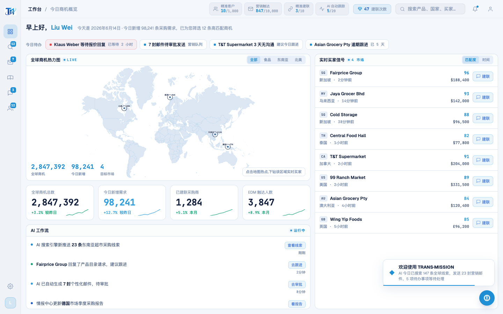
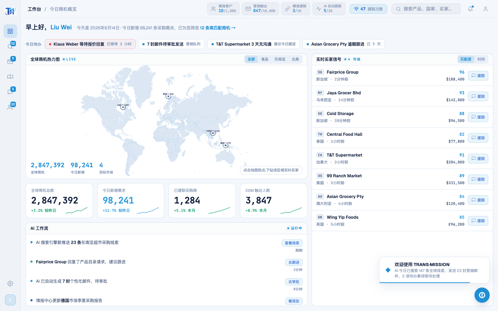

# Round 050 · 🟦 产品轴 · 工作台「12 条高匹配商机」静态数→可点直达(+ 建联数不一致登记)

- 时间:2026-06-25
- 档位:🟦 Standard(产品北极星轴 微调收尾;cron 1min 起搏,不 ScheduleWakeup)
- 分支:`feat/rebrand-transmission`
- backlog 来源项:QuotaBar 审计(本身已优秀:去 emoji/单一色/≥80% 挣来转红/◆ toast)→ 顺带审 greeting:「已为您筛选 12 条高匹配商机」是**静态数字、不可点**(缺明确下一步)。

## 做了什么
工作台 greeting 副行「12 条高匹配商机」→ **可点 azure 链接 →** `nav('intel')`(直达情报中心看这些商机)。
- `.cc-link`(azure/600,hover 转 brand2+下划线),加「→」暗示可点。静态统计 → 明确下一步。
- 数据未造假(12 仍是文案,链接只是把它变可达)。

## 验收
- **build** ✓(727ms)· **机检** dashboard `newErrors:[]` ✓ · **golden h3** ✓ PASS
- **两北极星裁决**:产品 —— 静态数变可达行动(明确下一步)✓;视觉 —— azure 链接 on-brand、克制。**KEEP。**

## 截图
- (纯静态文案)→ (12 条高匹配商机 → azure 可点)

## 残留 → backlog(审计新发现 + 收敛)
- 🟡 **建联数不一致(看不懂的数字,真实发现)**:TopBar「建联次数 47」(R044/46 解锁动态扣减)vs QuotaBar「精准建联 3/10」—— 两个都叫「建联」却显不同数,卖方易困惑。**正解需数据模型决策**(两者是否同一资源?余额 vs 配额?)→ 风险中,留用户/专轮定,不在 auto-loop 擅自统一。
- 待办内嵌计数静态(7 封)· 通知 bell 静态摘要。
- **收敛**:连审 TopBar/QuotaBar/greeting,屏本身已优秀,本轮只挖到微调 + 1 个需决策的不一致。**产品轴高/中价值见底**;按用户「连续低价值发 digest」,下轮若仍只低价值即发 digest(建议 merge feat/rebrand-transmission→main + 问 建联数 口径)。

## commit / 分支 / push
- commit on `feat/rebrand-transmission` · push origin。**cron 1min 起搏,不 ScheduleWakeup。**
