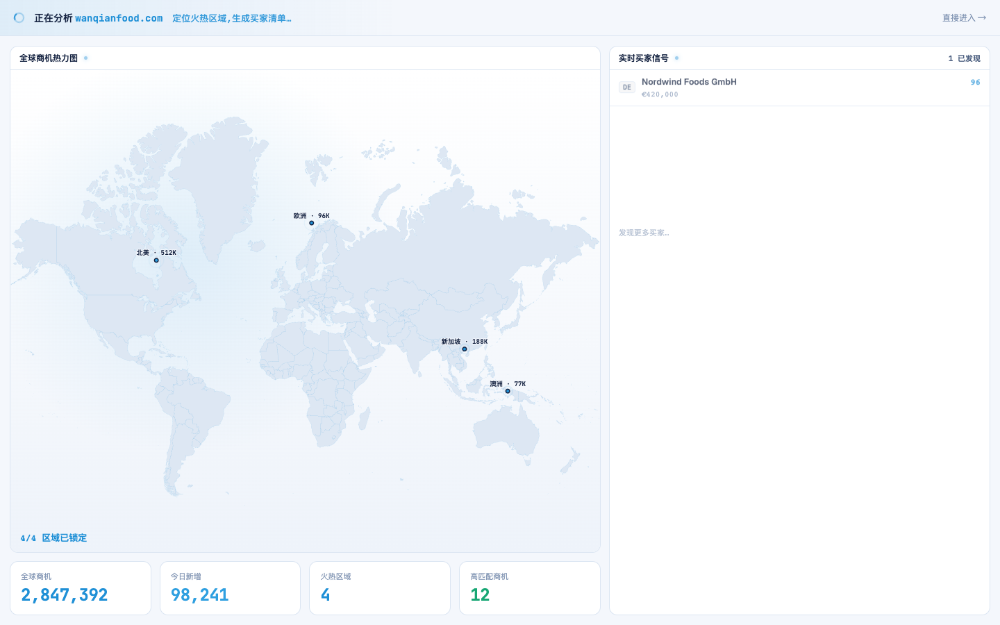
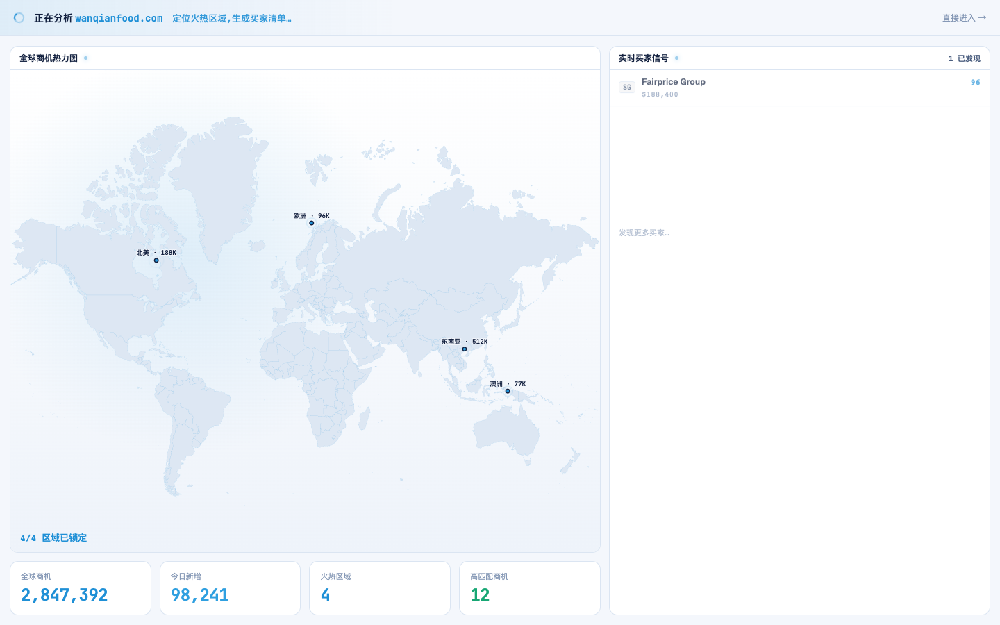

# Round 051 · 🟦 产品轴 · 开头动画数据对齐工作台(拼装的就是你的真实指挥台)

- 时间:2026-06-25
- 档位:🟦 Standard(产品北极星轴,重点优化开头动画;已 merge,**main 上工作**;cron 1min)
- 分支:`main`
- backlog 来源项:用户「优化开头的动画」+ 审计 FirstRunAnalysis 序列帧发现 —— 开头「指挥台拼装」揭示的**数据与工作台不一致**:开头显「北美 · 512K(最热)」+ 通用买家(Nordwind/Pacific Gourmet),但工作台显「东南亚 · 512K(最热,万仟 T1)」+ 真实渠道(Fairprice/Jaya/T&T)。512K 热区被对调、买家也不同 → 拼装预览的是「另一个市场」,削弱「这是你的市场」成就感/希望,且自相矛盾。

## 做了什么
把开头动画揭示的数据**对齐工作台 + 万仟剧本**(开头拼装的 = 稍后落到工作台的):
- **热点**:`北美 512K hot / 新加坡 188K` → `东南亚 512K hot(x778,T1)/ 北美 188K / 欧洲 96K / 澳洲 77K`(坐标+量级与 DashboardPage 一致)。
- **买家**:`Nordwind/Lim Heng/Pacific Gourmet/Saveur`(通用欧美)→ `Fairprice 96/Jaya 93/T&T 91/99 Ranch 89`(万仟点名真实华人超市渠道,cc/mt/val 与工作台买家整列一致)。
- KPI(2,847,392/98,241/4/12)本已一致,未动。动画机制(count-up/逐区点亮/买家流入)良好,未动。

## 验收
- **build** ✓(934ms)· **机检** analysis 序列帧 `pass:true`(t0/t1/t2)✓ · **golden h3** ✓ PASS
- **序列帧实拍**:t2 现显「东南亚 512K / 北美 188K / 欧洲 96K / 澳洲 77K」+ Fairprice Group 流入——与工作台地图/买家整列一致。
- **两北极星裁决**:产品 —— 开头拼装 = 真实预览你的指挥台(东南亚是你最热市场、Fairprice 等是你的买家),成就感/希望真实挣来,消除数据自相矛盾(看不懂)✓,真实数据(万仟渠道);视觉 —— 动画/配色不变。**KEEP。**

## 截图
- (北美 512K + Nordwind)→ (东南亚 512K + Fairprice,与工作台一致)

## 残留 → backlog
- 动画机制(时序 5.2s / 缓动 / 买家流入 450ms)已良好;若后续要更强 earned wow 可专轮抠时序/微动效。
- 建联数口径(47 vs 3/10)用户「先不动」。

## commit / 分支 / push
- commit on `main` · push origin main。**cron 1min 起搏,不 ScheduleWakeup。**
