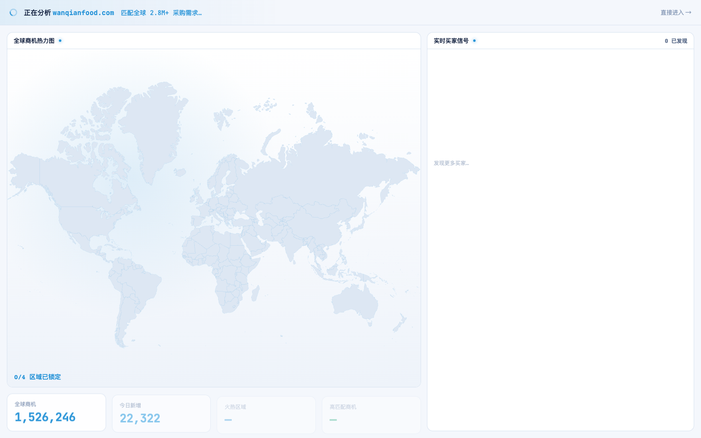
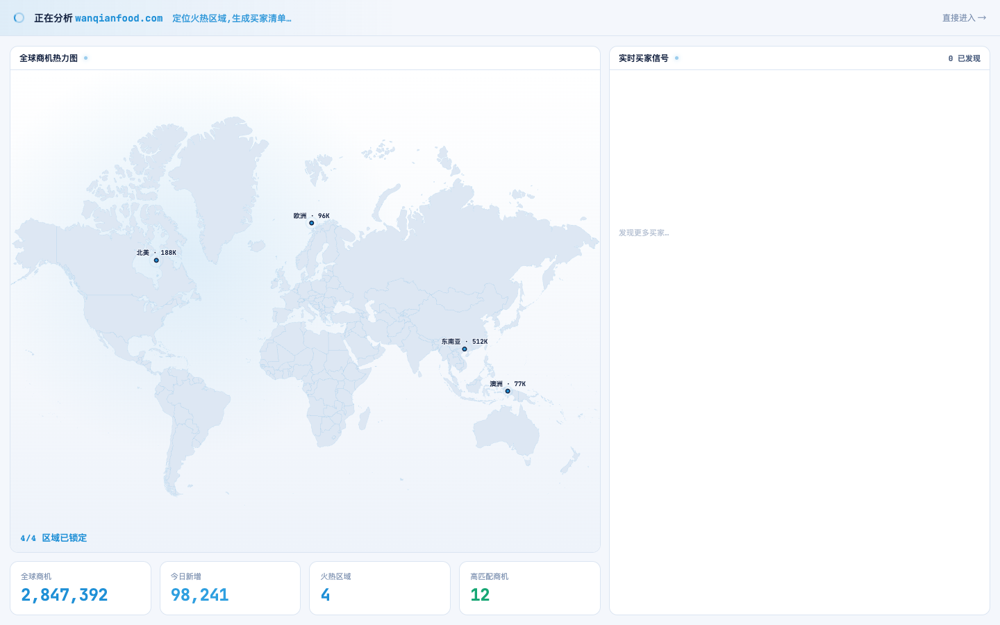

# Round 052 · 🟦 产品轴 · 开头动画逐件拼装编排(earned wow:KPI/热点逐个点亮)

- 时间:2026-06-25
- 档位:🟦 Standard(产品北极星轴,重点优化开头动画;`main`;cron 1min)
- 分支:`main`
- backlog 来源项:用户「优化开头动画 earned wow」+ 审计 R051 后的编排 —— 机制对了但**批量揭示**:4 个 KPI 同时点亮+count-up、热点 2→4 跳变,缺「指挥台逐件拼装」的递进感。

## 做了什么
把批量揭示改成**逐件拼装编排**(更贴「看着指挥台被你的市场填满」):
- **KPI 逐个点亮 + count-up**(左→右):新增 `kpiOn[]`,时间线 `1400 + i*180ms` 逐个 `kpiOn[i]=true` + countUp(1200ms);`.fra-kpi` 点亮加 `translateY(6px)→0` 缓动(cubic-bezier),每个数字「升入就位」。
- **热点逐区锁定**:`2000 + i*340ms` 逐个 `hotN=i+1`(东南亚 热点先亮,再北美/欧洲/澳洲),取代原 2→4 批量跳变。
- 时序微调(buyers 3300 起 / done 5300);prefers-reduced-motion 直接到终态(kpiOn 全 true)。真实数据未动(R051 已对齐工作台)。

## 验收
- **build** ✓(657ms)· **机检** analysis 序列帧 `pass:true` ✓ · **golden h3** ✓ PASS
- **序列帧实拍**:t1 现显 KPI 1-2 已点亮 count-up(1,526,246 / 22,322)而 KPI 3-4 仍 `—` 暗置 → 逐件填入(对比 R051 t1 四个同时数)。
- **两北极星裁决**:产品 —— 拼装递进感更强(逐件就位=「看着我的指挥台建起来」,希望/成就感 earned),真实数据不假 %;视觉 —— 升入缓动克制、单一 azure、不炫技。**KEEP。**

## 截图
- (KPI 逐个点亮:1-2 已亮,3-4 暗)→ (全部就位)

## 残留 → backlog
- 可选后期:热点点亮接 WorldHeatmap 的 sonar ping 同步、买家流入加微 stagger 已有;若要更强可单列「轨道 swoosh」母题动效(克制)。
- 建联数口径(47 vs 3/10)用户「先不动」。

## commit / 分支 / push
- commit on `main` · push origin main。**cron 1min 起搏,不 ScheduleWakeup。**
