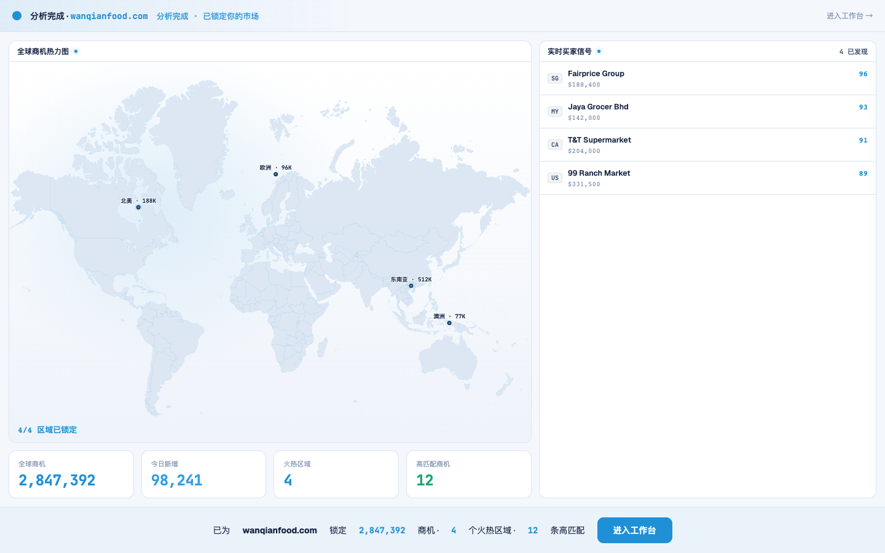
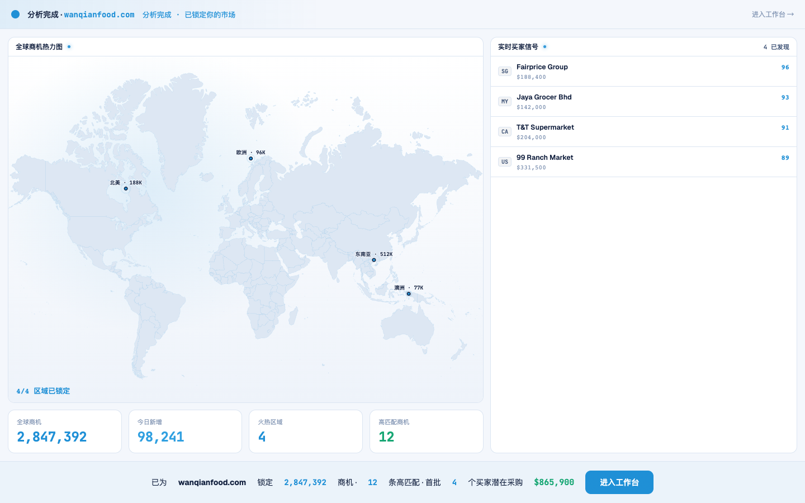

# Round 053 · 🟦 产品轴 · 开头动画 settle 加「潜在采购额」希望钩子 + 序列帧抓到 settle

- 时间:2026-06-25
- 档位:🟦 Standard(产品北极星轴,优化开头动画;`main`;cron 1min)
- 分支:`main`
- backlog 来源项:优化开头动画 earned wow —— 审计发现(a)seq 抓帧 200/1600/3600ms,**抓不到 5.3s 的 settle/就绪 payoff**(看不到高潮);(b)settle 文案「锁定 2.8M 商机 · 4 火热区域 · 12 高匹配」缺一个让卖方「有希望」的**真实金额**钩子(产品北极星「有希望=离成单更近」)。

## 做了什么
1. **harness**:`verify.mjs` seq 抓帧 `[200,1600,3600]` → `[300,2600,5600]`(t0 起 / t1 拼装中 / **t2 settle 就绪**),现能看清整条动画弧含高潮。
2. **settle 加真实「潜在采购额」**:新增 `pipeline` computed = **真实求和**首批 4 个买家的 val(Fairprice 188,400 + Jaya 142,000 + T&T 204,000 + 99 Ranch 331,500 = **$865,900**,非编造);settle 文案改「…12 条高匹配 · 首批 4 个买家潜在采购 **$865,900**」,金额用绿色(money 正向语义)+略放大。「4 火热区域」信息仍在 KPI/地图保留,未丢。

## 验收
- **build** ✓(659ms)· **机检** analysis 序列帧 `pass:true`(t2 现抓到 settle)✓ · **golden h3** ✓ PASS
- **实拍 t2(settle)**:「已为 wanqianfood.com 锁定 2,847,392 商机 · 12 条高匹配 · 首批 4 个买家潜在采购 $865,900」+ 进入工作台。全板拼装完成 + 金额 payoff。
- **两北极星裁决**:产品 —— 高潮给真实「钱在桌上」数字($865,900=真实求和),「有希望/离成单更近」earned,绝不假 %(求和真实买家值)✓;视觉 —— 绿仅 money 正向语义、单一 azure 不变、克制。**KEEP。**

## 截图
- (锁定…4 火热区域…)→ (…首批 4 买家潜在采购 $865,900)

## 残留 → backlog
- 开头动画 R051(数据)+R052(逐件拼装)+R053(payoff 金额)已较完整;余可选:轨道 swoosh 母题、热点 sonar 同步。
- 建联数口径(47 vs 3/10)用户「先不动」。

## commit / 分支 / push
- commit on `main`(含 verify.mjs seq 抓帧改进)· push origin main。**cron 1min 起搏,不 ScheduleWakeup。**
