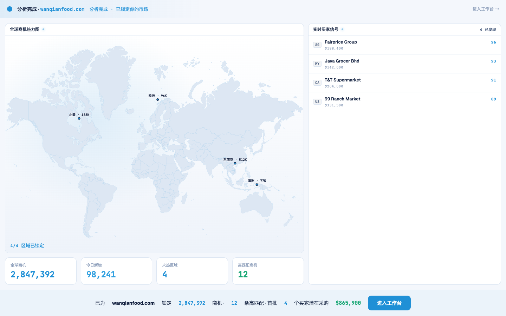
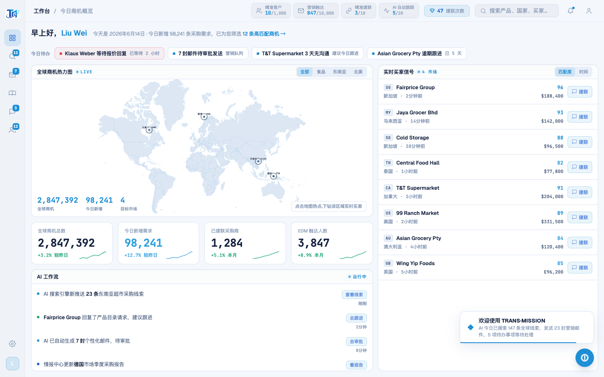

# Round 054 · ⬜ Utility · 首启 H1 黄金路径 golden(保护开头动画端到端流程)

- 时间:2026-06-25
- 档位:⬜ Utility(harness 回归保护;`main`;cron 1min)
- 分支:`main`
- backlog 来源项:审计发现 —— 开头动画 FirstRunAnalysis 是 H1 hero,且连续 4 轮(R051-53)在改它,但**只有 h3-golden(工作台实时信号)**,**没有首启端到端 golden**;seq 抓帧只截图、不验证「进入工作台」点击链路。FRA 入口 → 工作台的交接无自动护栏。

## 做了什么
新增 `scripts/h1-golden.mjs`,驱动开头流程**端到端**并断言零页面错误:
1. `doLogin()` → 网址弹窗出现
2. `startScan()` → FirstRunAnalysis 挂载(拼装中)
3. 等到 settle(~5.3s):settle 条出现 · 买家全部流入(4)· KPI count-up 到终值 2,847,392 · settle 显真实潜在采购额 **$865,900**
4. 点「进入工作台」(.fra-enter)→ FRA 卸载 · 工作台渲染 · 今日待办 chip 在(有事做)
- 帧 → `.review/h1-t0`(拼装中)/ t1(settle)/ t2(工作台)。

## 验收
- **h1-golden** ✓ **PASS**(10 断言全绿,errors:[]):弹窗✓ FRA挂载✓ settle✓ 买家4✓ KPI 2,847,392✓ pipeline $865,900✓ FRA卸载✓ 工作台✓ 待办4✓。
- **h3-golden** ✓ PASS(未触碰,确认无回归)· **build** ✓(R053 起绿)
- **实拍 t2**:进入后 FRA 卸载,工作台完整渲染(greeting/今日待办/地图/KPI/买家),与开头预览数据一致(R051)——首启叙事端到端连贯。
- 闸门:Utility/harness 轮,以 golden PASS + 零错 + 逻辑为闸门(§5)。**KEEP。**

## 截图
- (就绪 + $865,900)· (交接到工作台)

## 残留 → backlog
- 开头动画 R051-R054 已较完整(数据对齐 / 逐件拼装 / payoff 金额 / 端到端 golden 护栏)。后续 FRA 改动应跑 `node scripts/h1-golden.mjs`。
- 可选母题:轨道 swoosh / 热点 sonar 同步(克制,后期)。

## commit / 分支 / push
- commit on `main` · push origin main。**cron 1min 起搏,不 ScheduleWakeup。**
