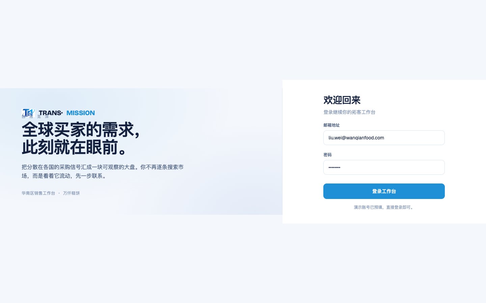

# Round 055 · 🟦 产品轴 · logo 全站换矢量 SVG(用户点名)+ 入库 4 个 SVG 资产

- 时间:2026-06-25
- 档位:🟦 Standard(产品/视觉;`main`;cron 1min)
- 分支:`main`
- backlog 来源项:用户「把 logo 部分都替换成 svg」+ 上一任务产出的干净 SVG(public/logo-*.svg)

## 做了什么
1. **入库 4 个矢量 logo**(上一步从用户 CorelDRAW 导出清洗:截掉 `</svg>` 后的损坏 base64 尾巴 + CRLF 归一 + 验 XML;透明底;文字已转曲;TM 为矢量渐变):
   `public/logo-full.svg`(完整锁版)· `logo-mark.svg`(TM 图标)· `logo-full-white.svg` / `logo-mark-white.svg`(白色/深底备用)。
2. **全站 logo PNG→SVG**:SidebarNav `.sb-logo`、LoginScreen `.lg-mark` + `.wm-logo` 的 `` → `.svg`;`index.html` favicon `type=image/png`→`image/svg+xml`、`.png`→`.svg`。矢量→任意尺寸/Retina 清晰。
3. **删掉被取代的 PNG**(`logo-mark.png`/`logo-full.png`,确认零引用)。

## 验收
- **build** ✓ · **机检** login/dashboard/wmodal `newErrors:[]` ✓
- **golden h1** ✓ PASS · **golden h3** ✓ PASS(首启 + 实时信号端到端未坏)
- **实拍**:login TM 标(SVG)清晰渲染于品牌栏;侧栏/网址弹窗同步换 SVG。
- **两北极星裁决**:视觉 —— 真矢量 logo,任意尺寸/Retina 锐利,优于位图;产品 —— 品牌一致(掌控感/信任)。无回归。**KEEP。**

## 截图
-  → (login TM 标 PNG→SVG)· dashboard 侧栏同步

## 残留 → backlog
- 可选:login 品牌栏可改用 `logo-full.svg`(已含字标+创拾觅深)替「TM 标 + 文字字标」组合(需排版权衡;现 crisp 文字更利落,留观察)。`logo-full.svg` 549KB 偏大,可 SVGO 压缩。
- 开头动画继续优化(R051-54 已:数据对齐/逐件拼装/payoff/golden);后续可选轨道 swoosh 母题。
- 建联数口径(47 vs 3/10)用户「先不动」。

## commit / 分支 / push
- commit on `main`(含 4 个 SVG 入库 + 删 2 PNG)· push origin main。**cron 1min 起搏,不 ScheduleWakeup。**
