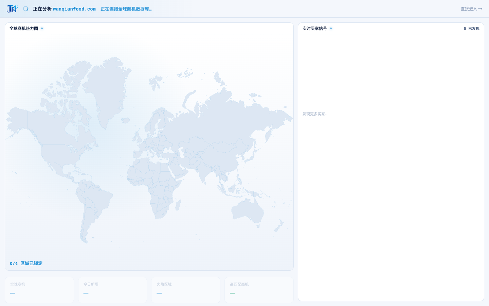

# Round 056 · 🟦 产品轴 · 开头动画状态栏加 TM 品牌标(SVG,串起 logo+动画两焦点)

- 时间:2026-06-25
- 档位:🟦 Standard(产品/视觉;`main`;cron 1min)
- 分支:`main`
- backlog 来源项:用户双焦点(logo→SVG + 优化开头动画)。审计:① 全站 live logo 已换 SVG(R039+R055:侧栏/登录/网址弹窗/favicon);剩 3 处 cube-replica 全在死 UI(onboarding/scan,T11 不碰)。② 开头动画 R051-54 已数据对齐/逐件拼装/payoff/golden,t0-t2 干净。→ 一个串起两焦点的小触点:**首启(品牌最重的开场)状态栏无品牌标识**。

## 做了什么
FirstRunAnalysis 状态栏左侧加**真 TM 矢量标**(`logo-mark.svg`,22px):`[TM] ◌ 正在分析 wanqianfood.com · 正在连接全球商机数据库…`。
- 开场即有品牌身份(产品:信任/掌控——「是 TRANS·MISSION 在为你分析你的市场」);用新 SVG logo,串起 logo+动画两焦点。
- 克制(小尺寸、紧贴 spinner、单一 azure 基调),不抢动画主体。

## 验收
- **build** ✓(733ms)· **机检** analysis 序列帧 `pass:true` ✓ · **golden h1** ✓ PASS(开头→工作台流程未坏)
- **实拍 t0**:状态栏左 TM 标 + spinner + 「正在分析 wanqianfood.com」,品牌身份就位。
- **两北极星裁决**:产品 —— 开场品牌身份(信任/掌控);视觉 —— 真矢量标、克制、on-brand。**KEEP。**

## 截图
- (裸 spinner+文案)→ (TM 标 + spinner)

## 状态:两焦点收敛
- **logo→SVG**:所有 live 处已换矢量(R039/R055/R056);剩 cube-replica 仅死 UI(onboarding/scan,不碰)。**完成。**
- **开头动画**:R051(数据对齐)+R052(逐件拼装)+R053(payoff $865,900)+R054(h1-golden)+R056(品牌标)。**较完整。**
- 余可选(低价值):login 用 logo-full.svg / full.svg SVGO 压缩 / 轨道 swoosh 母题;建联数口径(用户「先不动」)。**下轮若仍低价值按 §6 发 digest。**

## commit / 分支 / push
- commit on `main` · push origin main。**cron 1min 起搏,不 ScheduleWakeup。**
