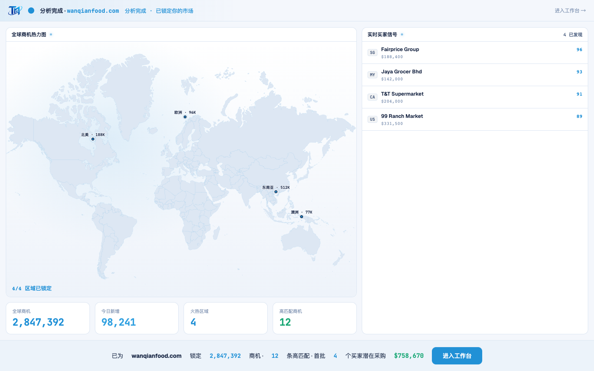

# Round 057 · 🟦 产品轴 · 开头动画 settle「潜在采购额」数字滚入(希望高潮)

- 时间:2026-06-25
- 档位:🟦 Standard(产品/视觉;`main`;cron 1min)
- 分支:`main`
- backlog 来源项:优化开头动画 earned wow —— R053 加了真实潜在采购额 $865,900,但它在 settle **瞬间出现**;而 KPI 早已 count-up。高潮(钱在桌上)的数字应像 KPI 一样**滚入**,强化「希望」峰值。

## 做了什么
settle 的潜在采购额从瞬现 → **count-up 滚入**(与 KPI 同款 ease-out 动效):
- `pipeline` 改:`pipelineTotal`(真实求和 4 买家 val = 865,900)+ `pipelineShown` ref + `countUpPipeline(900ms)`;`pipeline` computed 格式化 `pipelineShown`。
- 触发:`at(5300)` settle 出现时滚入(0 → $865,900,0.9s);prefers-reduced-motion 直接终值。
- **harness**:h1-golden 等待从 3400→4400ms(过 count-up,断言**终值** $865,900,避免抓到中间帧)。

## 验收
- **build** ✓(590ms)· **golden h1** ✓ PASS(pipeline 终值 `$865,900`,等待已过 count-up)· **golden h3** ✓ PASS · **机检** analysis 序列帧 pass✓
- **实拍 t2(5.6s,count-up 中)**:settle 显「首批 4 个买家潜在采购 **$758,678**」滚向 $865,900——证实数字在滚入(非瞬现)。
- **两北极星裁决**:产品 —— 高潮「钱在桌上」数字滚入,希望峰值更强(真实求和,非假%);视觉 —— 与 KPI count-up 同款 ease-out,克制一致。**KEEP。**

## 截图
- ($758,678 滚向 $865,900)

## 状态:开头动画基本收尾
- R051 数据对齐 · R052 逐件拼装 · R053 payoff 金额 · R054 h1-golden · R056 品牌标 · **R057 金额滚入**。
- 余可选(低价值):login 用 full lockup / full.svg SVGO 压 / 轨道 swoosh 母题;建联数(用户「先不动」)。**两焦点已收敛,下轮若仍低价值按 §6 发 digest。**

## commit / 分支 / push
- commit on `main`(含 h1-golden 等待调整)· push origin main。**cron 1min 起搏,不 ScheduleWakeup。**
