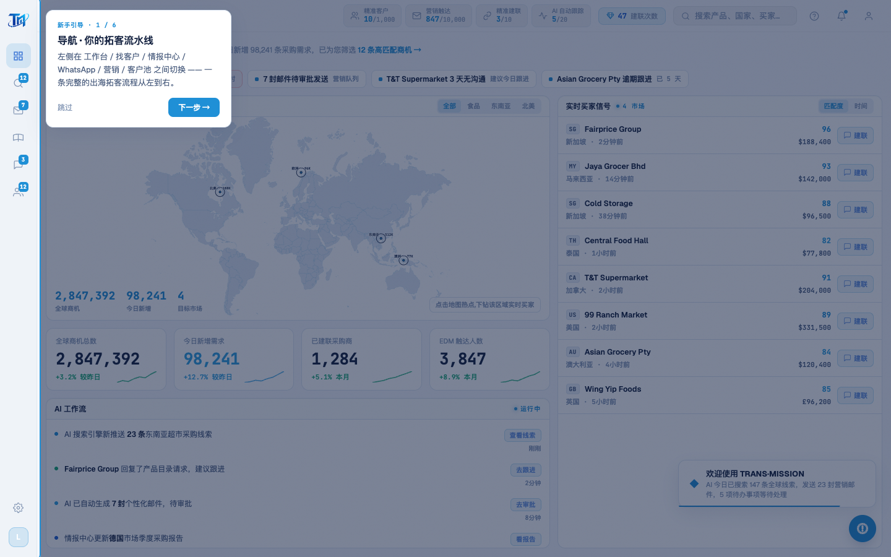

# Round 058 · 🟦 产品轴 · 交互式新手引导 tutorial 骨架 + 工作台 6 步(用户新重点)

- 时间:2026-06-25
- 档位:🟦 Standard(产品北极星轴 · 新重点;`main`;cron 1min)
- 分支:`main`
- backlog 来源项:用户 2026-06-25 选定新重点 ——「想加一点像 tutorial 一样的,可以点点,最快理解整个项目」。

## 做了什么(新功能首轮:骨架 + 触发 + 工作台步骤)
1. **GuidedTour.vue**(新组件):点「下一步」逐块高亮讲解。
   - **spotlight**:目标 `getBoundingClientRect` → 描 azure 边 + `box-shadow 0 0 0 9999px rgba(13,27,62,.55)` navy 调暗其余,弹性缓动平移。
   - **提示卡**:白卡 + azure 步数 + Bricolage 标题 + navy 说明 + 跳过/上一步/下一步;按目标方位(右/左/上/下)定位 + 视口内夹取。
   - **拦截**:引导期 `.tour` pointer-events 拦 app,只点卡片。`window.startTour()` 暴露给入口;`v-if=active` 不激活时完全 inert。
2. **工作台 6 步**(真实功能解释,无假话):侧栏流水线 · 今日待办 · 全球商机热力图 · 核心指标 · 实时买家信号+一键建联 · AI 工作流。
3. **入口**:TopBar 加「?」新手引导图标 → `startTour()`。
4. App.vue 挂 `<GuidedTour />`;verify.mjs 加 `tour` NAV。

## 验收
- **build** ✓ · **机检** dashboard/whatsapp/leads `newErrors:[]` ✓(GuidedTour v-if-gated 不激活时 inert)
- **golden h1** ✓ PASS · **golden h3** ✓ PASS(未破坏首启/实时信号链路)
- **实拍**:点引导 → 工作台调暗、**侧栏高亮**、卡片「新手引导 1/6 · 导航 · 你的拓客流水线」+ 说明 + 跳过/下一步。
- **两北极星裁决**:产品 —— 最快理解整个产品(明确每块干什么/掌控感),真实功能解释无假%;视觉 —— 干净 spotlight + 单一 azure 卡 + navy 字,零 AI 味(非俗气轮播)。**KEEP。**

## 截图
- (侧栏高亮 + 引导卡 1/6)

## 残留 → backlog(分轮扩展)
- 逐屏加步骤:找客户(ICP/数据源/enrich)· 情报中心(解锁)· WhatsApp(建联对话/话术)· 营销(审批发送)· 客户池(跟进)。
- 可选:首次进工作台自动提示「点 ? 看引导」;引导完成记忆(localStorage 不再自动弹)。多步不同方位(top/left)再各实拍一张。

## commit / 分支 / push
- commit on `main` · push origin main。**cron 1min 起搏,不 ScheduleWakeup。**
