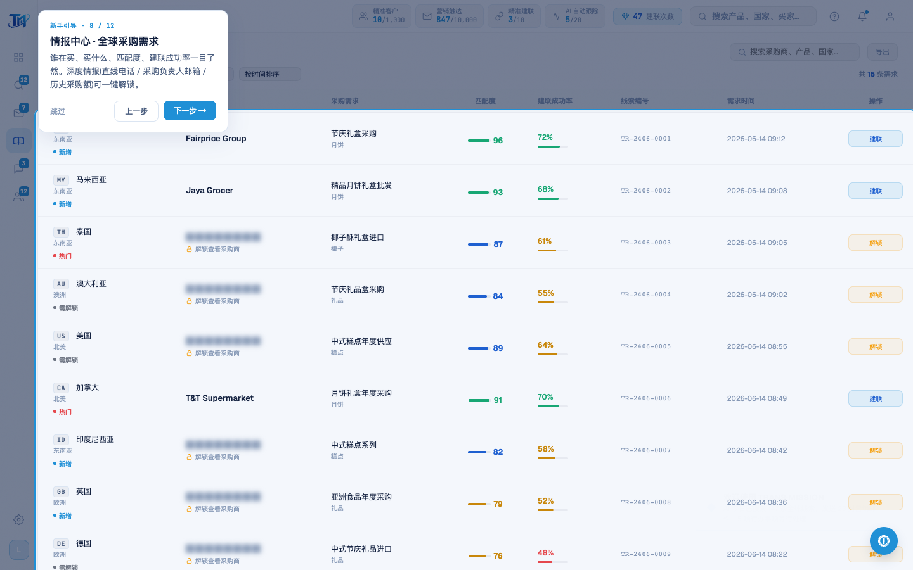
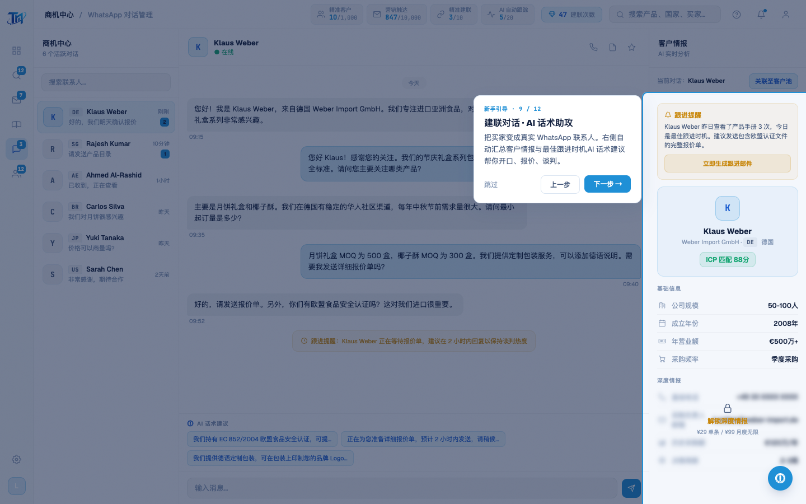
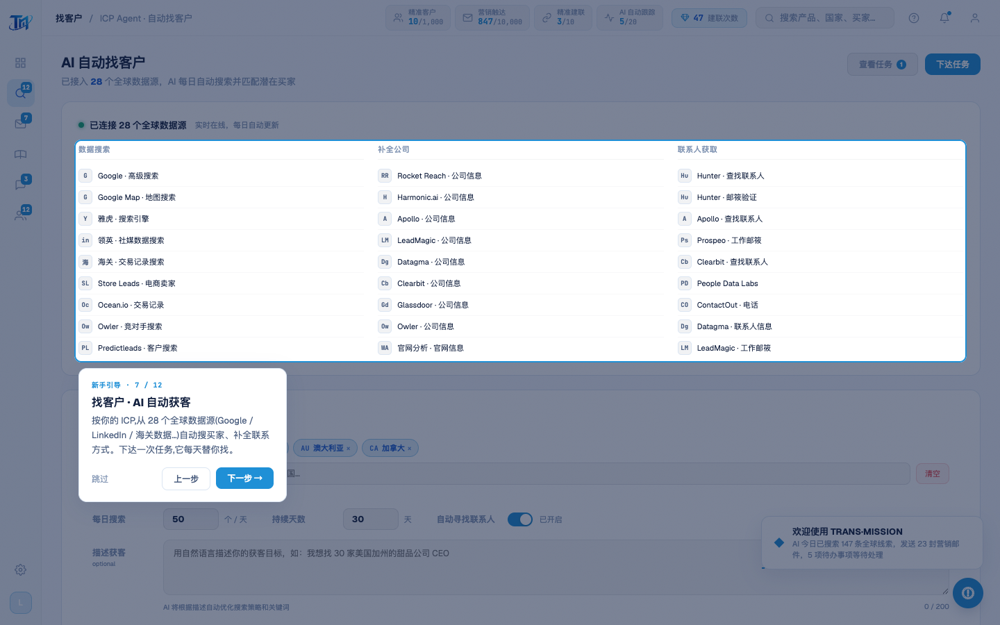

# Round 059 · 🟦 产品轴 · 新手引导走完整条流水线(6 屏 12 步)+ tour-check 护栏

- 时间:2026-06-25
- 档位:🟦 Standard(产品北极星轴 · 新重点;`main`;cron 1min)
- 分支:`main`
- backlog 来源项:R058 引导骨架(工作台 6 步)→ 逐屏扩展,走完整条出海拓客流水线。

## 做了什么
1. **引导扩到 6 屏 12 步**(承 R058 的工作台 6 步,新增 6 步,每步真实功能解释,引导自动 navTo 每屏):
   - 找客户:`.icp-ds-grid` —「28 个全球数据源按 ICP 自动搜买家 + 补全联系方式」
   - 情报中心:`#intel-table-body` —「谁在买/买什么/匹配度/建联成功率;深度情报一键解锁」
   - WhatsApp:`#intel-scroll` —「买家变真实联系人 + 右侧客户情报 + AI 话术助攻」
   - 营销队列:`.mkt-list-col` —「AI 生成个性化邮件,审批后批量发」
   - 客户池:`#pool-table` —「全部跟进状态总览,进来就知道该催谁」
   - 收尾:`.tb-help` —「随时点 ? 重看;去工作台一键建联」
2. **tour-check.mjs**(新护栏 harness):走完全部 12 步,断言**每步 spotlight 命中目标**(无跳过=选择器全对)+ 完成后引导关闭 + 零页面错误;抓 6 张代表帧。

## 验收
- **build** ✓ · **tour-check** ✓ **PASS**(12 步全命中 + 关闭,errors:[])· **golden h1** ✓ · **h3** ✓ · 机检 dashboard/wa/leads 零错✓
- **实拍**:intel 步(8/12,表格高亮+卡片)、WhatsApp 步(9/12,客户情报面板高亮)—— 跨屏 navTo + spotlight 定位准确。
- **两北极星裁决**:产品 —— 一条引导走完整条流水线(找客户→情报→建联→营销→客户池),新用户/demo 最快理解全产品,真实功能解释无假%;视觉 —— 干净 spotlight + 单一 azure 卡 + navy 字,6 屏一致零 AI 味。**KEEP。**

## 截图
- (8/12 情报中心)· (9/12 建联对话)· (7/12 找客户)

## 残留 → backlog
- 可选:首次进工作台自动微提示「点 ? 看引导」;引导完成 localStorage 记忆;高亮元素可点(交互式而非纯讲解);移动端适配。
- 建联数口径(用户「先不动」)。

## commit / 分支 / push
- commit on `main`(含 tour-check.mjs)· push origin main。**cron 1min 起搏,不 ScheduleWakeup。**
