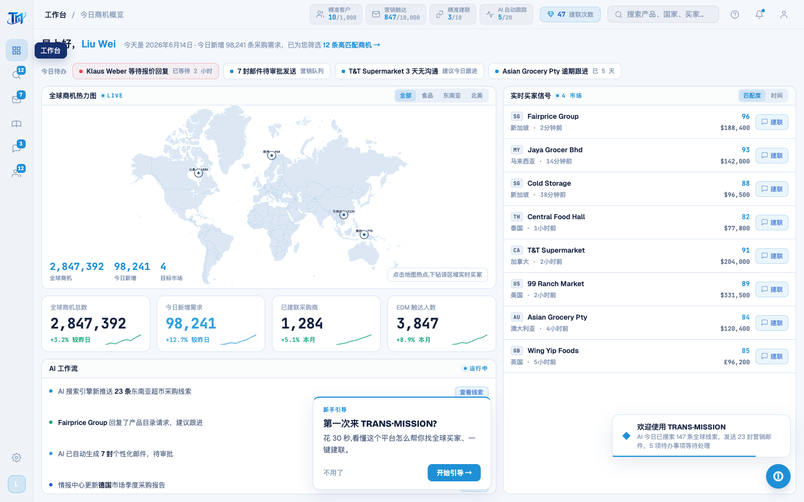

# Round 060 · 🟦 产品轴 · 引导首访提示 + 完成记忆 + 修暗色侧栏 tooltip(用户报)

- 时间:2026-06-25
- 档位:🟦 Standard(产品北极星轴 · 新重点;`main`;cron 1min)
- 分支:`main`
- backlog 来源项:① 引导发现性(新用户/demo 不知道点「?」)② **用户截图报:侧栏 hover 浮一个黑块**(暗底 tooltip 残留)。

## 做了什么
1. **首访提示 nudge**(让新用户/demo 主动发现引导):enterApp 后 1.5s,若未看过则底部居中弹「第一次来 TRANS·MISSION? · 30 秒看懂 · 开始引导 / 不用了」;自带「开始引导」按钮直接起引导。
2. **完成记忆**(不重复打扰):`localStorage tm_tour_seen` —— 起引导 / 跳过 / 完成 任一即标记,之后不再自动弹。
3. **修暗色侧栏 tooltip(用户报的「黑点」)**:`.sb-tip` 背景 `rgba(15,18,30,.95)` 近黑 + navy 字(不可读)→ **`var(--brand-navy)` 品牌深蓝 + 白字 + 柔和冷阴影**(`15,18,30` 是 rebrand 批量漏的暗底残留)。现为干净 on-brand 导航 tooltip。
4. **nudge 防挡**:初版放右上角会盖住实时买家面板的「建联」键(h3 golden 点不到而挂)→ 改**底部居中**(自带按钮,不指 ? 也不挡任何可点元素)。

## 验收
- **build** ✓ · **golden h3** ✓ PASS(修复 nudge 遮挡后)· **h1** ✓ · **tour-check** ✓(12 步)· 机检 nudge 屏零错✓
- **实拍**:底部居中 nudge「第一次来 TRANS·MISSION? / 开始引导」+ 欢迎 toast 分居底部不重叠;侧栏 tooltip 改 navy+白字。
- **两北极星裁决**:产品 —— 新用户/demo 一进来就被引导发现(明确下一步),完成记忆不打扰;视觉 —— 修掉暗底黑块残留、nudge 单一 azure on-brand。**KEEP。**

## 截图
- (底部 nudge + 侧栏 tooltip navy 化)

## 残留 → backlog
- 可选:交互式高亮(高亮元素可点而非纯讲解)· 移动端适配 · nudge 文案 A/B。
- 建联数口径(用户「先不动」)。

## commit / 分支 / push
- commit on `main`(含 enterApp nudge hook + verify.mjs nudge NAV)· push origin main。**cron 1min 起搏,不 ScheduleWakeup。**
