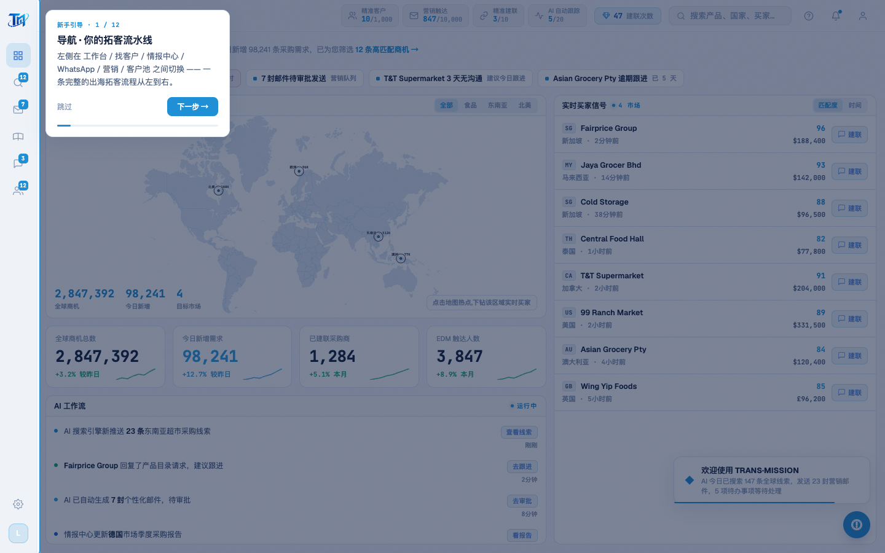

# Round 061 · 🟦 产品轴 · 引导加键盘驱动 + 进度条(demo 演示更顺)

- 时间:2026-06-25
- 档位:🟦 Standard(产品北极星轴 · 新重点;`main`;cron 1min)
- 分支:`main`
- backlog 来源项:引导细化。审计 tour 各步(leads 7/12 · pool 11/12 实拍)定位/可读都干净;补两个 demo 友好的小升级。

## 做了什么
1. **键盘驱动**(demo 演示更顺,presenter 不用瞄按钮):引导激活时 `→`/`Enter`/`空格` = 下一步,`←` = 上一步,`Esc` = 退出。window keydown 监听,`!active` 时不响应。
2. **进度条**:提示卡底部加细 azure 进度条,宽度 = `(i+1)/总步数`,平滑过渡 —— 一眼知道走到哪、还剩多少(对 demo 观众友好)。

## 验收
- **build** ✓ · **tour-check** ✓(12 步全命中 + 关闭)· **golden h1** ✓ · **h3** ✓ · 机检 tour 屏零错✓
- **实拍**:step 1/12 卡片底部 azure 进度条(~8% 填充);键盘驱动(静默,逻辑已接,tour-check 按钮路径未受影响)。
- **两北极星裁决**:产品 —— demo 可键盘流畅驱动 + 进度可见(掌控感);视觉 —— 进度条单一 azure、克制、on-brand。**KEEP。**

## 截图
- (引导卡 + 底部进度条)

## 残留 → backlog
- 可选(更大):交互式高亮(高亮元素真可点,做完一步看到效果再下一步)· 移动端适配。
- 引导已:骨架(R058)+ 6 屏 12 步(R059)+ 首访提示/记忆/修 tooltip(R060)+ 键盘/进度(R061),较完整。
- 建联数口径(用户「先不动」)。

## commit / 分支 / push
- commit on `main` · push origin main。**cron 1min 起搏,不 ScheduleWakeup。**
