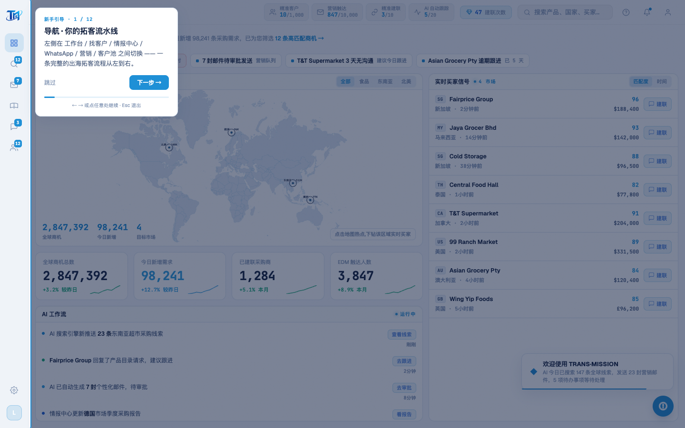

# Round 062 · 🟦 产品轴 · 引导点任意处继续 + 导航提示(demo 一路点到底)

- 时间:2026-06-25
- 档位:🟦 Standard(产品北极星轴 · 新重点;`main`;cron 1min)
- 分支:`main`
- backlog 来源项:引导细化 ——「可点」最自然的升级:标准引导交互「点任意处继续」。

## 做了什么
1. **点任意处继续**(标准引导交互,demo presenter 一路点空白处即可推进):`.tour` 加 `@click.self="next"` —— 点暗化背景 / 高亮区(spotlight pointer-events:none 穿透到背景)= 下一步;点卡片不触发(.self 只在目标是 .tour 本体时响应,按钮各自处理)。
2. **导航提示**:卡底加一行 muted 小字「← → 或点任意处继续 · Esc 退出」,把全部驱动方式(R061 键盘 + 本轮点击 + Esc)讲清,demo/新用户一眼会用。

## 验收
- **build** ✓ · **tour-check** ✓(12 步全命中 + 关闭;按钮路径不受 @click.self 影响,无双触发)· **golden h1** ✓ · **h3** ✓ · 机检 tour 零错✓
- **实拍**:卡底进度条 + 提示「← → 或点任意处继续 · Esc 退出」。
- **两北极星裁决**:产品 —— 引导现支持 下一步按钮 / 点任意处 / 方向键 / Esc 全套,demo 流畅(掌控感);视觉 —— 提示克制 muted 小字,不抢。**KEEP。**

## 截图
- (卡底进度条 + 导航提示)

## 残留 → backlog(引导已较完整)
- 引导:骨架(R058)+ 6 屏 12 步(R059)+ 首访提示/记忆/修 tooltip(R060)+ 键盘/进度(R061)+ 点任意处/提示(R062)。**讲解型引导功能基本齐。**
- 余可选(更大/换范式):真·交互式高亮(点高亮元素执行真实动作再推进,需处理跳屏)· 移动端适配。**下轮若仍低价值/需换范式,按 §6 发 digest 问方向。**
- 建联数口径(用户「先不动」)。

## commit / 分支 / push
- commit on `main` · push origin main。**cron 1min 起搏,不 ScheduleWakeup。**
