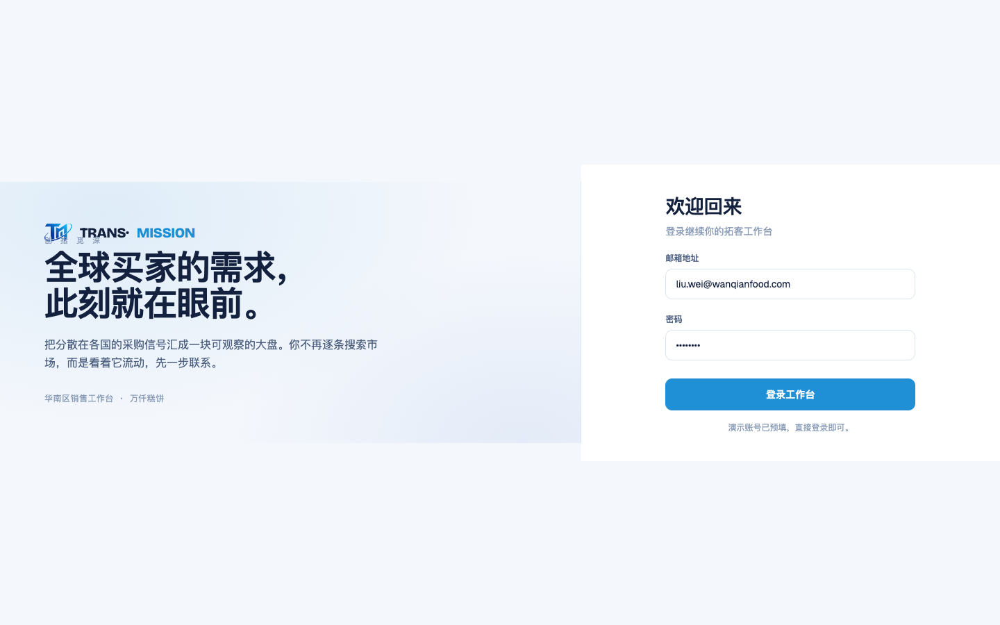
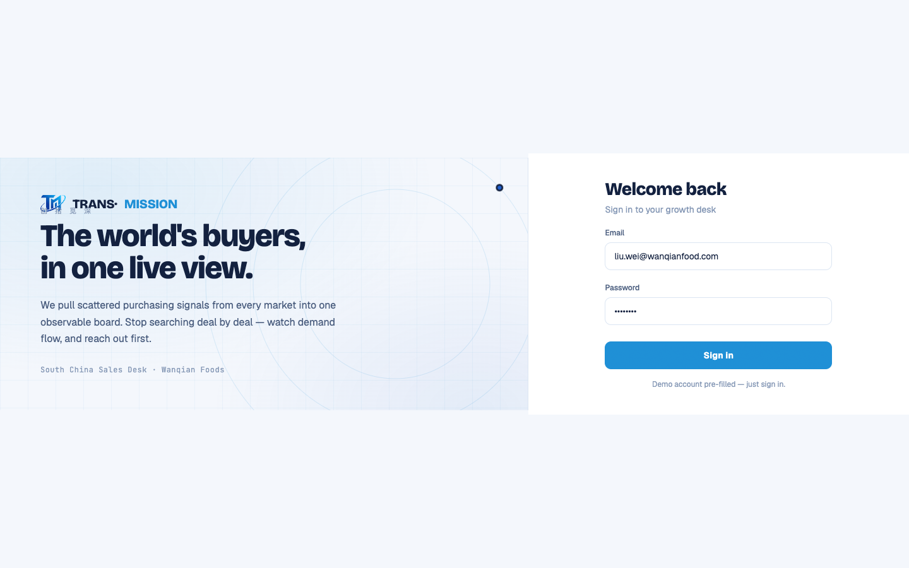
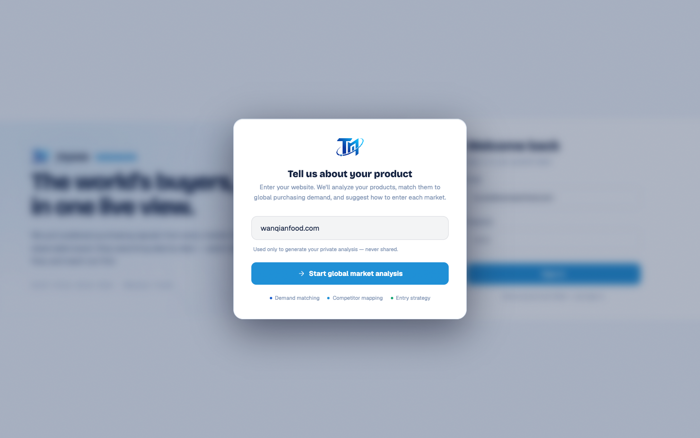

# Round 063 · 🟦 产品轴 · 登录页酷炫化(轨道信号母题)+ 英文化(用户新重点首轮)

- 时间:2026-06-25
- 档位:🟦 Standard(`main`;cron 1min)
- 分支:`main`
- backlog 来源项:用户 2026-06-25 三焦点 ——①全站英文 ②开头动画科技感 ③登录页酷炫。本轮做登录页(同时覆盖 ③+① 的登录部分)。

## 做了什么
1. **登录页酷炫(品牌「Signal Room」路线,零 slop)**:左品牌栏加**轨道/雷达信号母题** —— 3 圈同心 azure 细环 + 2 个 azure/royal 节点沿环慢速反向公转(呼应 logo 轨道+节点)+ 极淡蓝图网格底。纯 SVG+CSS,`prefers-reduced-motion` 停转;克制无 glow 光晕、无俗气渐变。内容 z-index 之上,环在背后。
2. **登录页全英文**:
   - 品牌栏:"The world's buyers, in one live view." / "We pull scattered purchasing signals from every market into one observable board. Stop searching deal by deal — watch demand flow, and reach out first." / "South China Sales Desk · Wanqian Foods"
   - 表单:Welcome back / Sign in to your growth desk / Email / Password / Sign in / Demo account pre-filled — just sign in.
   - 网址弹窗:Tell us about your product / Enter your website… / Start global market analysis / Demand matching · Competitor mapping · Entry strategy
   - 保留「创拾觅深」品牌署名(logo 锁版身份,非 UI 文案)。

## 验收
- **build** ✓ · **机检** login `newErrors:[]` ✓ · **golden h1** ✓(登录→网址弹窗→FRA→工作台 流程未坏)· **h3** ✓ · **tour-check** ✓
- **实拍**:login 左栏雷达轨道环+节点+网格,英文标题;网址弹窗全英文。
- **两北极星裁决**:视觉 —— 科技/酷炫靠 azure 轨道信号动效(on-brand,呼应 logo),非 glow/渐变 slop,克制高级;产品 —— 英文化服务国际/demo。**KEEP。**

## 截图
-  → (轨道母题+英文)· (网址弹窗英文)

## 残留 → backlog(三焦点分轮)
- ② 开头动画 FirstRunAnalysis 加科技感 + 英文(下轮)。
- ① 其余屏英文化:dashboard / leads / intel / whatsapp / marketing / pool / 引导 tour / toast / legacy-app.js 大量中文串(分轮逐屏)。
- 死 UI 扫描层 rso 仍中文(T11,不碰)。

## commit / 分支 / push
- commit on `main` · push origin main。**cron 1min 起搏,不 ScheduleWakeup。**
