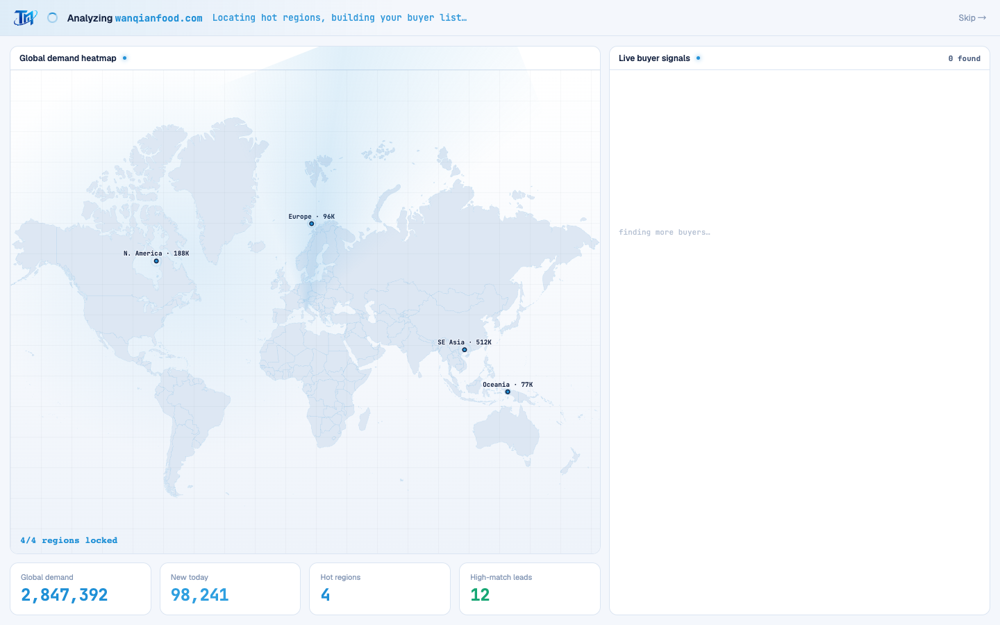
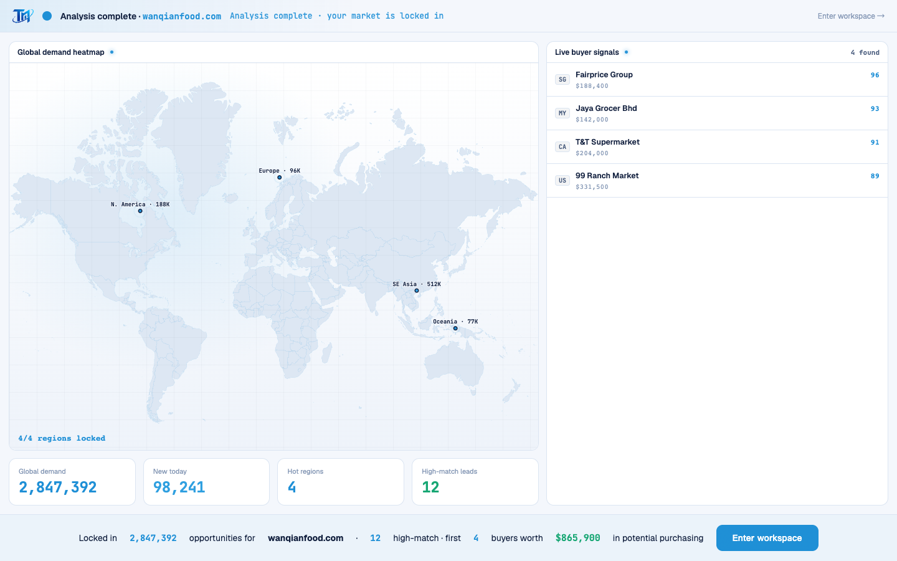

# Round 064 · 🟦 产品轴 · 开头动画 FirstRunAnalysis 加科技感(雷达扫描+网格)+ 英文化

- 时间:2026-06-25
- 档位:🟦 Standard(`main`;cron 1min)
- 分支:`main`
- backlog 来源项:用户三焦点 ② 开头动画加科技感 + ① 英文。承 R063(登录页)。

## 做了什么
1. **科技感(品牌 Signal Room 路线,零 slop)**:地图区加
   - **雷达扫描扇区** `.fra-scan`:`conic-gradient` 单向 azure 扇形(.14 alpha)绕地图中心匀速旋转 = 分析中的「扫描/雷达」感;**完成即移除**(`v-if="!done"`),`prefers-reduced-motion` 不显。
   - **蓝图网格** `.fra-grid`(原有样式,本轮真正渲染):极淡 navy 1px 网格,终端蓝图底。
   - 都克制无 glow 光晕、无渐变填充 slop;呼应 logo 轨道 + WorldHeatmap 既有 sonar ping。
2. **开头动画全英文**:
   - 状态条:Analyzing <domain> / Connecting to the global demand database… / Reading your site… / Matching against 2.8M+ global purchasing signals… / Locating hot regions, building your buyer list… / Analysis complete · your market is locked in;Skip → / Enter workspace →
   - 面板:Global demand heatmap · N/4 regions locked · Live buyer signals · N found · finding more buyers…
   - 热点:SE Asia · 512K / N. America · 188K / Europe · 96K / Oceania · 77K
   - KPI:Global demand / New today / Hot regions / High-match leads
   - settle:"Locked in 2,847,392 opportunities for <domain> · 12 high-match · first 4 buyers worth $865,900 in potential purchasing" + Enter workspace

## 验收
- **build** ✓ · **机检** analysis 序列帧 `pass:true` ✓ · **golden h1** ✓(settle pipeline `$865,900`,Enter workspace 点击=.fra-enter 类未变,流程未坏)· **h3** ✓ · **tour-check** ✓
- **实拍**:t1(分析中)地图雷达扫描扇区 + 网格 + 全英文;t2(settle)英文总结 + $865,900。
- **两北极星裁决**:视觉 —— 科技/扫描感靠 azure 雷达扇区 + 网格(on-brand,克制,完成即停),非 glow/渐变 slop;产品 —— 英文化。**KEEP。**

## 截图
- (雷达扫描+网格+英文)· (英文 settle)

## 残留 → backlog
- ① 逐屏英文化:dashboard / leads / intel / whatsapp / marketing / pool / 引导 tour / toast / legacy-app.js 大量中文串(分轮,这是「全站英文」主战场,量大)。
- 死 UI rso 扫描层仍中文(T11,不碰)。

## commit / 分支 / push
- commit on `main` · push origin main。**cron 1min 起搏,不 ScheduleWakeup。**
